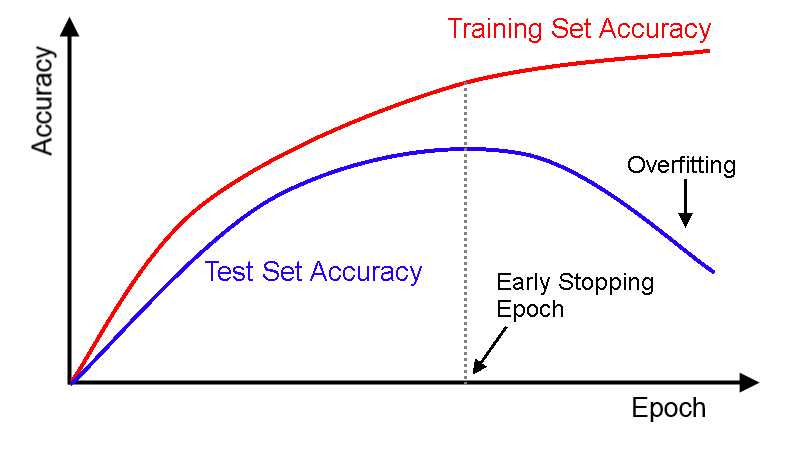

# Machine Learning

## İçerik
- [Giriş](#giriş)

# Giriş
Machine learningin çıkış noktası turing testine dayanır.  

**Turing Testi: "Zeka"nın Tanımını Değiştirdi**

1950 yılında Alan Turing, "Düşünen makineler yapabilir miyiz?" sorusunun çok felsefi ve içinden çıkılmaz olduğunu fark etti. Bunun yerine daha basit bir ölçüt önerdi: "Bir makine, bir insanı, kendisinin de insan olduğuna ikna edebiliyorsa, o makine zekidir."

Bu test, yapay zekanın amacını netleştirdi: İnsan Davranışını Taklit Etmek. Artık amaç, insan gibi konuşan, insan gibi tepki veren sistemler yapmaktı.

**"Öğrenme" Fikri Doğdu**

Bir makineye tüm dünya bilgisini ve dil kurallarını tek tek öğretmek imkansızdı. İşte bu tıkanma noktasında, bilim insanları şunu fark etti: "Bir bebek nasıl zeki oluyor? Doğduğunda hiçbir şey bilmiyor, zamanla deneyimleyerek, örnekler görerek öğreniyor."

Eğer bir makine Turing Testi'ni geçecek kadar insan gibi davranacaksa, ona her şeyi öğretmek yerine, öğrenmeyi öğretmek daha mantıklıydı. İşte Machine Learning (Makine Öğrenmesi) tam olarak buradan doğdu:

**Amaç:** Makineye katı kurallar vermek değil, ona binlerce örnek (konuşma metni, resim, vs.) gösterip, bu örneklerdeki desenleri (pattern) kendi kendine bulmasını sağlamak.

**Mantık:** "İnsan gibi cevap verebilmesi için, önce insanların nasıl cevap verdiğini gözlemlemeli."

Üç öğrenme görecez:
1. Danışmanlı Öğrenme (Sınıflandırma ve tahmin)
2. Danışmansız Öğrenme (Kümeleme)
3. Takviyeli Öğrenme (Tüm otonom sistemler böyle çalışır.)

Transfer öğrenmesi popüler ama bu derste işlenmiyecek.

**Neden Makine öğrenmesi?**
- Teknolojiye herkes ulaşabilir.
- Yeni ve güçlü algoritmalar.
- Veri boyutu ve parametre sayısı arttı.
- Otonom sistemlere talep var.
- Fonksiyonel tıpta kullanılıyor.

**Makine Öğrenmesi Uygulamaları**
- Veri Madenciliği
- Programlanması zor yazılım uygulamaları
- Kişileştirilmiş uygulamalar

**Makine öğrenmesinin bugünü ve geleceği**  
| Bugün | Gelecek |
|-------|---------|
| Yapay sinir ağları, karar ağaçları, regresyon | Farklı kaynaklardan veri işleme |
| Bulanık mantık, derin öğrenme | Hayatboyu öğrenme |
| İlişkisel/ilişkisel olmayan veritabanları | Deney yoluyla öğrenme |
| Yapısal olmayan veri | Akan veri işleme (streaming) |
| Ticari uygulamalar (İK, iş zekası) | |

**Data Fusion** (Veri Füzyonu/Tümleştirmesi), birden fazla kaynaktan gelen veriyi birleştirerek, tek bir kaynaktan elde edilemeyecek kadar doğru, tutarlı ve anlamlı bilgi üretme sürecidir.  

- Örneğin bir otonom araç düşünün:

 - Kamera: "Önümde yuvarlak, kırmızı bir cisim var." (diyelim)
 - Lidar (lazer tarayıcı): "Önümde 15 metre uzaklıkta, hareket eden bir nesne var." (diyelim)
 - GPS: "Şu an bir kavşaktayım." (diyelim)

Fusion olmazsa: Kamera yuvarlak cismin bir trafik konisi mi yoksa dur işareti mi olduğunu tam çıkaramayabilir.

**İlişkili Disiplinler**  
- Yapay zeka
- Görüntü işleme
- Ses tanıma
- Biyometrik veri işleme
- Kontrol teorisi
- Psikoloji
- Nörobilim
- istatistik
- Veritabanları
- Örüntü tanıma
- Paralel ve/veya dağıtık hesaplama
- **Linguistic**

**Makine Öğrenmesi Nedir?**  
Tom Mitchell'ın tanımı şöyledir:
 - Bir bilgisayar programının, E tecrübesinden (Experience) yola çıkarak, P performans ölçütüne (Performance) göre, T görevinde (Task) başarısı artıyorsa, o program öğreniyor denir.

Bu üç kavram (T, P, E) aslında öğrenme sürecinin 3 ana bileşenidir.

**Öğrenme Sistemi Tasarımı**
1. Eğitim tecrübesi seçimi  
En iyi oyun hareketleri, satranç hareketleri
2. Hedef fonksiyonu seçimi  
Satranç-hareketleri, satranç-değerleri
3. Hedef fonksiyonu için bir temsil seçimi  
Ağırlıkları olan bir fonksiyon
4. Hedef fonksiyonuna yakınsamak için bir öğrenme algoritması seçimi  
Parametre tahmin metodu  

**Sınıflandırma ve Regresyon farkı**  
Hedef değişkenim **kategorik** (spam/spam değil, hasta/sağlıklı) ise **Sınıflandırma**, **sayısal** (fiyat, sıcaklık, boy) ise **Regresyon** kullanırım.

| Özellik | Sınıflandırma | Regresyon |
| :--- | :--- | :--- |
| **Tahmin Ettiği Şey** | Kategori / Sınıf / Etiket | Sayı / Değer / Miktar |
| **Örnek Çıktılar** | "Kedi", "Köpek", "Spam", "Spam Değil", "Hasta", "Sağlıklı" | 150.000 TL, 25°C, 75 km/sa, 3.5 yaş |
| **Sorduğu Soru** | Bu hangi gruba ait? / Bu nedir? | Bu ne kadar? / Kaç tane? / Ne değerde? |

##  Öğrenme Türleri

### 1. **Danışmanlı Öğrenme (Supervised Learning)**
- Giriş ve çıkış (sınıf) bilgisi bellidir
- Etiketli veri ile model oluşturulur
- **Uygulamalar:**
  - Karakter tanıma
  - E-posta filtreleme (spam/not spam)
  - Protein katlanma tipi tahmini
  - Görsel nesne tanıma

### 2. **Danışmansız Öğrenme (Unsupervised Learning)**
- Kümeleme (clustering)
- Etiketsiz veriler benzerliklerine göre gruplanır
- **Uygulamalar:**
  - Gen dizilimi analizi
  - Müşteri segmentasyonu
  - Birliktelik kural analizi (market sepeti, hastalık kuralları, web ziyaretleri)

### 3. **Takviyeli Öğrenme (Reinforcement Learning)**
- Ödül-ceza mekanizmasına dayalı
- Ajan çevresiyle etkileşerek öğrenir
- Canlıların öğrenme şeklini taklit eder

---

##  Makine Öğrenmesi Temel Soruları

- Örnek sayısı doğruluğu nasıl etkiler?
- Gürültü öğrenmeyi nasıl etkiler?
- Öğrenmenin teorik sınırı nedir?
- Geçmiş bilgi (ön bilgi) öğrenmeye nasıl yardım eder?
- Biyolojik öğrenme sistemlerinden nasıl ilham alabiliriz?

---

## Makine Öğrenmesi Temel Soruları - Cevaplar

---

## 1. Örnek sayısı doğruluğu nasıl etkiler?

### Genel İlke:
**Daha fazla örnek = genellikle daha yüksek doğruluk**, ancak bu ilişki doğrusal değildir.

### Örnek Sayısının Etkisi:

| Örnek Sayısı | Etki |
|--------------|------|
| **Çok az örnek** | Model ezberleme (overfitting) riski yüksek, genelleme başarımı düşük |
| **Yeterli örnek** | Model gerçek desenleri öğrenir, doğruluk artar |
| **Çok fazla örnek** | Getiri azalır (verimlilik düşer), hesaplama maliyeti artar |

### Öğrenme Eğrisi (Learning Curve):



**Önemli:** Her problem için gereken örnek sayısı farklıdır. Karmaşık problemler (örneğin görüntü tanıma) basit problemlere göre (örneğin spam filtreleme) daha fazla örnek gerektirir.

---

## 2. Gürültü öğrenmeyi nasıl etkiler?

### Gürültü Türleri:
1. **Etiket gürültüsü (Label noise):** Yanlış etiketlenmiş veriler
2. **Öznitelik gürültüsü (Attribute noise):** Hatalı/eksik öznitelik değerleri

### Gürültünün Etkileri:

| Gürültü Seviyesi | Etki |
|------------------|------|
| **Düşük** | Model performansı kısmen düşer, ancak genelde tolere edilebilir |
| **Orta** | Modelin genelleme yeteneği bozulmaya başlar |
| **Yüksek** | Model anlamsız desenler öğrenir, doğruluk ciddi oranda düşer |

### Aşırı Gürültü Durumu:
- Model **gürültüyü desen olarak öğrenir** (overfitting)
- Eğitim hatası düşük, test hatası yüksek olur
- Rastgele tahminden bile kötü sonuç verebilir

### Gürültüyle Başa Çıkma Yöntemleri:
- Veri temizleme (data cleaning)
- Gürültüye dayanıklı (robust) algoritmalar kullanma
- Düzenlileştirme (regularization)
- Ensemble yöntemleri (rastgele ormanlar gibi)

---

## 3. Öğrenmenin teorik sınırı nedir?

### PAC Öğrenme (Probably Approximately Correct):
Teorik olarak, **yeterli örnek verildiğinde** ve **doğru hipotez uzayı seçildiğinde**, bir konsept öğrenilebilir.

### Teorik Sınırları Belirleyen Faktörler:

| Faktör | Açıklama |
|--------|----------|
| **Hipotez uzayının büyüklüğü** | Ne kadar çok olası model varsa, öğrenmesi o kadar zor |
| **VC Boyutu** | Bir model sınıfının ayırt edebileceği maksimum nokta sayısı |
| **Hata toleransı (ε)** | Ne kadar hassas olmalıyız? |
| **Güven seviyesi (δ)** | Ne kadar emin olmalıyız? |

### Temel Teorik Sınır:
**Hiçbir öğrenme algoritması, görmediği veri hakkında %100 kesinlikte tahmin yapamaz.** (No Free Lunch Theorem)

Örnek sayısı arttıkça, teorik olarak **gerçek fonksiyona keyfi olarak yaklaşılabilir**, ancak **mükemmel doğruluk** (özellikle gürültülü verilerde) teorik olarak imkansızdır.

---

## 4. Geçmiş bilgi (ön bilgi) öğrenmeye nasıl yardım eder?

### Ön Bilginin Faydaları:

| Katkı | Açıklama |
|-------|----------|
| **Daha az veri gereksinimi** | Ön bilgi, modelin doğru yöne odaklanmasını sağlar, böylece daha az örnekle öğrenebilir |
| **Daha hızlı öğrenme** | Doğru hipotez uzayına yönlendirme yapar |
| **Daha iyi genelleme** | Anlamsız desenleri eleyerek gerçek desenlere odaklanmayı sağlar |
| **Gürültüye dayanıklılık** | Ön bilgi, gürültülü verilerde doğru sinyali ayırt etmeye yardımcı olur |

### Ön Bilgi Türleri ve Kullanımı:

| Ön Bilgi Türü | Örnek | Kullanım |
|---------------|-------|----------|
| **Alan bilgisi** | Tıpta hangi belirtilerin önemli olduğu | Öznitelik mühendisliği |
| **Dağılım bilgisi** | Verilerin normal dağıldığı | Bayesian öğrenme (prior) |
| **Yapısal bilgi** | Görüntülerde kenarların önemli olması | CNN mimarileri |
| **Kısıtlamalar** | Fonksiyonun doğrusal olması | Model seçimi |

### Bayesian Öğrenme Örneği:
```
P(h|D) = [P(D|h) * P(h)] / P(D)
          (veri)   (ön bilgi)
```
Ön bilgi (prior), az veri olduğunda baskınken, veri arttıkça verinin etkisi artar.

---

## 5. Biyolojik öğrenme sistemlerinden nasıl ilham alabiliriz?

### Biyolojik Sistemlerden Esinlenen Yaklaşımlar:

| Biyolojik Sistem | Makine Öğrenmesi Karşılığı |
|------------------|----------------------------|
| **Nöronlar ve sinapslar** | Yapay sinir ağları |
| **Görsel korteks (hücre katmanları)** | Derin öğrenme, CNN'ler |
| **Takviyeli öğrenme (ödül-ceza)** | Pekiştirmeli öğrenme (RL) |
| **Evrim ve doğal seçilim** | Genetik algoritmalar |
| **Beyin plastisitesi** | Transfer öğrenme, sürekli öğrenme |

### Önemli İlham Kaynakları:

#### 1. **Hiyerarşik Öğrenme**
- Biyolojide: Beyin basit desenlerden karmaşık desenlere doğru işler
- ML'de: Derin ağların katmanlı yapısı

#### 2. **Seyreklik (Sparsity)**
- Biyolojide: Beyin aynı anda tüm nöronları kullanmaz
- ML'de: Dropout, seyrek temsiller

#### 3. **Plastisite ve Stabilite**
- Biyolojide: Yeni bilgi öğrenirken eski bilgiyi unutmama
- ML'de: Sürekli öğrenme (continual learning) araştırmaları

#### 4. **Dikkat Mekanizması (Attention)**
- Biyolojide: İnsanlar önemli uyaranlara odaklanır
- ML'de: Transformer modelleri, dikkat mekanizmaları

#### 5. **Uyku ve Bellek Konsolidasyonu**
- Biyolojide: Uyku sırasında öğrenilenler pekiştirilir
- ML'de: Deneyim tekrarı (experience replay) - DeepMind'in Atari oyunları

---

### Özet Tablo

| Soru | Kısa Cevap |
|------|------------|
| Örnek sayısı doğruluğu nasıl etkiler? | Artan örnek sayısı doğruluğu artırır, ancak bir doyum noktası vardır |
| Gürültü öğrenmeyi nasıl etkiler? | Gürültü modelin genelleme yeteneğini bozar, aşırı durumlarda öğrenmeyi imkansız kılar |
| Öğrenmenin teorik sınırı nedir? | Mükemmel doğruluk imkansızdır; sınırlar hipotez uzayı, VC boyutu ve veri miktarıyla belirlenir |
| Ön bilgi nasıl yardım eder? | Daha az veriyle, daha hızlı ve daha doğru öğrenmeyi sağlar |
| Biyolojik sistemlerden nasıl ilham alırız? | Sinir ağları, pekiştirmeli öğrenme, dikkat mekanizmaları gibi modeller biyolojiden esinlenmiştir |
## Kavram Öğrenmesi

## Karar Ağaçları