# Açık Aralık Çözümleri

Çözüme başlarken alınan başlangıç noktalarına göre sayısal yöntemler, kapalı ve açık aralık metotlar olmak üzere ikiye ayrılır:
- Kapalı Aralık Metotları
  - İkiye Bölme Metodu (Bisection Method)
  - Doğrusal İnterpolasyon Metodu (Regula Falsi, Yer Değiştirme, Yanlış Nokta)
- Açık Aralık Metotları
  - Newton-Raphson Metodu
  - Secant (Kiriş) Metodu
  - Tekrarlama Metodu (Sabit Nokta İterasyonu)

Kapalı yöntemlerde, çözüm aralığının bilinmesi/tahmin edilmesi gerekmektedir ve bu aralık daraltılarak köke yaklaşılır.  
Açık yöntemlerde, alınan bir ya da iki başlangıç noktasına göre çözüme başlanır ve her bir iterasyonda yeni bulunan değer üzerinden kök bulunmaya çalışılır.  
Kökü bulmak için **verilen aralığın dışına çıkılabilir.**  
Açık yöntemlerde yakınsama garanti edilmez, ancak yöntem yakınsarsa, kapalı yöntemlerden çok daha hızlı yakınsar.  

### Newton Rapson Methodu

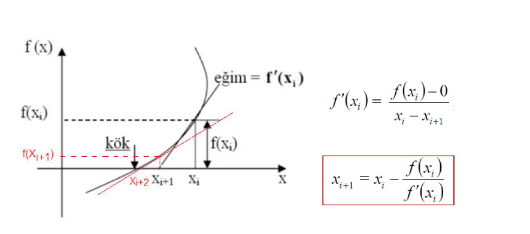

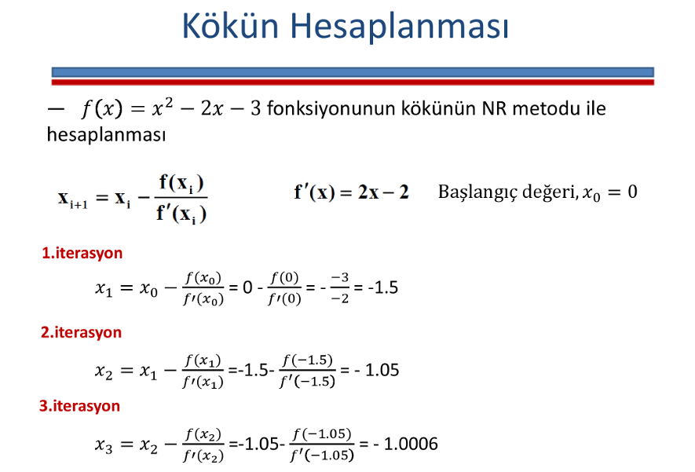

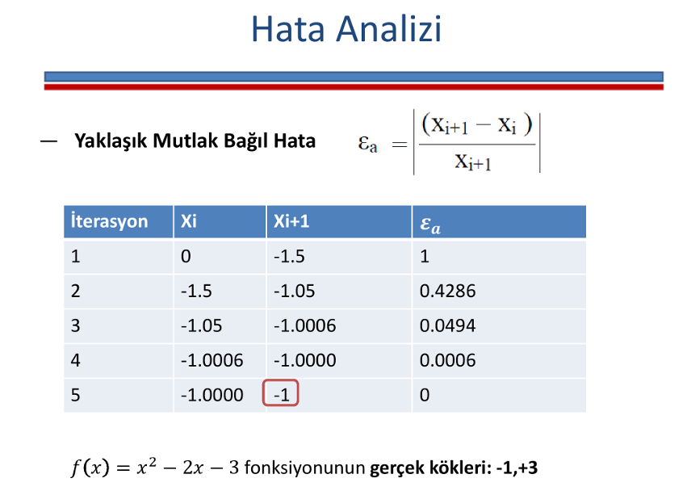

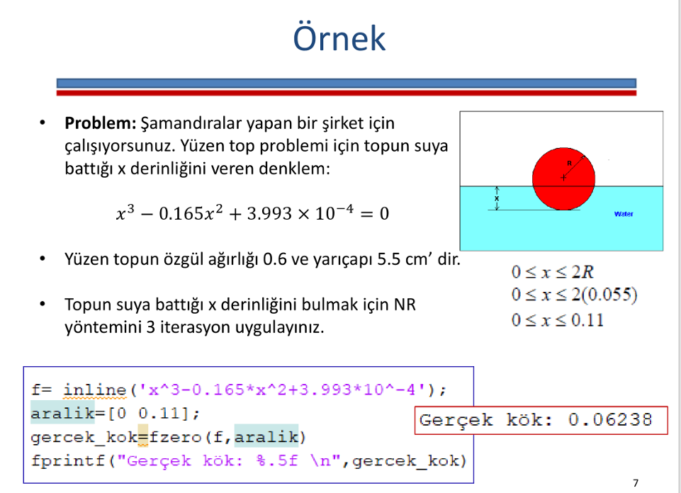

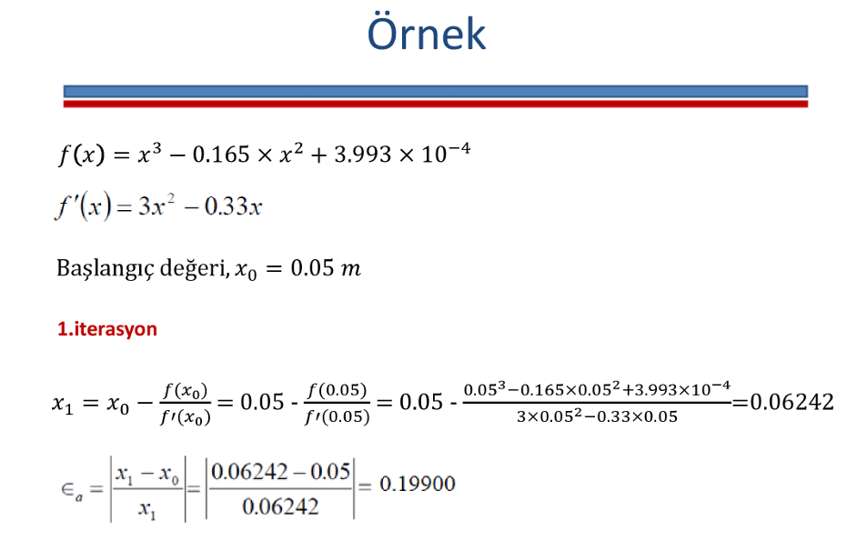

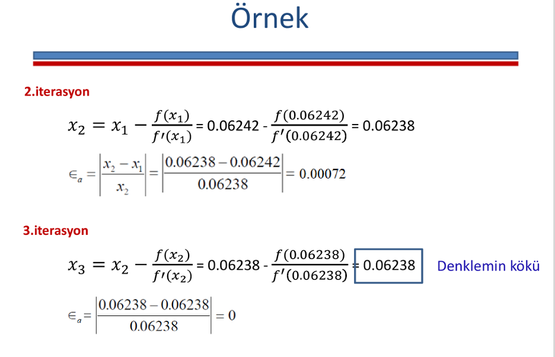

### Secant(Kiriş) Methodu

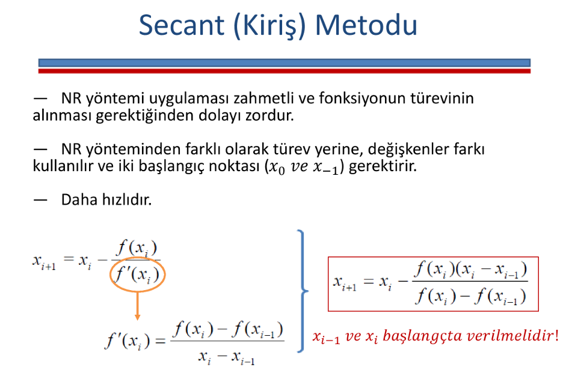

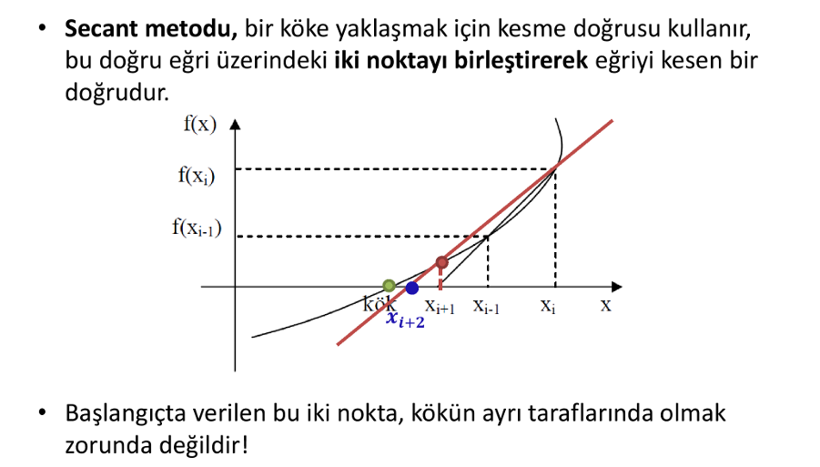

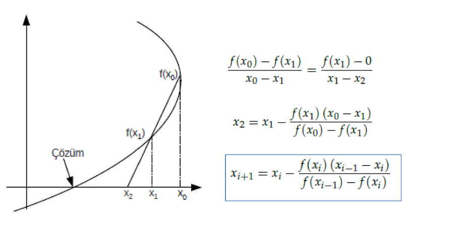

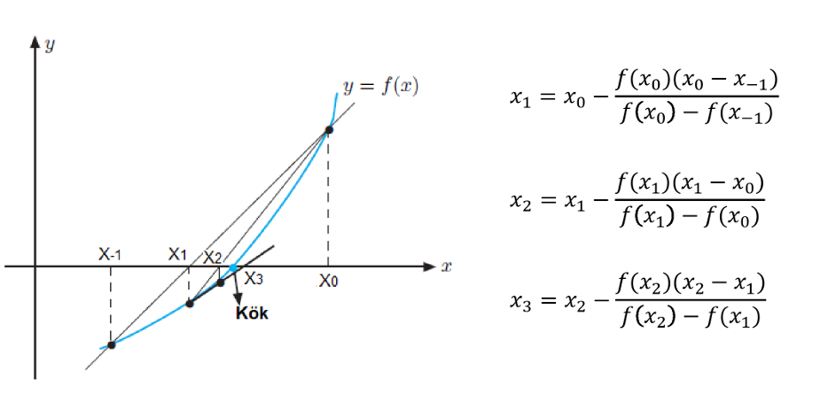

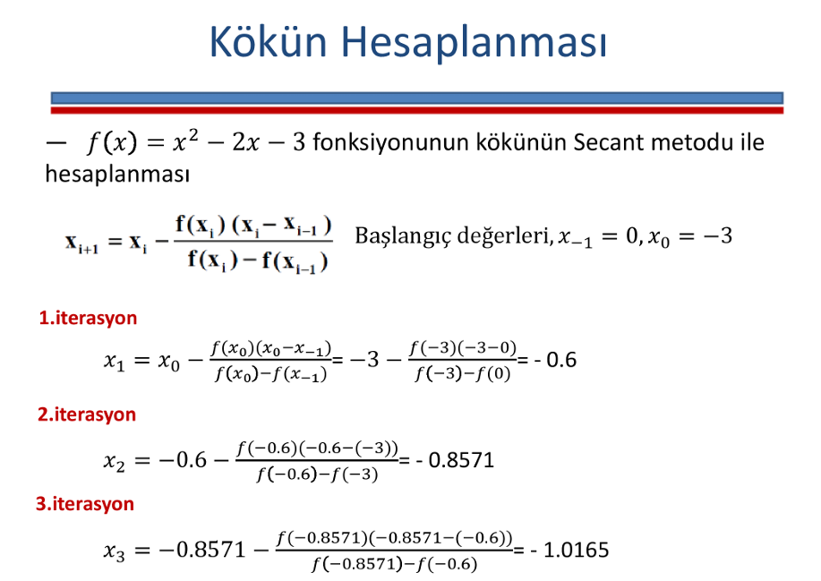

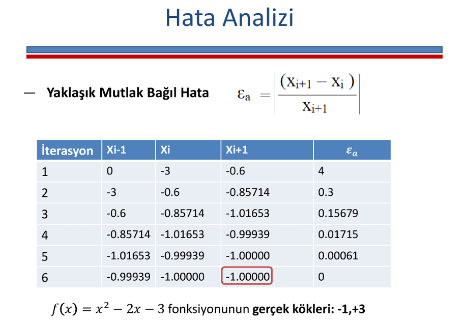

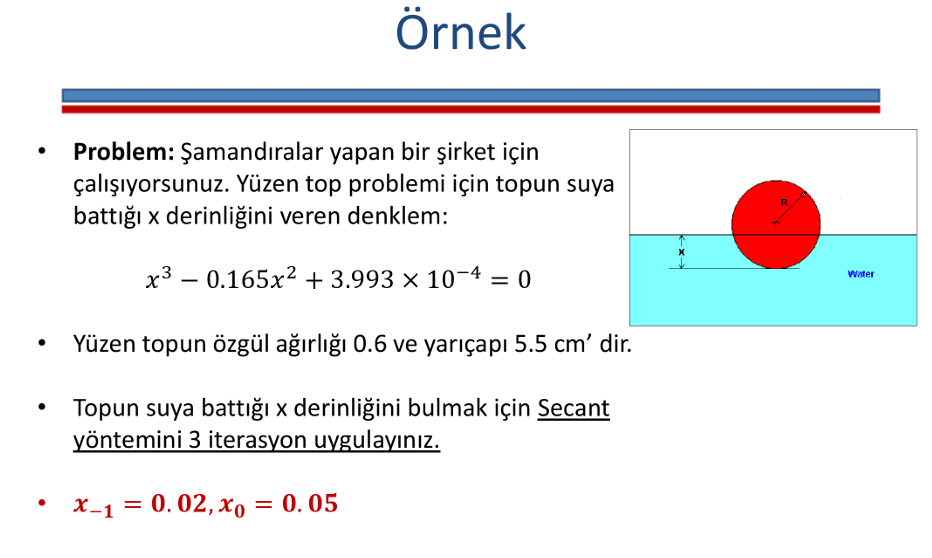

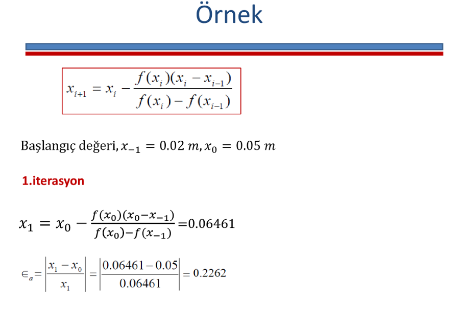

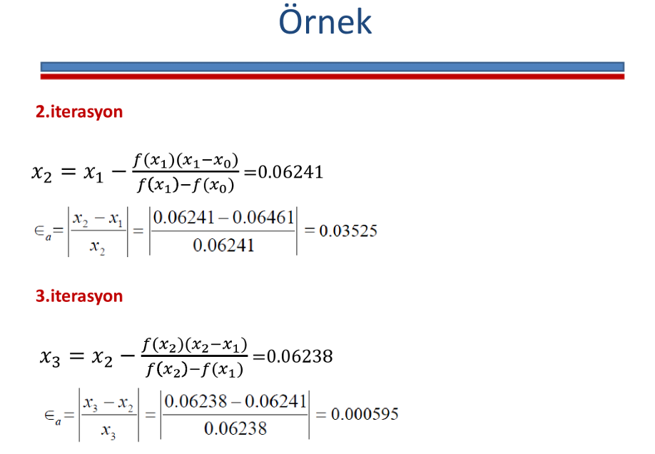

### Tekrarlama Metodu

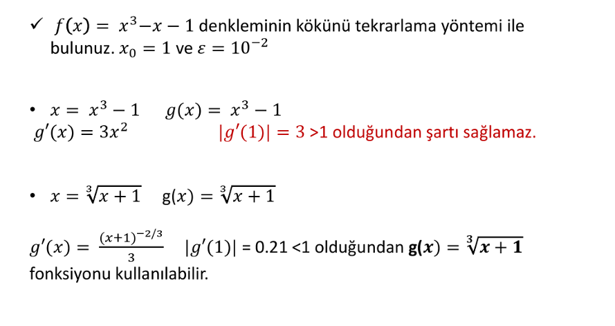

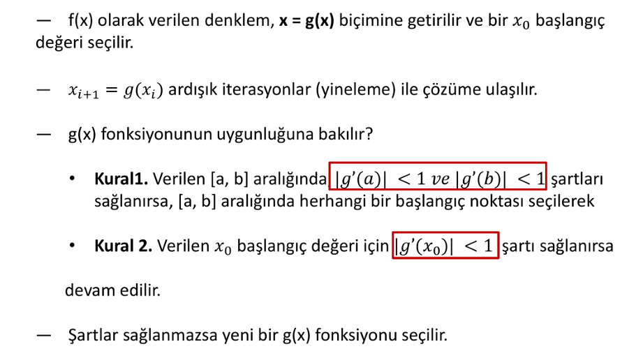

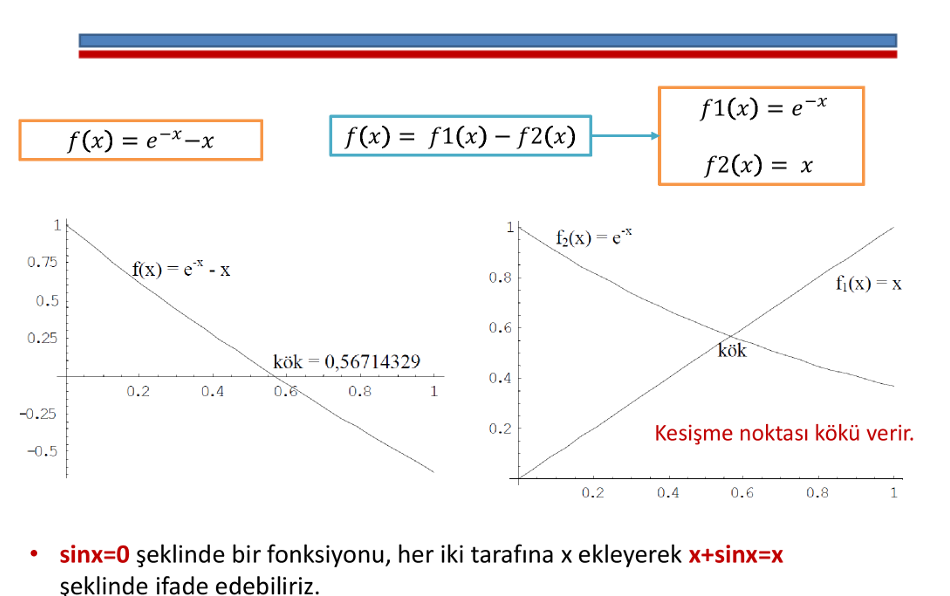

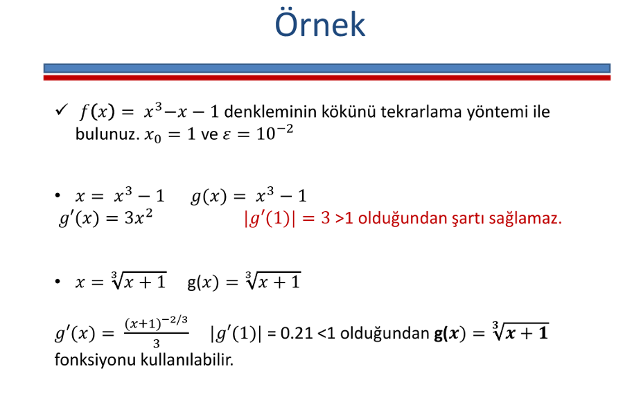

