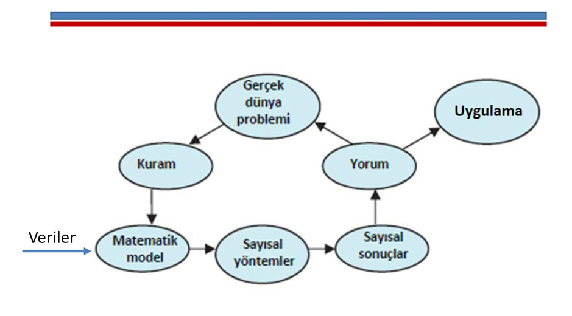
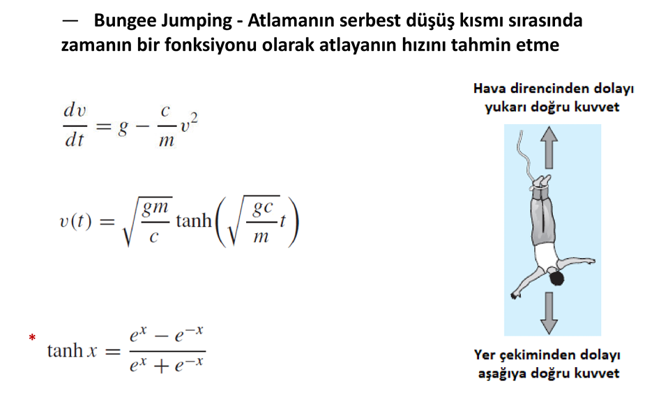
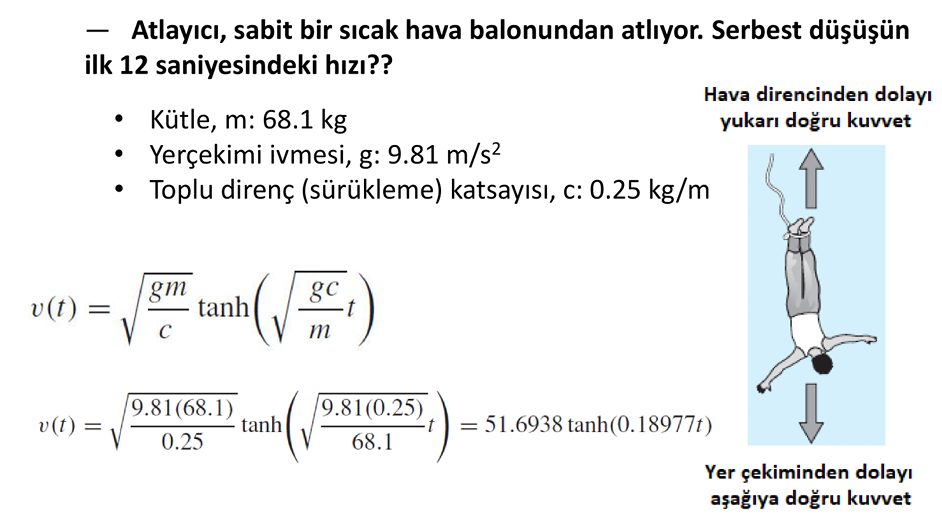
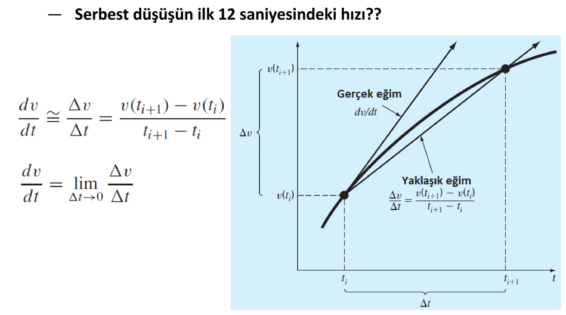
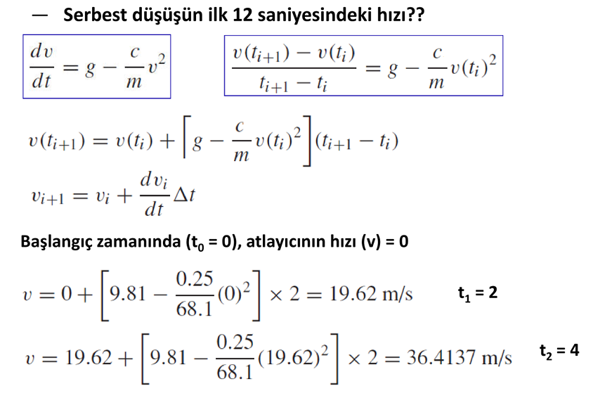
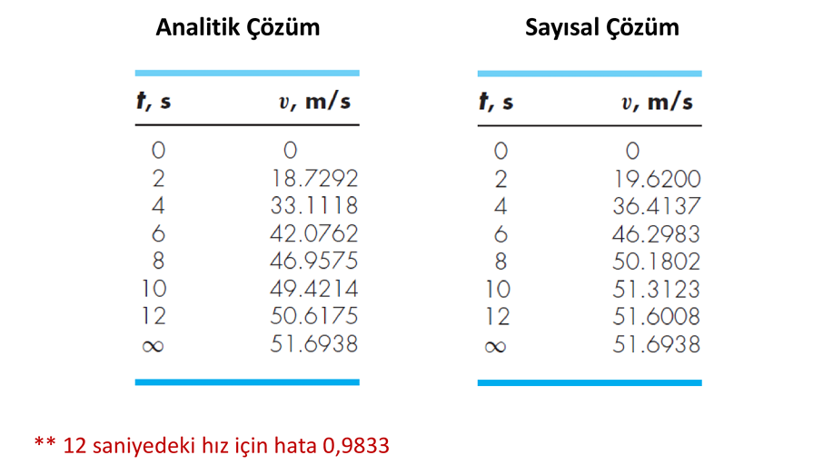

## Giriş

**Sayısal analiz**, sürekli değişkenleri içeren problemlere sayısal çözümler elde etmek için algoritmalar oluşturan, analiz eden ve uygulayan matematik ve bilgisayar bilimi alanıdır.

**Sayısal Yöntemler**, kesin çözümün imkansız olduğu veya hesaplanmasının çok pahalı olduğu durumlarda faydalın olan, yakşalık ancak doğru sayısal çözümler veren teknikler tasarlamayı içerir.

Aynı zamanda bu yöntemlerin yakınsama, doğruluk, kararlılık ve hesaplama karmaşıklığını karakterize etmeye de odaklanır.

Fiziksel bir sistemin veya bir sürecin ana özelliklerini
matematik terimlerle ifade eden bir eşitlik **matematik
model** olarak tanımlanır. 

**Sayısal Yöntemlerin Uygulanması**

---

**Bungee Jumping Örneği**

---

Çözülecek probleme göre sayısal analiz alanı, çeşitli
disiplinlere ayrılmaktadır:
- Denklemlerin Kökleri
- Lineer Cebirsel Denklem Sistemleri
- Eğri Uydurma
- Sayısal Türev ve integral
- Diferansiyel Denklemler
- Optimizasyon

Sayısal yöntemler kullanılırken dikkat edilmesi gereken
hususlar:
- Başlangıç Değeri
- Yakınsama Hızı
- Kararlılık
- Doğruluk ve Hassaslık
- Uygulama Alanının Genişliği