# Hata Kavramı

Sayısal Yöntemler ile hesaplama sonucunda yaklaşık çözümler elde edilir, dolayısıyla belirli bir hata payı içerirler.  

`Gerçek değer = Hesaplanan (yaklaşık) değer ± Hata`  

**Hata Kaynakları**  
- Kullanılan Verideki Hata (Ölçme Hatası)
- Yuvarlama Hataları
- Kesme Hataları
- İnsan Kaynaklı Hatalar
- Bilgisayar Kaynaklı Hatalar

 

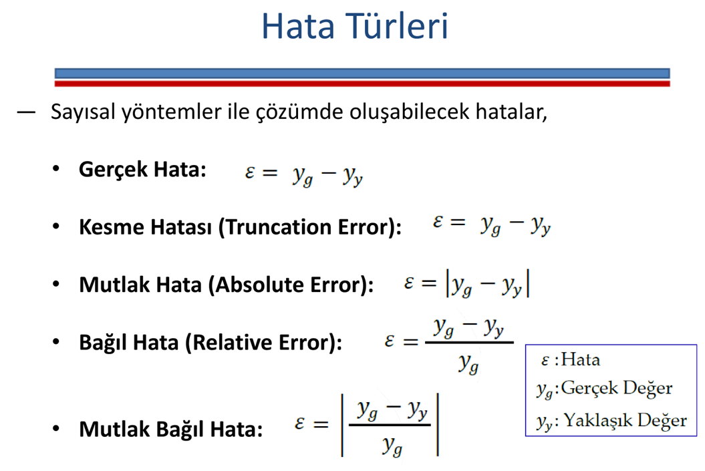

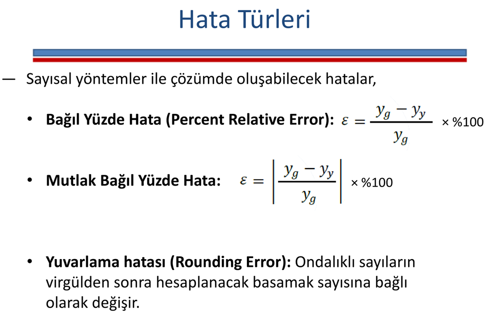

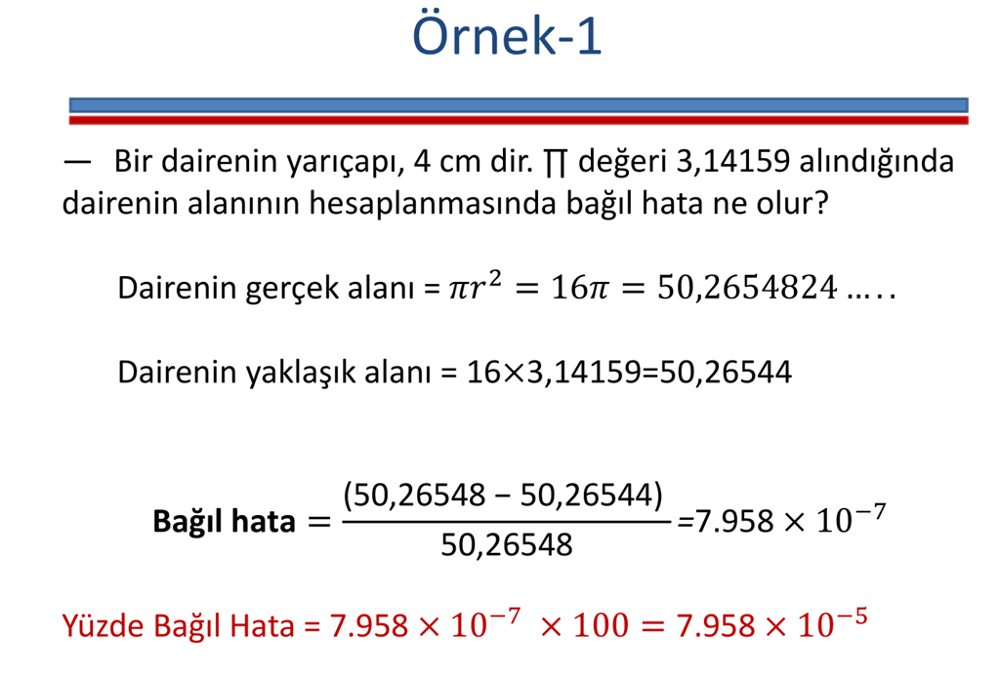

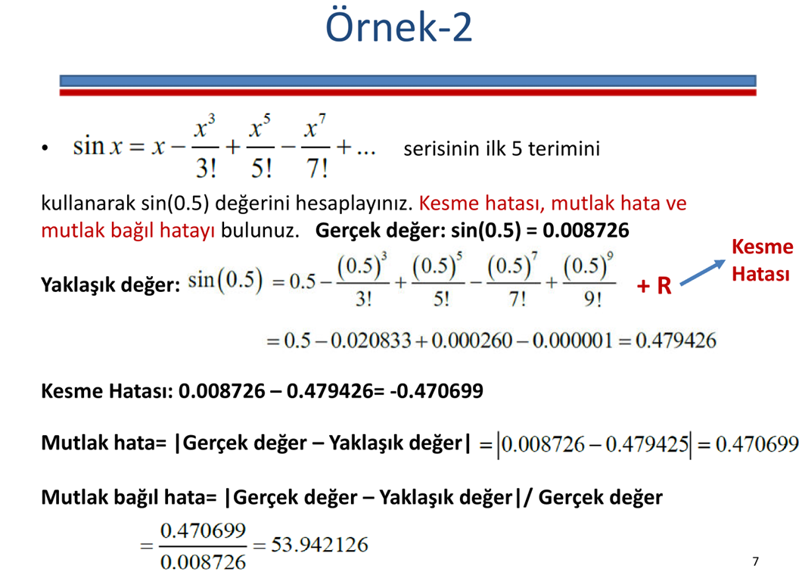

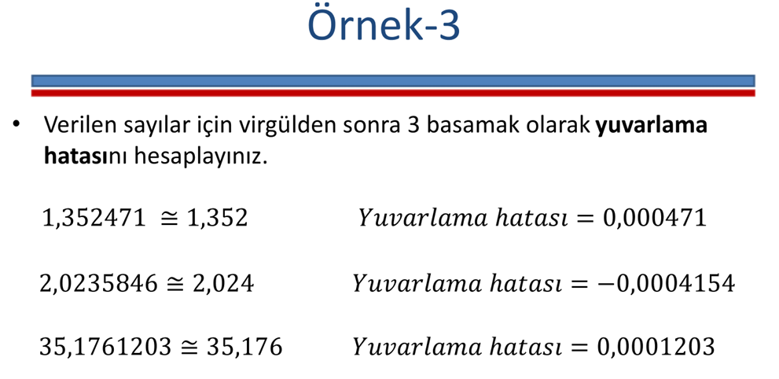

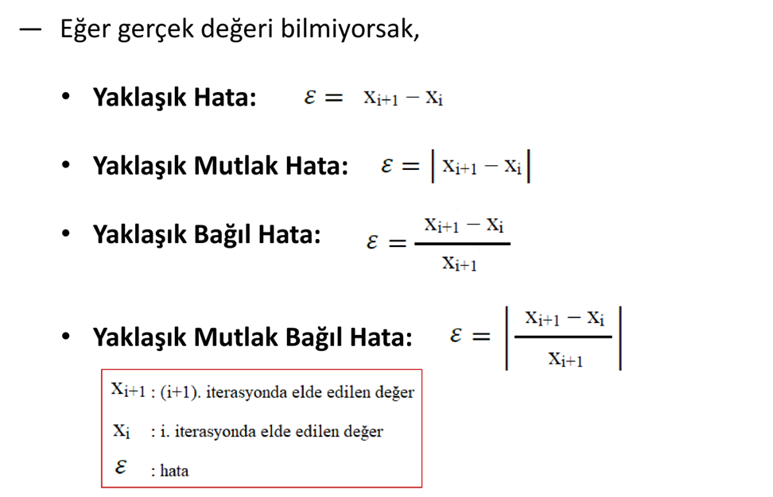

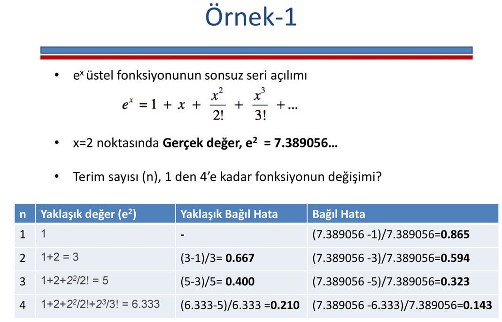

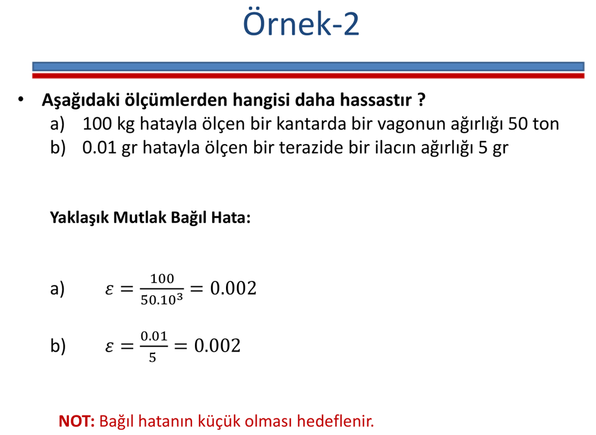

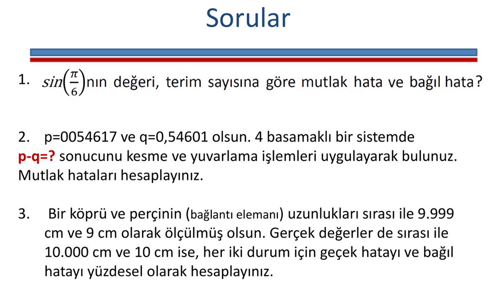

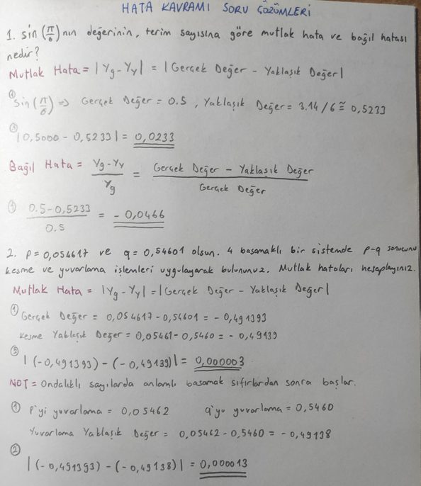

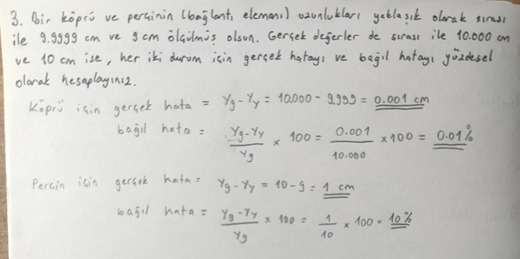