# Lineer Olmayan Denklemlerin Çözümü

**Lineer denklemler**; bağımlı değişkenin bağımsız değişken ile doğrusal değişim gösterdiği denklemlerdir. Polinom gösterimde bilinmeyenlerin üzeri 1 ise bu denklemler, lineer denklemlerdir.  

İki veya daha yüksek dereceli polinomlar veya üstel,
trigonometrik, ve logaritmik fonksiyonlar ve lineer olmayan ifade içeren denklemler, **lineer olmayan denklemlerdir**.  

f(x) 0 denklemini sağlayan x değerlerine, bu denklemin
**kökleri** denir.  

- **Kök bulma işlemi**, verilen f (x) denkleminde f (c) 0
değerini sağlayan c değer(ler)inin bulunması işlemidir.  

- Tek değişkenli bir fonksiyon için bu değerler aynı zamanda eğrinin x eksenini kestiği noktalardır.  

- Kök bulma işlemlerinde öncelikle kökün hangi aralıkta
olduğu belirlenir.

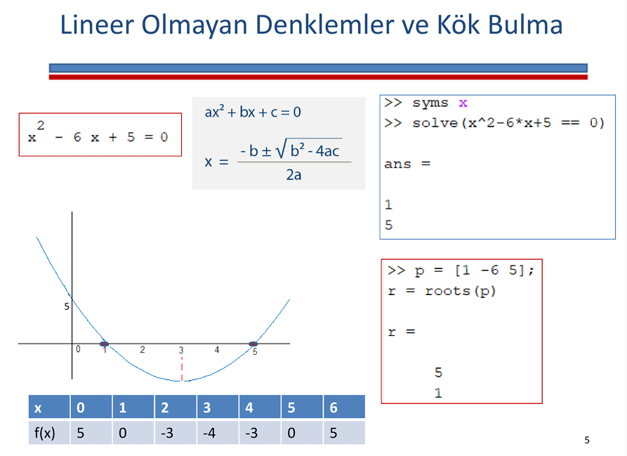

 

Bir denklemin köklerini bulmak için kullanılan teoremler;
- Ara Değer Teoremi
- Ortalama Değer Teoremi
- Rolle Teoremi
- Taylor Teoremi

## Ara Değer Teoremi
f(x) fonksiyonu [a,b] aralığında sürekli bir fonksiyon olmak üzere,  
f(a) <= s <= f(b) veya f(b) <= s <= f(a) koşulunu sağlayan en az bir noktası bulunabilir.

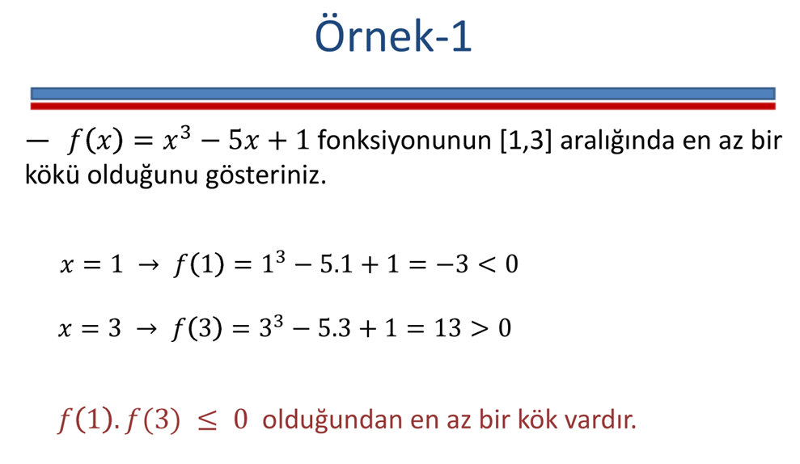

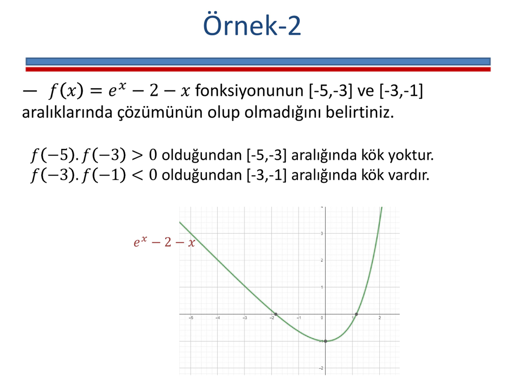

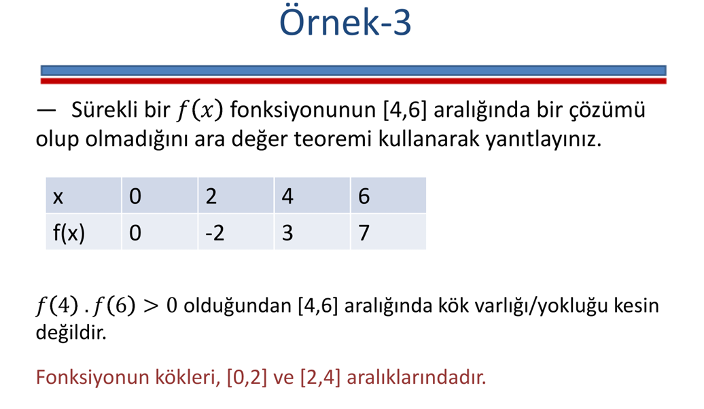

## Ortalama Değer Teoremi

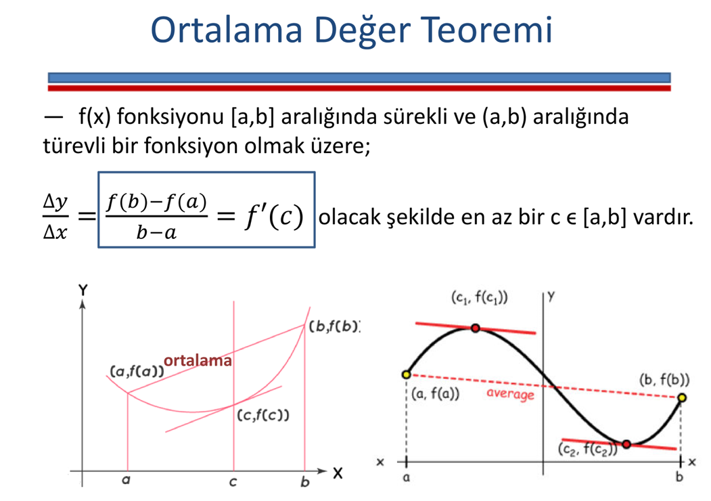

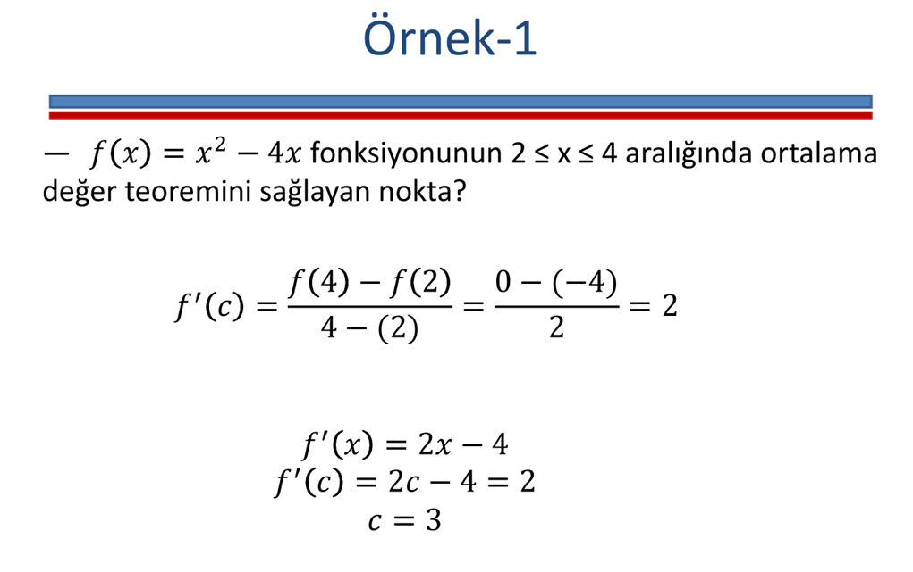

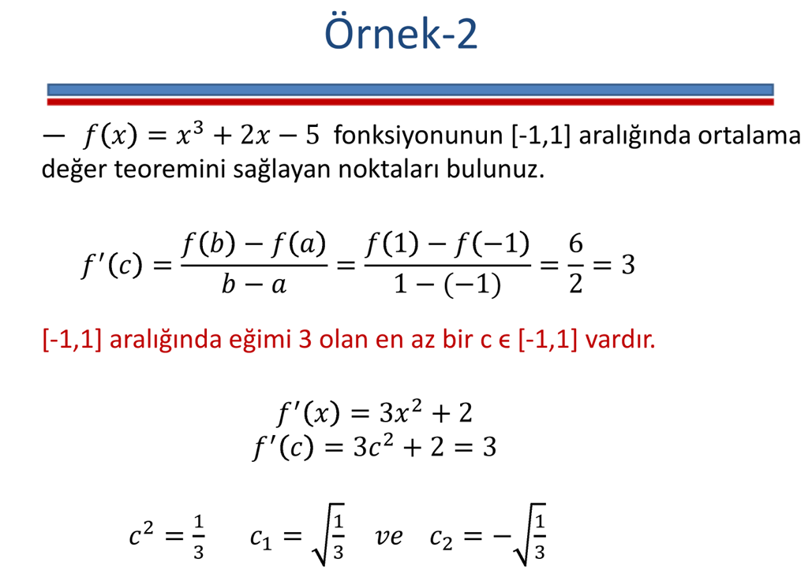

## Rolle Teoremi

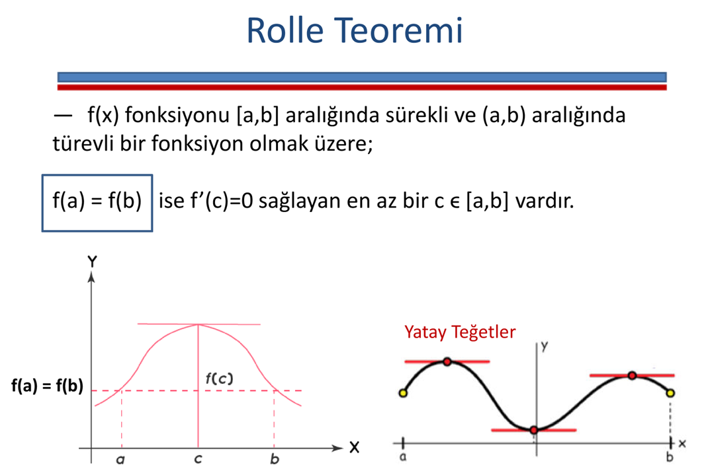

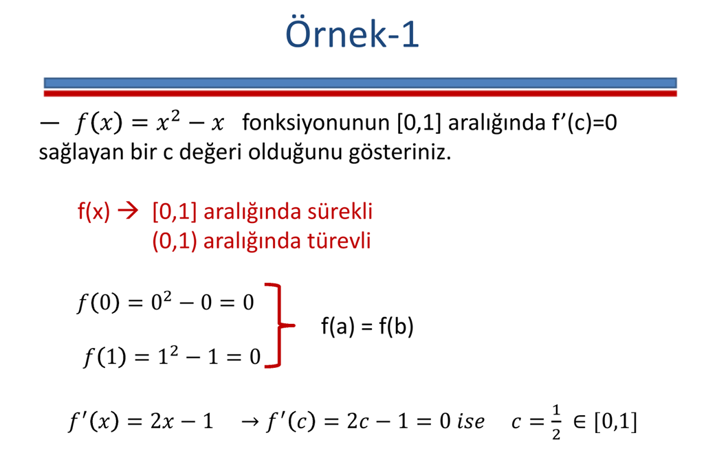

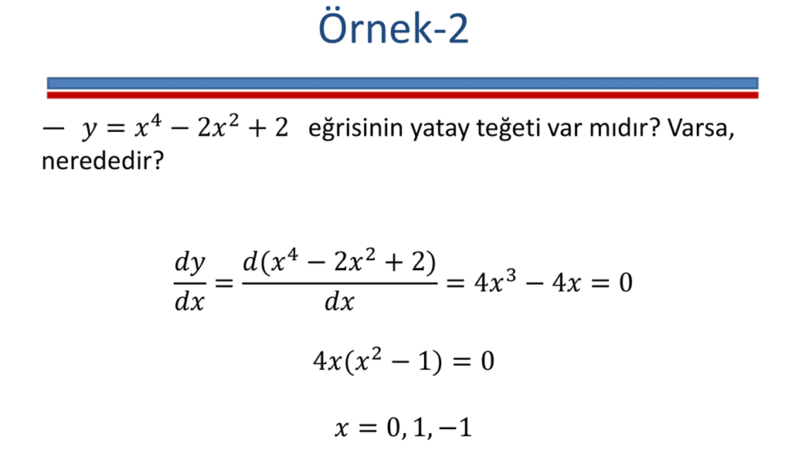

## Sorular

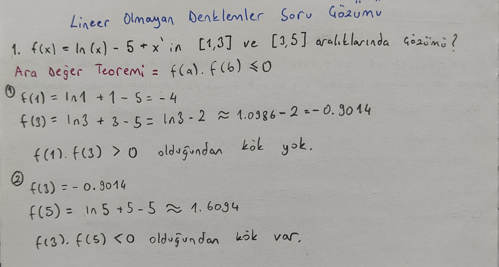

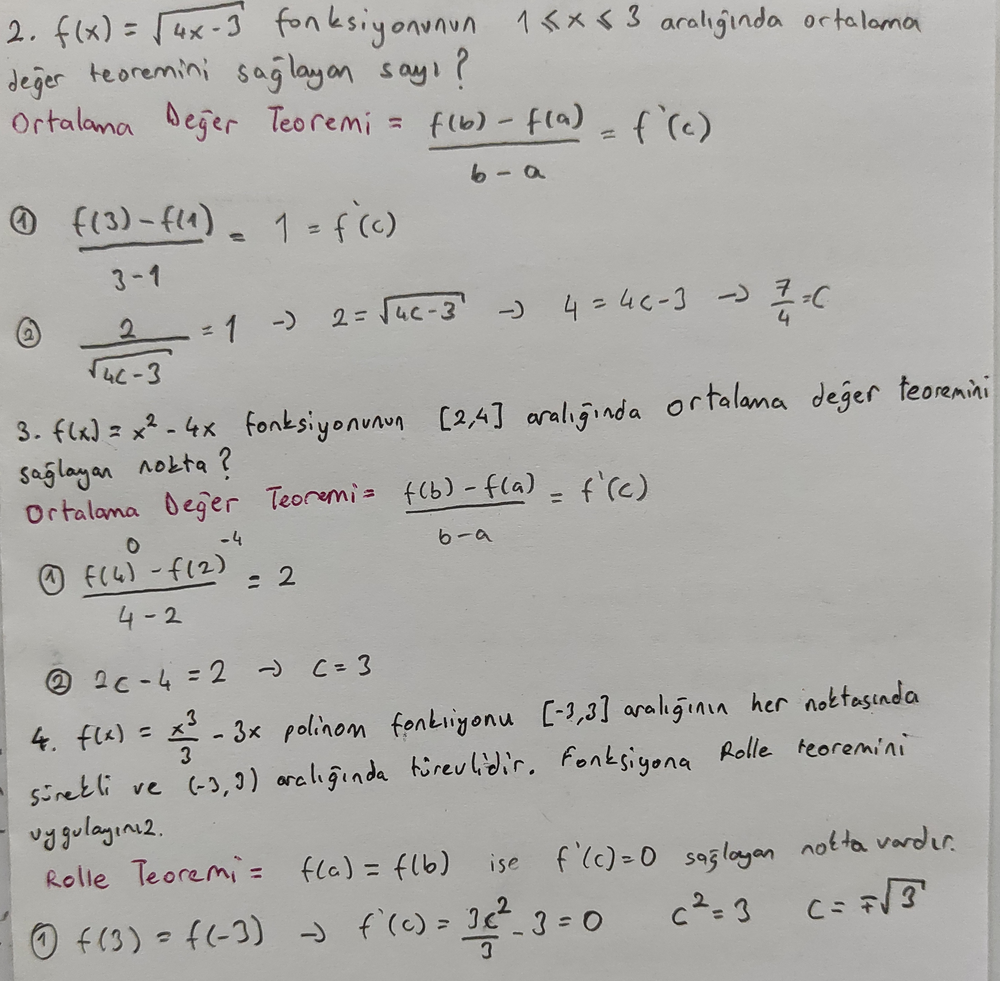