# Logic Circuits and Design

- [Ch1 Number Systems and Conversion](#ch1-number-systems-and-conversion)

## Ch1 Number Systems and Conversion

Bu dersteki amacımız kaba taslak bir bilgisayar geliştirmeyi amaçlıyoruz.

**NOT, AND ve OR Kapılarının Çalışma Mantığı:**

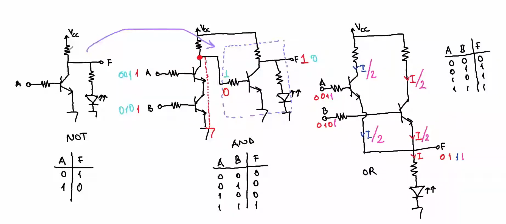

**Sayı Sistemleri**

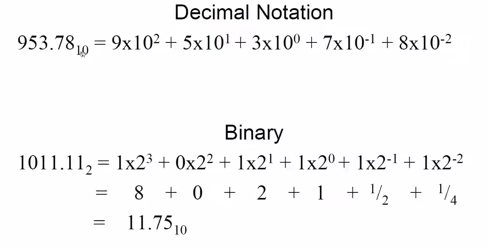

**Conversion Örneği**

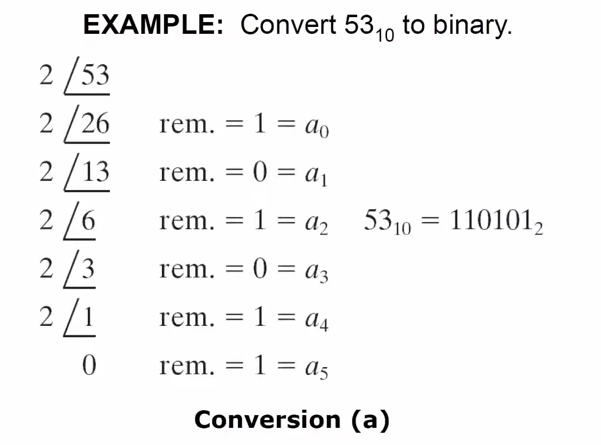

**Conversion Örneği 2**

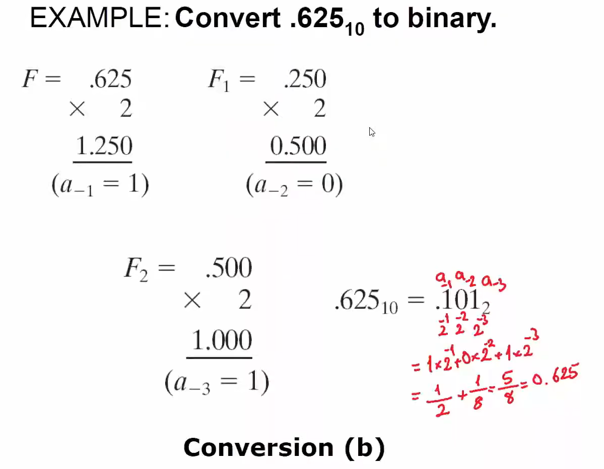

**Conversion Örneği 3**

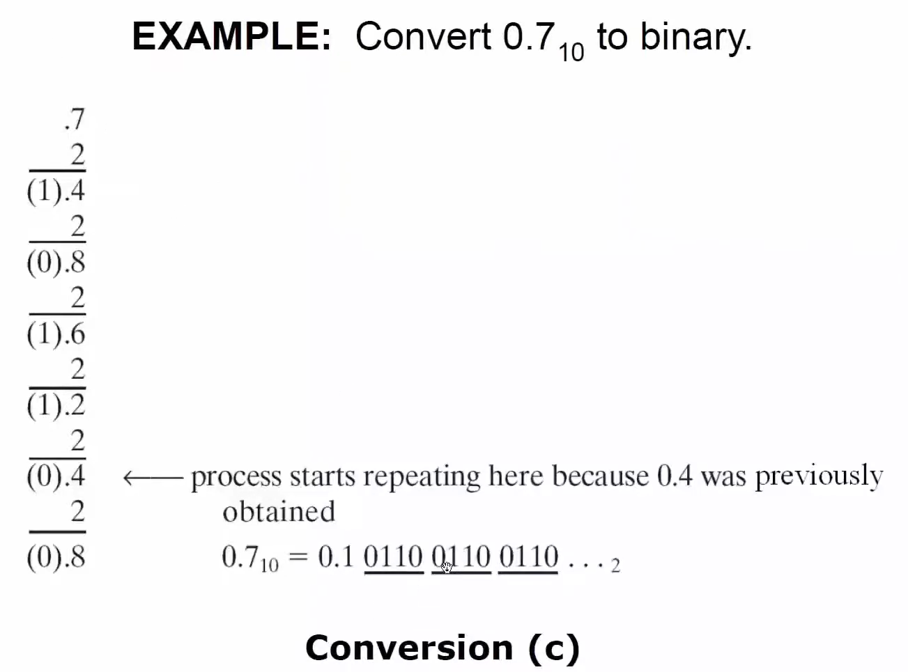

**Conversion Örneği 4**

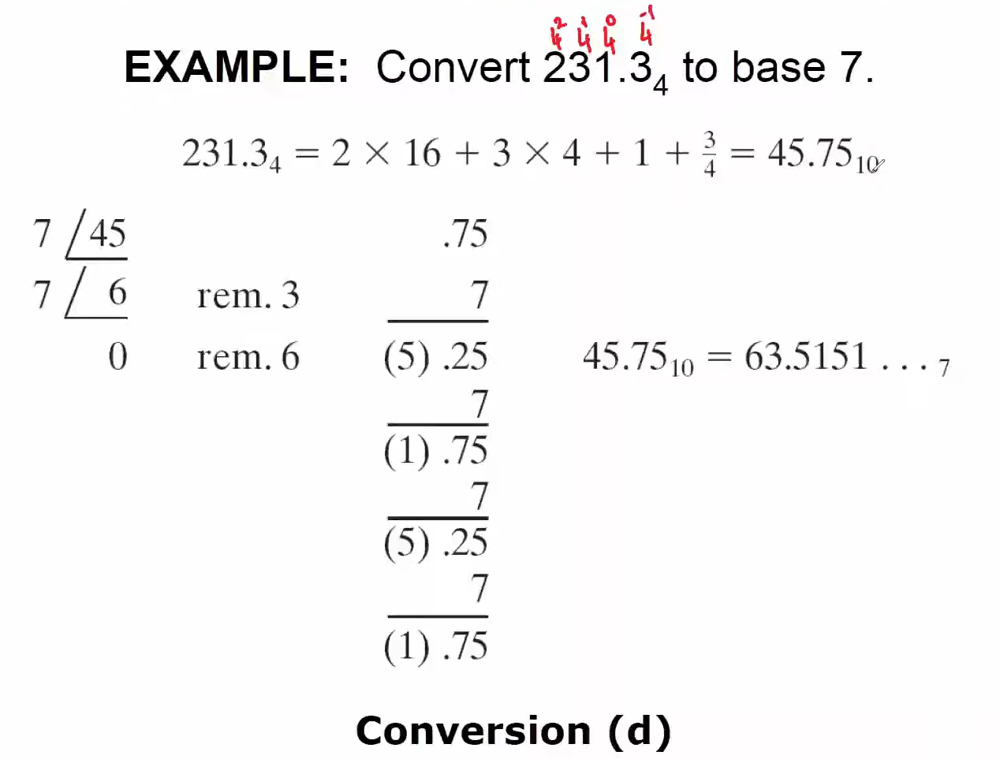

**Sayı Tabloları**

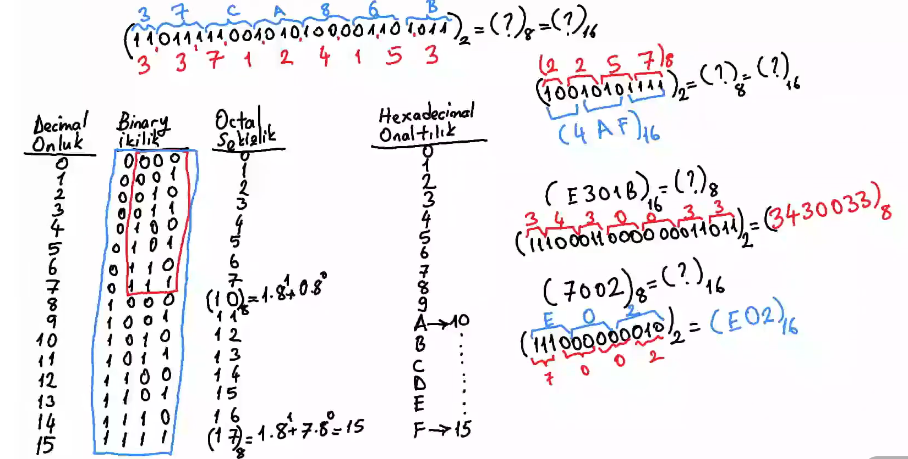

**Binary - Hexadecemimal Dömüşüm**

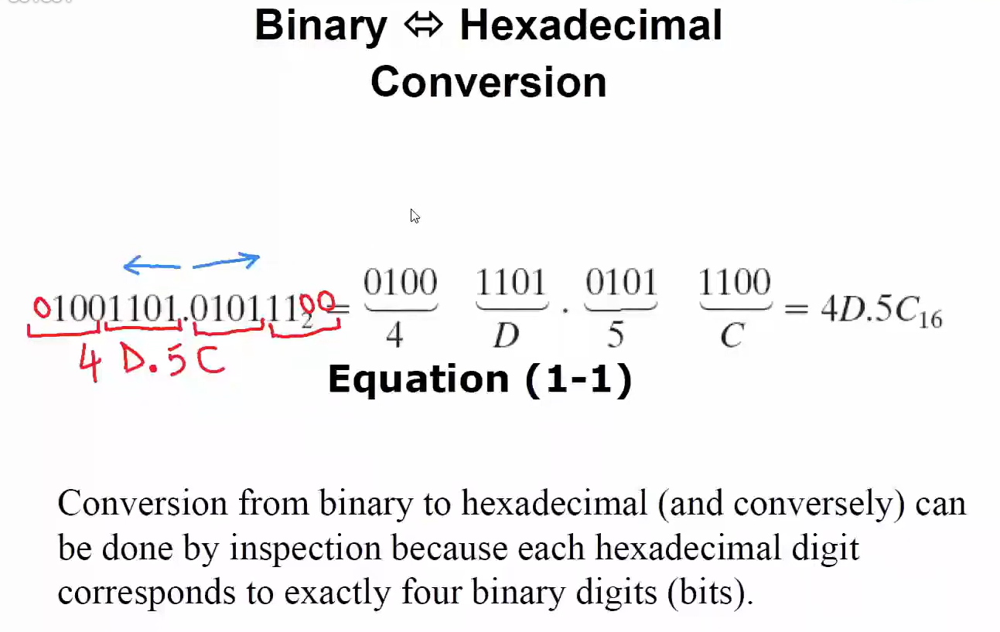

**Toplama ve Çıkarma**

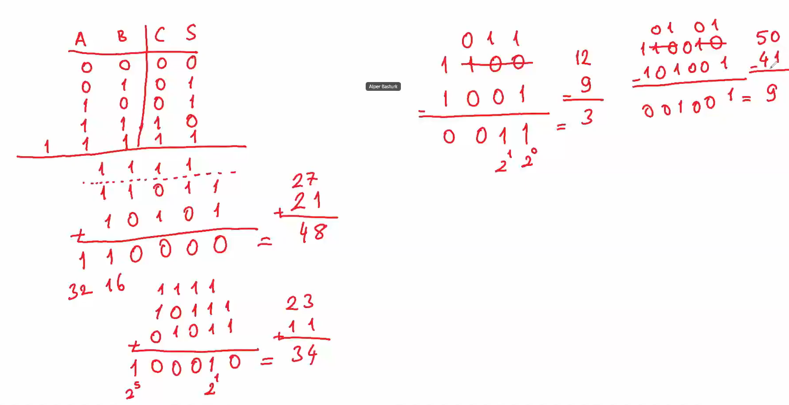

**Complement Çıkarma Yöntemi**

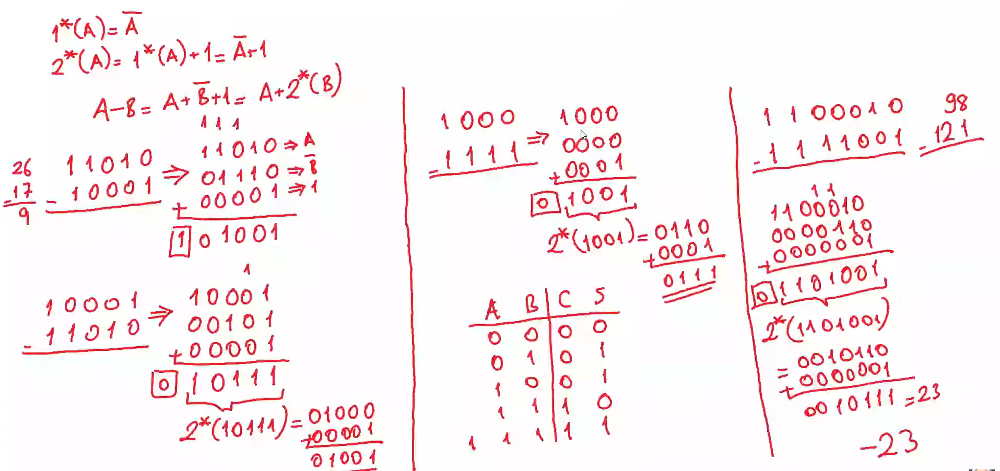

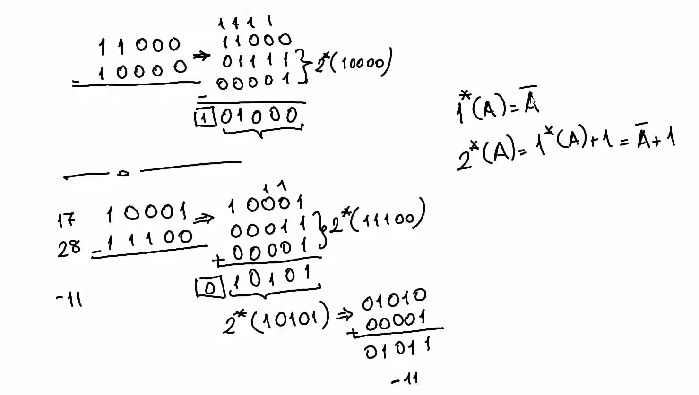

**Çarpma**

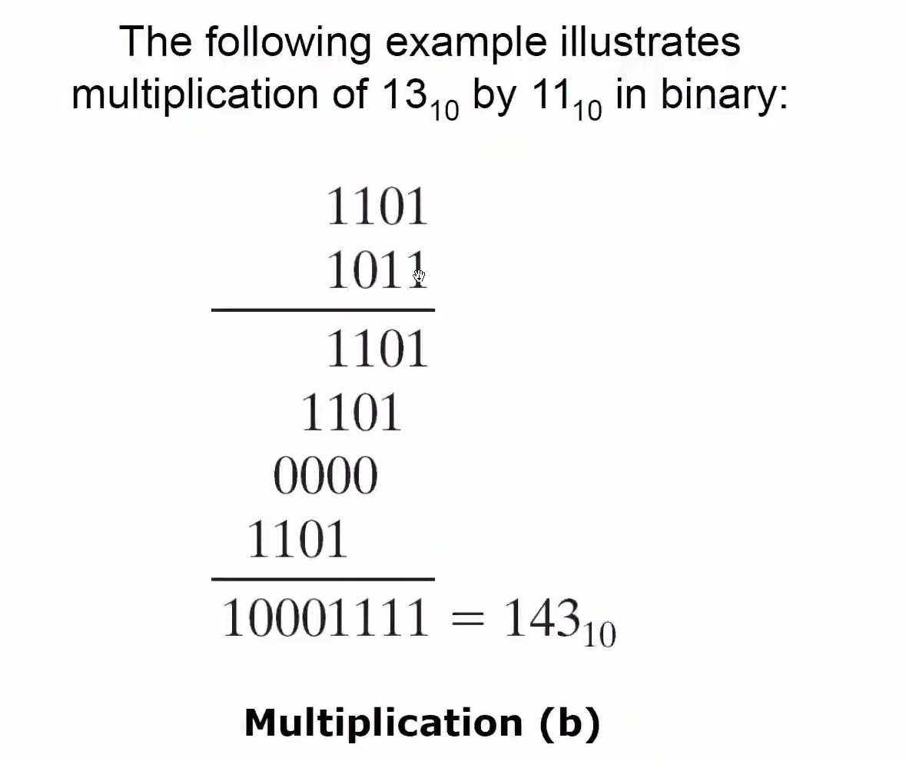

**İşaretli ve İşaretsiz Bit**

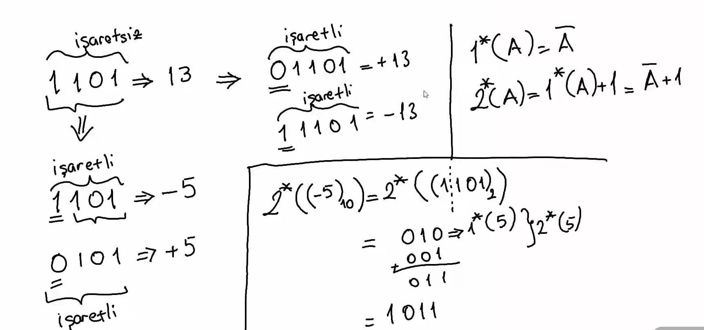

**Binary Codes for Digital Numbers**

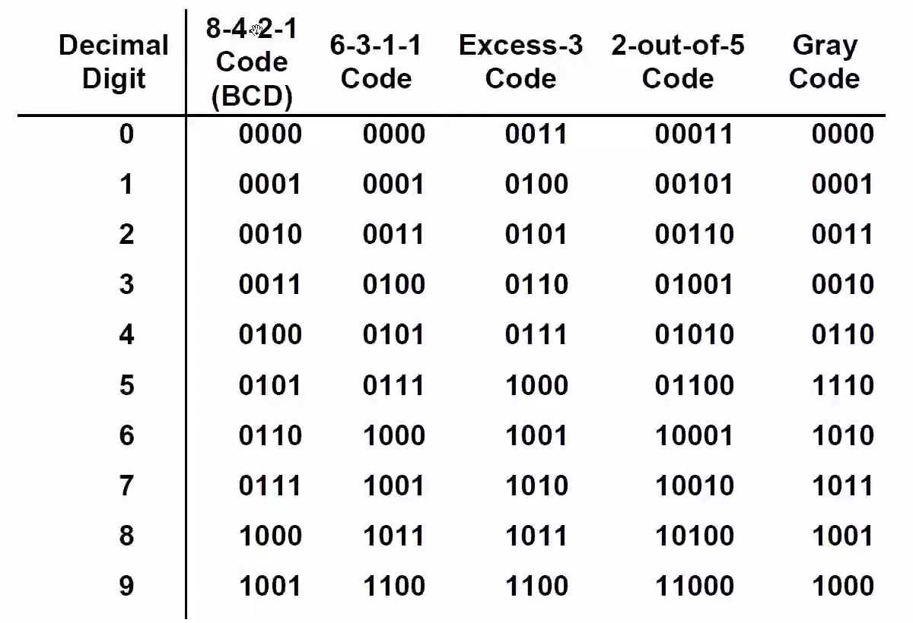