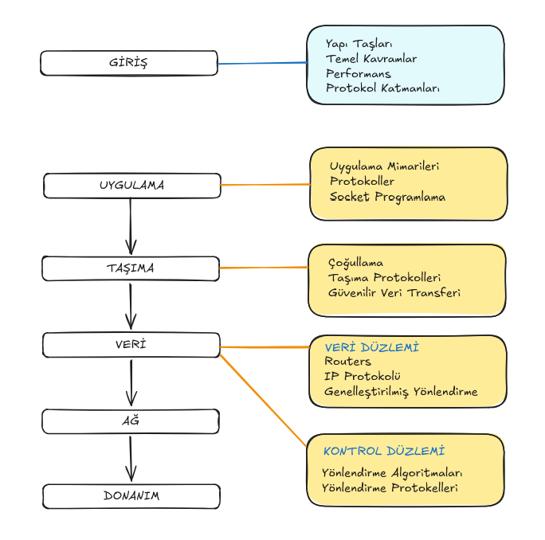

## İçerik

- [1.1 Giriş](#11-giriş-introduction)
- [Temel Kavramlar](#temel-kavramlar)
  - [1.2 Network Edge](#12-ağın-ucu-network-edge)
  - [1.3 Network Core](#13-ağ-çekirdeği-network-core)
- [1.4 Performans](#14-ağ-performansı-delay--throughput)
- [1.5 Protokol Katmanları](#15-protokol-katmanları-ve-encapsulation)
- [1.6 Ağ Güvenliği](#16-ağ-güvenliği-network-security)
- [1.7 Bilgisayar Ağları Tarihi](#17-bilgisayar-ağları-tarihi)
- [İnterneti Kim Kontrol Ediyor](#i̇nterneti-kim-kontrol-ediyor)
- [İnterneti Kim Kullanıyor?](#i̇nterneti-kim-kullanıyor-who-uses-the-internet)

## 1.1 Giriş (Introduction)

**İnternet Nedir?**  
1. **"Somut" (Donanım/Yazılım) Bakış Açısıyla İnternet:**
- **Fiziksel Bir Altyapıdır:** İnternet, dünya çapında milyarlarca bilgisayar ve cihazı birbirine bağlayan devasa bir ağdır. Bu cihazlara **host** veya **uç sistem (end system)** denir.  

- **Ağların Ağıdır (Network of Networks):** Tek bir ağ değil, birbirine bağlı yüzbinlerce farklı ağdan oluşur. Bu ağlara örnek olarak ev ağları, mobil ağlar, kurumsal ağlar, internet servis sağlayıcı (ISP) ağları ve veri merkezi ağları verilebilir.

- **Bağlantı Elemanları:** Bu uç sistemler birbirine iletişim bağlantıları (communication links) (kablo, fiber optik, radyo dalgaları gibi) ve paket anahtarları (packet switches) (yönlendiriciler/router'lar ve anahtarlar/switch'ler) aracılığıyla bağlanır.

- **Protokollerle Çalışır:** Tüm bu donanım ve yazılımın uyum içinde çalışmasını sağlayan kurallar bütününe protokol denir (HTTP, TCP, IP, WiFi gibi). Bu protokoller uluslararası standartlarla (RFC'ler gibi) belirlenir.
**Protokol Nedir?**  
İki veya daha fazla iletişim kuran varlığın (insan veya bilgisayar) birbirini anlaması ve başarılı bir iletişim kurması için uyması gereken, önceden belirlenmiş kurallar dizisidir.  

2. **"Hizmet" (Yazılım/Uygulama) Bakış Açısıyla İnternet:**

- **Uygulamalara Altyapı Sağlar:** İnternet, üzerinde çalışan dağıtık uygulamalara (web, video akışı, e-posta, oyun, sosyal medya vb) hizmet veren bir altyapıdır.

- **Programlama Arayüzü Sunar:** Uygulamaların (örneğin bir e-posta programının veya web tarayıcısının) İnternet'e bağlanıp veri gönderip alabilmesi için "kancalar" veya "programlama arayüzleri" sağlar. Bu, tıpkı posta servisinin mektup göndermek için bir altyapı ve kurallar sağlamasına benzer. Uygulamalara farklı hizmet seçenekleri (örneğin hızlı ama güvenilmez veya yavaş ama güvenilir teslimat gibi) sunar.

**Protokol Nedir?**  
- **Tanım:** Bir iletişimde, iki veya daha fazla taraf arasındaki etkileşimi düzenleyen kurallar bütünüdür. Bu kurallar, hangi mesajların gönderileceğini ve bir mesaj alındığında veya başka bir olay gerçekleştiğinde hangi aksiyonların alınacağını belirler.

 

## Temel Kavramlar

## 1.2 Ağın Ucu (Network Edge) 

İki ana konu ele alınır: Erişim Ağları ve Fiziksel Ortam.

---

### 1. Erişim Ağları (Access Networks)

Erişim ağı, bir uç cihazı (bilgisayar, akıllı telefon) veya bir ev ağını, internetin geri kalanına bağlayan ilk ağdır. Cihazı, kaynaktan hedefe giden yoldaki **ilk durak yönlendiriciye (first-hop router)** bağlar.

Üç temel erişim ağı türü vardır:
- **Konutsal (Residential) Erişim Ağları:** Evleri bağlar.
- **Kurumsal (Institutional) Erişim Ağları:** Şirket, okul veya belediye gibi kurumları bağlar.
- **Mobil (Mobile) Erişim Ağları:** Hücresel operatörler veya Wi-Fi ağları üzerinden bağlantı sağlar.

Bu ağları incelerken akılda tutulması gereken iki önemli nokta:
1.  **Bit İletim Hızı:** Bağlantı ne kadar hızlı?
2.  **Paylaşım:** Kullanıcılar bu ağı diğer kullanıcılarla ne ölçüde paylaşmak zorunda?

#### 1.1. Kablolu Erişim Ağları (Cable-Based Access)

- **Çalışma Prensibi:** Birden fazla eve hizmet veren ortak bir kablolu ağ altyapısı kullanılır. Evler, bir kablolu ağ merkezine (cable head end) bağlanır.
- **Teknoloji:** Sinyaller, **Frekans Bölmeli Çoğullama (FDM)** ile farklı frekanslarda gönderilir (FM radyo gibi). Bu sayede sinyaller birbirine karışmaz. Ancak belirli bir frekans bandı, komşular arasında paylaşılır.
- **Asimetrik Yapı:** Genellikle **asimetriktir**; yani **aşağı yönlü (downstream)** veri hızı, **yukarı yönlü (upstream)** veri hızından daha yüksektir. Bu, kullanıcıların genellikle veri tüketicisi (indirme) olmasından kaynaklanır.
    - Aşağı Yönlü Hız: 40 Mbps - 1.2 Gbps
    - Yukarı Yönlü Hız: 30 - 100 Mbps
- **Önemli Not:** Ağ **paylaşımlıdır**. Komşunuz yoğun veri kullanıyorsa, sizin kullanabileceğiniz bant genişliği azalabilir.

#### 1.2. Dijital Abone Hattı (DSL - Digital Subscriber Line)

- **Çalışma Prensibi:** Mevcut telefon hatları (bükümlü çift kablolar - twisted pair) kullanılır.
- **Teknoloji:** Eviniz, telefon santraline (central office) doğrudan bağlıdır.
- **Paylaşım:** Kablolu ağın aksine, sizinle santral arasındaki hat **size özeldir**, komşularla paylaşılmaz.
- **Asimetrik Yapı:** DSL de asimetriktir.
    - Aşağı Yönlü Hız: 24 - 52 Mbps
    - Yukarı Yönlü Hız: 3.5 - 16 Mbps
- **Kısıt:** Hız, evinizle santral arasındaki mesafeye çok bağlıdır. Yaklaşık 3 milden (5 km) uzaksanız, DSL hizmeti alamayabilirsiniz.

#### 1.3. Ev Ağları (Home Networks)

- Tipik bir ev ağı şunlardan oluşur:
    - **Modem (Modülatör/Demodülatör):** Dış dünyadan gelen DSL veya kablo sinyalini dönüştürür.
    - **Yönlendirici (Router):** Modeme bağlıdır ve ev içindeki cihazlara bağlantı sağlar. Genellikle kablolu (Ethernet) ve kablosuz (Wi-Fi) bağlantıları bir arada sunar.
    - **Bağlantı Türleri:**
        - **Kablolu Ethernet:** 100 Mbps veya 1 Gbps hızlarında.
        - **Kablosuz Wi-Fi:** Onlarca veya yüzlerce Mbps hızlarında.

#### 1.4. Kablosuz Erişim Ağları (Wireless Access Networks)

- **İki Ana Sınıf:**
    1.  **Yerel Kablosuz Ağlar (Wi-Fi / WLAN):**
        - Kısa mesafe (10-100 metre).
        - IEEE 802.11 ailesi protokolleri.
        - Hızlar: 11 Mbps'den 450 Mbps ve üzerine kadar.
    2.  **Geniş Alan Kablosuz Ağlar (Hücresel - 3G, 4G, 5G):**
        - Uzun mesafe (onlarca kilometre).
        - Mobil operatörler tarafından işletilir.
        - Kullanıcı başına hızlar: 1 Mbps'den onlarca Mbps'ye kadar.
- Her iki türde de cihazların bağlandığı bir **baz istasyonu (base station)** veya **erişim noktası (access point)** bulunur.

#### 1.5. Kurumsal ve Veri Merkezi Ağları (Enterprise & Data Center Networks)

- **Kurumsal Ağlar:** Ev ağlarının "steroidli" halidir. Çok sayıda cihazı desteklemek için birden fazla anahtar (switch) ve yönlendirici (router) içerir. Kablolu Ethernet ve kablosuz Wi-Fi karışımını kullanır.
- **Veri Merkezi Ağları:** Çok sayıda sunucuyu birbirine ve internete bağlar. Çok yüksek hızlarda (yüzlerce Gbps) çalışır.

---

### 2. Veri Paketleri (Packets) ve İletim

- Bir kaynak (host) büyük bir veriyi (örneğin bir dosya) göndermek istediğinde, onu daha küçük parçalara böler. Bu parçaların her birine **paket (packet)** denir.
- Her pakete, gönderim için gerekli ek bilgileri içeren bir **paket başlığı (packet header)** eklenir.
- Bir paket (veri + başlık) **L bit** uzunluğundadır (örneğin 1500 bayt).
- Kaynak, bu L bitlik paketi, erişim ağına **R bit/saniye** hızında iletir.
    - **R**, **link iletim hızı (link transmission rate)** veya **link kapasitesi (link capacity)** olarak adlandırılır.
- **İletim Süresi:** Bir paketi linke göndermek için geçen süre = `L (bit) / R (bit/sn)`.

---

### 3. Fiziksel Ortam (Physical Media)

Fiziksel ortam, bitlerin kaynaktan hedefe iletilmesini sağlayan fiziksel yoldur. İki ana türü vardır: **Kılavuzlu (guided)** ve **Kılavuzsuz (unguided)**.

#### 3.1. Kılavuzlu Ortam (Guided Media)
Sinyal, fiziksel bir kablo içinde ilerler.

- **Bükümlü Çift Kablo (Twisted Pair):**
    - Eski telefon hatları ve günümüz Ethernet/ADSL kabloları.
    - Yüzlerce Mbps / Gbps hızlarına ulaşabilir.
    - Elektromanyetik gürültüden etkilenebilir.
- **Koaksiyel Kablo (Coaxial Cable):**
    - Kablolu TV ve internet için kullanılır.
    - Yüzlerce Mbps hızında çalışır.
- **Fiber Optik Kablo (Fiber Optics):**
    - Işık darbeleriyle veri iletir.
    - Çok yüksek hızlar (yüzlerce Gbps ve üzeri) ve çok düşük hata oranı sunar.
    - Gönderici/alıcı bileşenleri daha pahalıdır.

#### 3.2. Kılavuzsuz Ortam (Unguided Media - Kablosuz)
Sinyal, radyo dalgaları gibi kılavuzsuz bir ortamda yayılır.

- **Özellikler:**
    - **Yayın (Broadcast):** Sinyal, verici civarındaki tüm cihazlar tarafından alınabilir (dinleme/güvenlik riski).
    - **Zorlu Ortam:** Sinyaller mesafeyle zayıflar, engellerden yansır veya bloke olur, motor/mikrodalga gibi cihazlardan kaynaklanan gürültüden etkilenir.
- **Türler:**
    - **Wi-Fi:** Onlarca metre, yüzlerce Mbps.
    - **4G Hücresel:** Onlarca km, onlarca Mbps.
    - **Bluetooth:** Kısa mesafe (5-10 m), düşük hız (1-2 Mbps), kablo alternatifi.
    - **Karasal Mikrodalga (Terrestrial Microwave) / Uydu (Satellite):** Noktadan noktaya veya geniş alana yayın. Uydularda belirgin bir **yayılma gecikmesi (propagation delay)** vardır (jeosenkron uydu için ~270 ms).

 

## 1.3 Ağ Çekirdeği (Network Core) 

Ağın merkezinde neler olduğunu, paketlerin yönlendiriciler arasında nasıl ilerlediğini ve internetin yapısını açıklamaktadır.

---

### 1. AĞ ÇEKİRDEĞİNİN TEMEL BİLEŞENLERİ

Ağ çekirdeği, bir dizi **yönlendirici (router)** ve bunları birbirine bağlayan **iletişim bağlantılarından (communication links)** oluşur.

- **Paket Anahtarlama (Packet Switching):** Ağ çekirdeğinin çalışma prensibidir. Uç cihazlar, uygulama mesajlarını parçalara ayırıp **paketler** oluşturur ve bu paketleri ağa gönderir. Paketler, kaynaktan hedefe bir yol boyunca iletilir.

---

### 2. TEMEL İKİ İŞLEV: YÖNLENDİRME (ROUTING) VE İLETME (FORWARDING)

| İşlev | Türü | Açıklama | Analoji |
|-------|------|----------|---------|
| **İletme (Forwarding)** | Yerel (Local) | Gelen bir paketi, yönlendiricinin uygun çıkış bağlantısına taşımak. Her yönlendiricideki **iletme tablosu (forwarding table)** kullanılır. | Bir kavşakta hangi çıkış yoluna sapacağına karar vermek. |
| **Yönlendirme (Routing)** | Küresel (Global) | Paketlerin kaynaktan hedefe izleyeceği yolları (path) belirlemek. Yönlendirme algoritmaları, bu yolları hesaplar ve yerel iletme tablolarını oluşturur. | Seyahat öncesi San Jose'den Northampton'a hangi rotadan (üst yol mu, alt yol mu) gidileceğine karar vermek. |

---

### 3. PAKET İLETİMİ VE DEPOLA VE İLET (STORE AND FORWARD)

- Bir paket **L bit** uzunluğunda ve link iletim hızı **R bit/sn** ise, paketi linke gönderme süresi = **L/R saniye**.
- **Depola ve İlet (Store and Forward):** Bir yönlendirici, bir paketin tüm bitlerini tamamen aldıktan (**depoladıktan**) sonra, bir sonraki yönlendiriciye göndermeye (**iletmeye**) başlar.

---

### 4. PAKET KUYRUKLANMASI (QUEUING) VE KAYBI (LOSS)

- **Sorun:** Gelen linklerin hızı, giden linkin hızından yüksek olabilir.
    - *Örnek:* A ve B'den gelen linkler 100 Mbps, bir sonraki link 1.5 Mbps.
- **Kuyruk Oluşumu:** Paketler, gidiş linkinden daha hızlı geldiğinde, yönlendiricide **kuyruk (queue)** oluşur. Bu da **kuyruk gecikmesi (queuing delay)** yaşanmasına neden olur.
- **Paket Kaybı:** Yönlendiricinin belleği (kuyruk için ayrılan alan) dolduğunda, yeni gelen paketler **kaybolur (packet loss)** veya **düşürülür (dropped)** .

---

### 5. DEVRE ANAHTARLAMA (CIRCUIT SWITCHING) vs. PAKET ANAHTARLAMA

| Özellik | Devre Anahtarlama | Paket Anahtarlama |
|---------|--------------------|-------------------|
| **Kaynak Ayırma** | Çağrı başlamadan önce tüm kaynaklar tahsis edilir. | Kaynaklar paylaşılır, tahsis yok. |
| **Kuyruk/Kayıp** | Olmaz (kaynaklar özel olduğu için). | Olabilir (tıkanıklık durumunda). |
| **Verimlilik** | Düşük (kaynaklar boş kalabilir, başkası kullanamaz). | Yüksek (istatistiksel çoğullama - statistical multiplexing). |
| **Kullanım** | Geleneksel telefon ağları. | İnternet (günümüz telefon ağları bile paket kullanır). |

#### FDM ve TDM (Devre Anahtarlama Teknikleri)

- **FDM (Frekans Bölmeli Çoğullama):** Spektrum dar frekans bantlarına bölünür, her çağrıya bir bant tahsis edilir.
- **TDM (Zaman Bölmeli Çoğullama):** Zaman dilimlere ayrılır, her çağrıya periyodik zaman dilimleri tahsis edilir.

#### 📊 Sayısal Örnek: 1 Gbps Link

- **Varsayım:** Her kullanıcı aktifken 100 Mbps ihtiyaç duyar, zamanın sadece %10'u aktiftir.
- **Devre Anahtarlama:** Desteklenebilecek maksimum kullanıcı = **10** (1 Gbps / 100 Mbps).
- **Paket Anahtarlama:** Eğer 35 kullanıcı aynı anda sisteme alınırsa, 10'dan fazlasının aynı anda aktif olma (yani kuyruk oluşma) olasılığı sadece **%0.04'tür**. Bu, istatistiksel çoğullama kazancıdır ve 10 yerine 35 kullanıcıya hizmet vermeyi mümkün kılar.

---

### 6. İNTERNETİN YAPISI: AĞLAR AĞI

İnternet, milyonlarca erişim ağını birbirine bağlayan hiyerarşik bir yapıdır.

1.  **Erişim Ağları (Access ISPs):** Kullanıcıların (ev, mobil, kurum) bağlı olduğu ağlar.
2.  **Bölgesel Ağlar (Regional Networks):** Erişim ağlarını birbirine ve omurgaya bağlar. (Ör: NYSERNET)
3.  **Birinci Seviye (Tier 1) ISPs:** Ulusal ve uluslararası omurga ağları. (Ör: Level 3, Sprint, AT&T, NTT)
4.  **İnternet Değişim Noktaları (IXPs):** Farklı ağların birbiriyle doğrudan bağlantı (peering) kurduğu noktalar.
5.  **İçerik Sağlayıcı Ağları (Content Provider Networks):** Google, Facebook, Microsoft gibi şirketlerin kendi içeriklerini kullanıcıya yaklaştırmak için kurduğu özel ağlar. Bazen Tier 1 ağları by-pass ederler.

> **Özet:** İnternet, merkezde birkaç büyük omurga ağı (Tier 1), bunların etrafında bölgesel ağlar ve en uçta da milyonlarca erişim ağından oluşan devasa bir **ağlar ağıdır**.

 

## 1.4 Ağ Performansı (Delay & Throughput)

Bu bölüm, ağ performansının iki temel unsuru olan **gecikme (delay)** ve **verim (throughput)** kavramlarını derinlemesine incelemektedir.

---

### 1. GECİKMENİN (DELAY) 4 BİLEŞENİ

Bir paket yönlendiricide işlenirken toplam 4 farklı gecikmeye maruz kalır:

| Gecikme Türü | Açıklama | Süre |
|--------------|----------|------|
| **1. İşlem Gecikmesi (Processing Delay)** | - İletme tablosuna bakma - Paket bütünlük kontrolü - Anahtarlama işlemi | Mikrosaniye veya daha az |
| **2. Kuyruk Gecikmesi (Queuing Delay)** | Paketin çıkış linkinde sırada bekleme süresi. Ağdaki tıkanıklık seviyesine bağlıdır. | Değişken |
| **3. İletim Gecikmesi (Transmission Delay)** | Paketin tüm bitlerini linke gönderme süresi = **L (bit) / R (bit/sn)** | L/R |
| **4. Yayılma Gecikmesi (Propagation Delay)** | Bir bitin linkin başından sonuna gitme süresi. Işık hızına yakındır. Örnekler: - Uydu bağlantısı: ~270 ms - Transatlantik: ~30 ms | Mesafe / Hız |

---

### 2. İLETİM vs. YAYILMA GECİKMESİ (KARŞILAŞTIRMA)

Bu iki kavram sıkça karıştırılır. **Tollbooth (Gişe) Analojisi:**

| Kavram | Analoji | Açıklama |
|--------|---------|----------|
| **İletim (Transmission)** | Arabaların gişeden geçmesi | Paketin *tüm bitlerinin* linke konulma süresi |
| **Yayılma (Propagation)** | Arabaların yolda ilerlemesi | Bir bitin linkin *diğer ucuna ulaşma* süresi |

**Örnek:** 10 araçlık konvoy, her araç için 12 sn gişe işlemi, gişeler 100 km aralıklı, araç hızı 100 km/s.
- **İletim süresi:** 10 araç × 12 sn = **120 sn (2 dk)**
- **Yayılma süresi:** 100 km / 100 km/s = **60 dk**
- **Toplam süre:** 62 dk (konvoyun 2. gişe önünde toplanması)

---

### 3. TRAFİK YOĞUNLUĞU (TRAFFIC INTENSITY) ve KUYRUK GECİKMESİ

- **a** = Ortalama paket varış hızı (paket/sn)
- **L** = Paket uzunluğu (bit)
- **R** = Link bant genişliği (bit/sn)

**Trafik Yoğunluğu = (L × a) / R**

| Trafik Yoğunluğu | Sonuç |
|------------------|-------|
| **Küçük (<<1)** | Kuyruk nadiren oluşur, gecikme az |
| **1'e yaklaşırken** | Kuyruk gecikmesi çok hızlı artar (grafikte dik yükseliş) |
| **>1** | İş yükü kapasiteyi aşar → kuyruk sonsuz büyür, gecikme sonsuz |

> **Trafik yoğunluğu 1'e yaklaştıkça gecikme patlar!** (Otoban trafiği gibi)

---

### 4. TRACEROUTE: GERÇEK ZAMANLI GECİKME ÖLÇÜM ARACI

**Traceroute**, kaynaktan hedefe giden yoldaki her yönlendiriciye olan gecikmeyi (RTT) ölçen bir programdır.

**Çalışma Prensibi:**
1. 1. yönlendiriciye 3 paket gönder → gelen cevaplarla RTT ölç → göster
2. 2. yönlendiriciye 3 paket gönder → RTT ölç → göster
3. Hedefe ulaşana kadar devam et

**Örnek Çıktı (UMass → Eurocom.fr):**

| Hop | Lokasyon | RTT (ms) | Açıklama |
|-----|----------|----------|----------|
| 1 | UMass içi | 1, 1, 2 | İlk yönlendirici |
| 2 | UMass içi | 1, 1, 2 | Yakın |
| ... | ... | ... | |
| 4 | Washington DC | 22 | ABD doğu yakası |
| ... | ... | 105 | Fransa'ya varış (Atlantik aşımı) |
| ... | * * * | - | Cevap vermeyen yönlendirici |

**Notlar:**
- RTT bazen azalabilir (farklı yol, değişen tıkanıklık)
- Yıldız (*) işareti: yönlendirici cevap vermiyor

---

### 5. PAKET KAYBI (PACKET LOSS)

- **Nedeni:** Yönlendirici tamponları dolar, yeni gelen paket depolanamaz.
- **Sonuç:** Paket düşürülür (dropped) veya kaybolur.
- **Ölçüm:** Bazı durumlarda paketlerin %10-20'si kaybolabilir.
- **Çözüm:** Bölüm 3'te anlatılacak (TCP ile kayıp tespiti ve hız kontrolü).

---

### 6. VERİM (THROUGHPUT)

**Tanım:** Kaynaktan hedefe birim zamanda (bit/sn) gönderilen veri miktarı.

- **Anlık (instantaneous):** Çok kısa aralıkta ölçülen
- **Ortalama (average):** Uzun zaman aralığında ölçülen

#### 🔧 Darboğaz (Bottleneck) Kavramı (Sıvı-Boru Analojisi)

Uçtan uca verim, yol üzerindeki **en ince boru** (en düşük kapasiteli link) tarafından sınırlanır.

**Senaryo 1:** İnce boru (Rs) → Kalın boru (Rc)
- **Verim = Rs** (ilk link sınırlar)

**Senaryo 2:** Kalın boru (Rs) → İnce boru (Rc)
- **Verim = Rc** (ikinci link sınırlar)

> **Genel Kural:** Uçtan uca verim = **min(Rs, Rc, R/10, ...)** yol boyunca tüm linklerin kapasitelerinin en küçüğü.

#### 🌐 Çoklu Akış (Multiple Flows) Durumu

- 10 sunucu → 10 istemci, ortak bir link (kapasite R) paylaşılıyor.
- Link adil paylaşım yapıyorsa, her akış **R/10** alır.
- Bir akışın uçtan uca verimi = **min(Rs, Rc, R/10)**

> **Pratikte:** Darboğaz genellikle **ağın ucunda** (erişim linklerinde) olur, çekirdekte değil.

> *İlerleyen bölümlerde (özellikle Bölüm 3), TCP'nin kayıp ve tıkanıklıkla nasıl başa çıktığı detaylandırılacaktır.*

 

## 1.5 Protokol Katmanları ve Encapsulation

Son derece karmaşık bir sistem olan internetin tasarımını, öğretilmesini ve öğrenilmesini kolaylaştıran **katmanlı mimari (layered architecture)** kavramını ele almaktadır.

---

### 1. KATMANLI MİMARİ (LAYERED ARCHITECTURE) NEDEN GEREKLİ?

İnternet milyarlarca etkileşimli parçadan oluşan dev bir sistemdir. Bu karmaşıklıkla başa çıkmak için **katmanlı mimari** kullanılır.

#### ✈️ Havayolu Yolculuğu Analojisi

Karmaşık bir havayolu sistemini düşünelim (uçaklar, pistler, kuleler, bagajlar, güvenlik, yolcular...). Bu sistemi anlatmak için:
1.  **Adımlara bölmek:** Bilet al → check-in yap → bagajı ver → güvenlikten geç → kapıya git → uçağa bin → uç → iniş → çıkış (işlemleri tersine yap).
2.  **Yatay (Katmanlı) düşünmek:** Kalkış tarafındaki bir işlev (örneğin uçağa binme) ile varış tarafındaki ilgili işlev (uçaktan inme) birlikte bir **hizmet (service)** sunar (yolcuyu taşıma). Bu hizmet, daha alt katmanların (örneğin uçağın uçması) hizmetlerine güvenir.

#### ✅ Katmanlı Mimarinin Avantajları

1.  **Net Yapı:** Sistemin parçalarını ve bunların ilişkilerini gösteren açık bir referans modeli sağlar.
2.  **Modülerlik (Modularization):**
    - Bir katman, kendinden üstteki katmandan bilgi alır.
    - Kendi hizmetini sunmak için alttaki katmanın hizmetlerini kullanır.
    - Bir katmanın iç işleyişi değiştirilirse, **diğer katmanlar etkilenmez** (arayüzler aynı kaldığı sürece). Bu, bakım ve güncellemeyi kolaylaştırır.

---

### 2. İNTERNETİN 5 KATMANLI MİMARİSİ

İnternet, yukarıdan aşağıya doğru 5 katmandan oluşur. Bu kurs da **tepeden aşağıya (top-down)** bir yaklaşım izleyecektir.

| Katman | Görevi | Protokol Veri Birimi (PDU) |
|--------|--------|-----------------------------|
| **1. Uygulama (Application)** | Uygulamanın dağıtık parçaları arasında mesaj alışverişini kontrol eden protokoller. | **Mesaj (Message)** |
| **2. Taşıma (Transport)** | Uygulama katmanı mesajlarını bir **işlemden (process)** başka bir işleme taşır. (TCP güvenilir taşıma sağlar). | **Segment (Segment)** |
| **3. Ağ (Network)** | Veriyi bir **cihazdan (host)** başka bir cihaza taşır. İnternet protokolü (IP) "en iyi çaba (best effort)" hizmeti sunar (garanti yok). | **Verigram (Datagram)** |
| **4. Bağlantı (Link)** | Veriyi aynı iletişim bağlantısının iki ucu arasında taşır (örn: iki yönlendirici arası). | **Çerçeve (Frame)** |
| **5. Fiziksel (Physical)** | Bitlerin link üzerinden gönderilmesini kontrol eder. | - |

> **Önemli Fark:** Ağ katmanı **cihazdan cihaza (host-to-host)** iletişim, taşıma katmanı ise **işlemden işleme (process-to-process)** iletişim sağlar.

---

### 3. KAPSÜLLEME (ENCAPSULATION) - VERİNİN YOLCULUĞU

Kapsülleme, bir üst katmandaki veri birimine, o katmanın kendi başlık (header) bilgisini ekleyerek yeni bir alt katman veri birimi oluşturma işlemidir. Bu, internetin temel işleyiş mekanizmasıdır.

**Veri Gönderilirken (Yukarıdan Aşağıya):**

1.  **Uygulama Katmanı:** Uygulama, gönderilecek **Mesaj (Message)** oluşturur.
2.  **Taşıma Katmanı:** Mesajı alır, kendi başlık bilgisini (**Ht**) ekler ve bir **Segment (Segment)** oluşturur.
    - *Örnek Bilgi:* Hangi işleme (process) gideceğini belirten bilgi (port numarası), güvenilirlik için gereken bilgiler.
3.  **Ağ Katmanı:** Segmenti alır, kendi başlık bilgisini (**Hn**) ekler ve bir **Verigram (Datagram)** oluşturur.
    - *Örnek Bilgi:* Gönderen ve alıcı cihazın IP adresleri.
4.  **Bağlantı Katmanı:** Datagramı alır, kendi başlık bilgisini (**Hl**) ekler ve bir **Çerçeve (Frame)** oluşturur.
5.  **Fiziksel Katman:** Çerçevedeki bitleri fiziksel ortama (kablo veya hava) gönderir.

**Veri Alınırken (Aşağıdan Yukarıya):**

- İşlem tersine işler. Her katman, kendi başlık bilgisini okur, gerekli işlemi yapar, başlığı çıkarır ve kalan veriyi bir üst katmana teslim eder.

---

### 4. UÇTAN UCA (END-TO-END) BAKIŞ

- Bir uygulama mesajı, kaynaktaki uygulama katmanından hedefteki uygulama katmanına doğru yolculuğuna başlar.
- Bu yolculuk sırasında veri, katmanlar boyunca aşağı iner, ağ üzerinden geçer ve hedefte tekrar yukarı çıkar.
- **Önemli Not:** Ağın içindeki **anahtarlar (switches) ve yönlendiriciler (routers)**, protokol yığınının sadece **alt katmanlarını** (fiziksel, bağlantı ve ağ katmanları) uygularlar.
    - Çünkü onların görevi, sadece çerçeveleri (frame) ve verigramları (datagram) iletmektir.
    - İçlerindeki taşıma katmanı segmenti veya uygulama katmanı mesajıyla ilgilenmezler.

---

### (ÖNEMLİ KAVRAMLAR)

| Kavram | Açıklama |
|--------|----------|
| **Katmanlı Mimari** | Karmaşık sistemleri (internet gibi) daha küçük, yönetilebilir ve bağımsız katmanlara ayırarak tasarlama ve anlama yöntemi. |
| **Protokol Veri Birimi (PDU)** | Belirli bir katmanda birim olarak ele alınan veri paketi (Mesaj, Segment, Datagram, Frame). |
| **Kapsülleme (Encapsulation)** | Bir üst katmandan gelen veriye, o katmanın kendi başlık bilgisini ekleyerek yeni bir PDU oluşturma süreci. |
| **Başlık (Header)** | Bir katmanın kendi hizmetini sunabilmesi için (adresleme, güvenilirlik, sıralama vb.) eklediği kontrol bilgisi. |
| **Hizmet (Service)** | Bir katmanın bir üst katmana sağladığı işlevsellik (örneğin, taşıma katmanının uygulama katmanına güvenilir veri taşıma hizmeti sunması). |

> *Bu bölüm, internetin nasıl organize olduğunu anlamak için temel bir çerçeve sunmaktadır. İlerleyen bölümlerde her bir katman (Uygulama, Taşıma, Ağ, Link) derinlemesine incelenecektir.*

 

## 1.6 Ağ Güvenliği (Network Security) 

Ağ güvenliğine yüksek seviyeli bir giriş yapmakta, tehditleri ve savunma yöntemlerini ele almaktadır. (Detaylı anlatım Bölüm 8'de yapılacaktır.)

---

### 1. GİRİŞ: İNTERNETİN GÜVENLİK TASARIMI

- **Orijinal Tasarım Vizyonu:** İnternet, başlangıçta "birbirine **güvenen** kullanıcıların şeffaf bir ağa bağlandığı" bir yapı olarak düşünülmüştü.
- **Güvenlik Öncelikli Değildi:** Tasarımcılar güvenliği unutmadı, ancak dönemin kullanım senaryoları göz önüne alındığında, **kritik bir tasarım kriteri olarak görülmedi**.
- **Bugünkü Durum:** Hâlâ güvenlik açıklarını kapatmaya çalışıyoruz.

---

### 2. TEMEL GÜVENLİK SORULARI

1.  **Saldırılar (Attacks):** Kötü niyetli kişiler bir ağa nasıl saldırabilir veya onu nasıl tehlikeye atabilir?
2.  **Savunmalar (Defenses):** Bu saldırılara karşı nasıl korunabilir, etkilerini nasıl azaltabiliriz?
3.  **Güvenli Tasarım (Security by Design):** Saldırılara karşı bağışık (veya dirençli) ağ mimarileri nasıl tasarlanır? (Güncel bir araştırma alanı)

---

### 3. SALDIRI TÜRLERİ (Bad Things Bad Actors Can Do)

Kötü niyetli aktörlerin ağ ortamında yapabileceği başlıca kötü şeyler:

| Saldırı Türü | Açıklama | Örnek / Analoji |
|---------------|----------|-------------------|
| **Paket Koklama (Packet Sniffing)** | Paylaşımlı ortamda (özellikle kablosuz ağlarda) geçen paketlerin kopyalarını ele geçirmek. | Wireshark gibi araçlar. |
| **Spoofing / Sahtecilik** | Ağa, kaynak adresi sahte olan paketler enjekte etmek. | Bankadan geldiğini iddia eden bir phishing e-postası. |
| **Hizmet Engelleme (DoS / DDoS)** | Bir ağ cihazına (sunucu, yönlendirici) aşırı iş yükü oluşturarak hizmet veremez hale getirmek. | Bir HTTP sunucusunu sahte isteklerle boğmak. Dağıtık saldırı (DDoS) için ele geçirilmiş binlerce bilgisayar (botnet) kullanılır. |

---

### 4. SAVUNMA YÖNTEMLERİ (Defenses)

Bu saldırılara karşı kullanılan başlıca savunma mekanizmaları:

| Savunma Yöntemi | Açıklama | Hangi Saldırıya Karşı? |
|------------------|----------|-------------------------|
| **Kimlik Doğrulama (Authentication)** | Bir hizmete erişmeden önce kullanıcının kimliğini kanıtlamasını istemek (örn: şifre, SIM kart). | Spoofing (sahtecilik) |
| **Şifreleme (Encryption)** | Paket içeriğini şifreleyerek, ele geçirilse bile okunamaz hale getirmek. | Paket Koklama (Sniffing) |
| **Dijital İmza (Digital Signature)** | Verinin göndericisinin doğruluğunu ve yol boyunca değiştirilmediğini garanti etmek. | Veri Tahrifatı (Tampering) |
| **Erişim Kontrolü (Access Control)** | Kaynaklara kimlerin, hangi işlemler için erişebileceğini belirlemek ve erişim öncesi kimlik doğrulama istemek. | Yetkisiz Kullanım |
| **Güvenlik Duvarı (Firewall)** | Ağa giriş/çıkış yapan trafiği denetleyen, belirli kullanıcıları veya trafik tiplerini engellemek üzere programlanabilen özel donanım/yazılım. | Genel Saldırılar (Bölüm 4'te detaylandırılacak) |

> **Önemli Not:** Güvenlik duvarları ve benzeri cihazlar, "ara kutu (middle box)" olarak adlandırılır ve Bölüm 4'te (Genelleştirilmiş İletme) detaylandırılacaktır.

---

> *Bu konu, kurs boyunca her katmanda (uygulama, taşıma, ağ, link) güvenlik perspektifiyle ele alınacak ve Bölüm 8'de derinlemesine incelenecektir.*

## 1.7 Bilgisayar Ağları Tarihi
Bilgisayar ağlarının 1960'lardan günümüze kadar olan gelişimini **5 ana dönemde** incelemektedir.

---

### 📜 GİRİŞ: TARİHSEL PERSPEKTİF

- **Ağ oluşturma fikirleri yeni değil:** 1879'da Paris'te ilk telefon santrali kuruldu. Hatta bundan önce semafor ağları (işaret kuleleri) vardı.
- **Kursun Amacı:** İlkelerin ve uygulamaların bir kısmı yeni olsa da, temelleri 60 yıl önceki araştırmalara dayanır.

---

### DÖNEM 1: 1961-1972 - PAKET ANAHTARLAMANIN İLK GÜNLERİ

| Yıl | Gelişme | Önem |
|-----|----------|------|
| **1961** | Leonard Kleinrock (MIT) ilk **paket anahtarlama** makalesini yayınladı. | Kuyruk teorisi kullanarak paket anahtarlamanın **patlamalı (bursty)** trafik için etkinliğini gösterdi. |
| **1964** | Paul Baran (RAND) askeri ağlar için paket anahtarlama üzerine çalışmaya başladı. | İngiltere'deki NPL'de de benzer çalışmalar vardı. **Üç grup birbirinden habersiz aynı fikri geliştiriyordu.** |
| **1967** | ARPA, **ARPANET** planını yayınladı. | Dünyanın ilk paket anahtarlamalı bilgisayar ağı ve internetin en eski doğrudan atası. |
| **1972** | **NCP (Ağ Kontrol Protokolü)** tamamlandı. | TCP/IP'nin doğrudan atası. |
| | Ray Tomlinson ilk **e-posta** programını yazdı. | |
| | ARPANET 15 düğüme (node) ulaştı. | |

---

### DÖNEM 2: 1972-1980 - AĞLARIN ÇOĞALMASI VE BİRBİRİNE BAĞLANMASI

- **Yeni Ağlar:** ARPANET'in yanında başka paket anahtarlamalı ağlar da ortaya çıktı:
    - **ALOHAnet:** Hawaii adalarındaki üniversiteleri bağlayan mikrodalga ağı.
    - **Packet Satellite & Packet Radio:** DARPA'nın projeleri (hücresel veri ağlarının atası).
    - **CYCLADES:** Fransız paket anahtarlama ağı.
- **Ağların Ağı (Internetting) Fikri Doğuyor:**
    - **1974:** Vint Cerf ve Bob Kahn, **"internetting"** (ağlar arası iletişim) ilkelerini yayınladı.
    - Bu ilkeler bugünün internet mimarisini tanımlar:
        1.  **Minimalizm ve Özerklik (Minimalism & Autonomy):** İç değişiklik gerektirmeden ağları bağlamak.
        2.  **En İyi Çaba Hizmeti (Best Effort):** Kayıp/gecikme olabileceğini kabul eder.
        3.  **Durumsuz Yönlendirme (Stateless Routing)**
        4.  **Merkezi Olmayan Kontrol (Decentralized Control)**
- **1976:** Bob Metcalf, **Ethernet'i** icat etti (PhD tezi).
- **1970'lerin Sonu:** ARPANET 200 düğüme ulaştı. Ticari ağlar kurulmaya başlandı.

---

### DÖNEM 3: 1980'LER - STANDARTLAŞMA VE BÜYÜME

| Yıl | Gelişme | Açıklama |
|-----|----------|----------|
| **1980'ler Başı** | **TCP/IP** standartlaştırıldı. | Bugün hâlâ kullandığımız protokol paketinin temeli. |
| **1982** | **SMTP** (e-posta protokolü) geliştirildi. | Hâlâ e-postanın temel protokolü. |
| **1983** | **DNS** (Alan Adı Sistemi) geliştirildi. | `gaia.cs.umass.edu` gibi adları IP adreslerine çevirir. |
| **1980'ler Sonu** | **TCP'ye tıkanıklık kontrolü** eklendi. | Hostların, tıkanıklık algıladığında gönderme hızını düşürmesini sağlar. |

**Yeni Ağlar:**
- **BITNET:** Üniversiteler arası e-posta ve dosya transferi.
- **CSNET:** ARPANET'e erişimi olmayan araştırmacılar için.
- **1986 - NSFNET:** NSF'nin süper bilgisayar merkezlerine erişim için kuruldu. 1980'lerin sonunda birincil omurga (backbone) haline geldi.
- **1989 Sonu:** Bağlı host sayısı **~100.000**'e ulaştı.

---

### DÖNEM 4: 1990'LAR - TİCARİLEŞME VE WEB'İN DOĞUŞU

| Yıl | Gelişme | Açıklama |
|-----|----------|----------|
| **1991** | **ARPANET** kullanımdan kaldırıldı. | İnternetin atası emekli oldu. |
| | **NSFNET** ticari kullanım kısıtlamalarını kaldırdı. | İlk e-posta reklamları bu dönemde alınmaya başlandı. |
| **1990'lar Başı** | **World Wide Web (WWW)** doğdu. | Tim Berners-Lee (CERN) tarafından icat edildi. **HTML, HTTP, web sunucusu ve tarayıcı**nın ilk sürümleri geliştirildi. |
| **1995** | **NSFNET** kullanımdan kaldırıldı. | Yerini ticari Tier-1 ISP'ler (Sprint, AT&T vb.) aldı. |
| **1990'lar Sonu** | Web kullanımı patladı. | Ağ güvenliği kritik bir konu haline geldi. |
| | Host sayısı **50 milyon**a ulaştı. | Omurga hızları Mbps'den Gbps'ye çıktı. |

---

### DÖNEM 5: 2000'LER - GÜNÜMÜZ

- **Genişbant (Broadband):** Evlere onlarca/yüzlerce Mbps hızında internet girişi.
- **2008 - Yazılım Tanımlı Ağ (SDN):** Tanımlandı (Bölüm 5'te detaylandırılacak).
- **Kablosuzun Yükselişi:** Wi-Fi, 4G ve yakında 5G ağları her yerde.
- **İçerik Sağlayıcı Ağları:** Google, Facebook, Microsoft kendi küresel omurga ağlarını kurdu (Tier-1 ISP'leri by-pass ederek kullanıcıya yakınlaştı).
- **Bulut Bilişim (Cloud Computing):** İşletmeler hizmetlerini AWS, Microsoft Azure gibi bulut platformlarında çalıştırıyor.
- **Mobil Çağ:** 2017'den itibaren internete bağlı **mobil cihaz sayısı**, sabit cihaz sayısını geçti.

---

### 📌 KURSU GENEL BAKIŞ - ŞİMDİYE KADAR NE ÖĞRENDİK?

| Bölüm | Konular |
|-------|---------|
| **Giriş** | İnternet nedir? Protokol nedir? |
| **Ağın Ucu (Edge)** | Hostlar, sunucular, erişim ağları. |
| **Ağ Çekirdeği (Core)** | Paket anahtarlama, devre anahtarlama, ağlar ağı. |
| **Performans** | Gecikme, kayıp, verim (throughput). |
| **Mimari** | Katmanlı mimari, kapsülleme (encapsulation). |
| **Güvenlik** | Saldırı türleri ve savunmalar. |
| **Tarih** | 1961'den günümüze ağların evrimi. |

 

## İnterneti Kim Kontrol Ediyor? 
İnternetin yönetişimi ve kontrolü konusunu ele almaktadır. İnternetin tek bir merkezi otoritesi olmadığı, aksine çok paydaşlı (multi-stakeholder) bir yapıya sahip olduğu vurgulanmaktadır.

---

### 1. GİRİŞ: ÇOK PAYDAŞLI YAPI VE "TÜSLEŞ" (TUSSLE) KAVRAMI

- **İnternet bir "ağlar ağıdır"** ve yüz milyonlarca ağ bulunmaktadır.
- Her bir ağ operatörü, kendi yerel parçası üzerinde **özerkliğe (autonomy)** sahiptir.
- Farklı paydaşların (şirketler, hükümetler, kullanıcılar, sivil toplum) çıkarları genellikle birbiriyle çelişir.
- **Dave Clark'ın "Tussle" Kavramı:** Bu çıkar çatışmaları ve mücadele süreci, internetin evrimi için **kesinlikle hayati (absolutely crucial)** öneme sahiptir.

---

### 2. İNTERNET YÖNETİŞİMİ İÇİN 3 KATMANLI REFERANS MODELİ

İnternetin kimin kontrolünde olduğu sorusunu 3 ayrı katmanda incelemek faydalıdır:

| Katman | Odak Noktası | Anahtar Sorular |
|--------|--------------|-----------------|
| **1. Teknik Altyapı (Standartlar)** | Donanım, yazılım, protokoller, mesaj formatları. | Standartları kim belirler? Ağların birlikte çalışması nasıl sağlanır? |
| **2. İsimler ve Numaralar** | Alan adları (umass.edu) ve IP adresleri (128.119.40.186). | İsimleri kim tahsis eder? İsim-anlaşmazlıkları nasıl çözülür? |
| **3. İçerik (Content)** | İnternette neyin yayınlanacağı, filtreleneceği, erişileceği. | İçeriği kim düzenler (regüle eder)? Erişim nasıl kontrol edilir? |

> **Not:** Bu üç katmanın kontrolü, **teknik, sosyal, politik ve yönetişimsel** süreçlerin bir karışımını içerir.

---

### 3. KATMAN 1: TEKNİK STANDARTLAR - BİRLİKTE ÇALIŞABİLİRLİK (INTEROPERABILITY)

#### 3.1. Standartlar Neden Gereklidir? (Analojiler)

| Analoji | Standart Olmazsa Ne Olur? |
|---------|----------------------------|
| **Elektrik Sistemi** | ABD'de her yerde 120V/60Hz çalışır. Ancak dünyada 15 farklı standart var, bu yüzden cihazlar uluslararası geçişlerde çalışmaz. |
| **Demiryolu (Rail Gauge)** | 1860'larda ABD'de **20 farklı ray açıklığı** vardı. Bir trendin ülkenin bir ucundan diğerine gitmesi imkansızdı. 1886'da tek bir standart (4 ft 8.5 inç) kabul edildi ve ağlar birbirine bağlanabildi. |

> **Çıkarım:** Standartlar, farklı ağların birbirine bağlanarak **tek bir büyük ağ (network of networks)** oluşturmasını sağlar.

#### 3.2. Teknik Standartları Belirleyen Kuruluşlar

| Kuruluş | Görevi / Kapsamı | Ürettiği Belgeler / Standartlar |
|---------|------------------|----------------------------------|
| **IETF** (Internet Engineering Task Force) | İnternet mimarisinin evrimi ve sorunsuz işleyişi için **teknik standartları** geliştiren açık, uluslararası topluluk. | **RFC'ler (Request for Comments):** 9000'den fazla. Örn: HTTP, TCP, IP. |
| **3GPP** (3rd Generation Partnership Project) | Mobil hücresel sistemler (3G, 4G, 5G) için teknik standartlar. | 5G, 4G standartları. |
| **IEEE** (Institute of Electrical and Electronics Engineers) | Ethernet ve Wi-Fi gibi link katmanı protokollerini standartlaştırır. | **802.3** (Ethernet), **802.11** (Wi-Fi). |
| **ITU** (International Telecommunication Union) | En eski ağ standartları kuruluşu (1949'dan beri BM ajansı). | Telekomünikasyon standartları. |

---

### 4. KATMAN 2: İSİMLER VE NUMARALAR - ICANN

İnternet isimlerinin (alan adları) ve numaralarının (IP adresleri) kontrolü **ICANN** (Internet Corporation for Assigned Names and Numbers) tarafından sağlanır.

#### ICANN'in İki Temel Rolü:

1.  **İnternet İsimlerini (Alan Adlarını) Tahsis Etmek:**
    - `umass.edu`nin Üniversiteye ait olduğunu belirlemek kolaydır. Ancak `patagonia` (bölge mi, marka mı?) gibi durumlar karmaşıktır.
    - **Uyuşmazlık Çözüm Politikası:** Kötü niyetli alan adı kayıtları için (örn: `benimadim-aptal.com`) bir çözüm mekanizması sunar.
    - **Ekonomik Değer:** Alan adları çok değerli olabilir (`thedomainnamevoice.com` 30 milyon dolara satıldı).

2.  **İnternet Adreslerini (IP) Yönetmek ve İsim- Adres Çevirisini (DNS) Koordine Etmek:**
    - `gaia.cs.umass.edu` gibi bir ismin, `128.119.40.186` IP adresine çevrilmesi sürecini (DNS) yönetir.

#### ICANN'in Yapısı:

- **Kâr amacı gütmeyen (non-profit)** kuruluş (1998'de kuruldu). Öncesinde bu süreç ABD hükümeti tarafından yürütülüyordu.
- **Taban-yukarı (bottom-up), fikir birliğine dayalı, çok paydaşlı** bir süreç yürütür.
- Toplantıları açıktır, hükümetler, iş dünyası, akademi ve sivil toplum eşit söz hakkına sahiptir.
- **Meydan Okuma:** Bazı kesimler (özellikle 2012'deki bir BM konferansında) hükümetlere daha fazla söz hakkı verilmesini önermiş, ancak bu kabul edilmemiştir.

---

### 5. KATMAN 3: İÇERİK (CONTENT) KONTROLÜ

İnternette hangi içeriğin bulunacağına ve kimlerin erişeceğine dair kararlar, büyük ölçüde ekonomik, politik ve toplumsal boyutları olan bir konudur. Üç ana aktör grubu vardır:

#### 5.1. İnternet Yönetişim Forumu (IGF - Internet Governance Forum)

- BM Genel Sekreteri tarafından toplanan, çok paydaşlı bir **tartışma platformu**dur.
- Karar alma organı değildir; karar alıcıları **bilgilendirmek ve ilham vermek** için vardır.

#### 5.2. İçerik Üreten ve Yayan Şirketler / Platformlar

- Web siteleri, sosyal medya platformları, arama motorları (Google, Facebook, Twitter vb.) kullanıcı deneyimini büyük ölçüde kontrol eder.
- **ABD'de Özel Bir Yasal Durum - Section 230:**
    - ABD yasaları (Title 47, Section 230), interaktif bilgisayar hizmeti sağlayıcılarını (platformları), **üçüncü taraf içeriklerden sorumlu tutmaz.**
    - Yani bir kullanıcının paylaştığı içerik nedeniyle platform (Facebook, Twitter vb.) yasal olarak "yayıncı" (publisher) sayılmaz. Bu yasa maddesi yakın gelecekte ABD Kongresi tarafından tekrar ele alınabilir.

#### 5.3. Hükümetler

- Ulusal veya yerel yönetimler, kendi yargı bölgeleri içinde internet erişimini veya içeriğini kontrol etmek için yasalar çıkarabilir.
- **Uygulama Mekanizması: Güvenlik Duvarı (Firewall)**
    - Bir ağ cihazıdır. Sıradan bir yönlendiriciden farkı, sadece **iletme (forwarding)** kurallarıyla değil, **engelleme (blocking)** kurallarıyla da programlanabilmesidir.
    - **Nasıl Çalışır?**
        1.  **IP Adresi Engelleme:** Belirli bir hedef IP adresine (örn: 128.119.40.186) giden tüm paketleri düşürmek üzere programlanabilir. Bu, o sunucudaki içeriğe erişimi tamamen engeller.
        2.  **Derin Paket İncelemesi (Deep Packet Inspection):** Paketin içeriğine bakarak (içinde "X" ifadesi geçiyorsa) engelleme kararı verebilir.

---

> **Sonuç:** "İnterneti kim kontrol ediyor?" sorusunun basit bir cevabı yoktur. Cevap, teknik standartlardan içerik düzenlemelerine kadar uzanan, sürekli değişen ve birbiriyle mücadele eden (tussle) çok paydaşlı bir ekosistemde gizlidir.

## İnterneti Kim Kullanıyor? (Who Uses The Internet?)

Bu video, ders kitabında derinlemesine yer almayan ancak ilginç bulunan **"İnterneti kim kullanıyor?"** sorusuna odaklanmaktadır. İstatistikler, dijital uçurum (digital divide) ve erişim hızları ele alınmaktadır.

---

### 1. KÜRESEL İNTERNET KULLANIM İSTATİSTİKLERİ (2022)

| Gösterge | Sayı / Oran | Kaynak / Not |
|----------|--------------|---------------|
| **Dünya Nüfusu** | 7.89 milyar | ITU (BM Bilgi ve İletişim Teknolojileri Ajansı) |
| **Mobil Telefon Sahipliği** | 5.3 milyar kişi | Nüfusun %67'si |
| **İnternet Erişimi** | ~5 milyar kişi | Nüfusun yaklaşık %62'si |

#### 📈 Yıllara Göre Büyüme
- **2000 Yılı:** 360 milyon internet kullanıcısı.
- **2022 Yılı:** ~5 milyar internet kullanıcısı.
- **Büyüme Faktörü:** 22 yılda **15 kat**.
- **Büyüme Hızı:** Son 20 yılda istikrarlı bir artış var.

> **Kişisel Not (Jim Kurose):** "Ben ilk kez bağlandığımda (1980, ARPANET) sadece 200 bilgisayar vardı. Büyükanne/büyükbabaların torunlarına 'Aman ne kadar büyümüşsün' demesi gibi."

---

### 2. BÖLGESEL FARKLILIKLAR (DİJİTAL UÇURUM)

#### 2.1. Bölgelere Göre İnternete Bağlı Nüfus Oranı

| Bölge | Bağlantı Oranı (Yaklaşık) |
|-------|----------------------------|
| **Kuzey Avrupa** | %82 - %100 |
| **Kuzey Amerika** | %90 |
| **Güney Amerika** | %72 |
| **Afrika / Güneydoğu Asya** | Çok daha düşük |

#### 2.2. Bağlı Olmayan Nüfus
- Hâlâ **3 milyar insan** internete bağlı değil.
- Yapılacak çok iş var.

---

### 3. DERİNLEMESİNE SORULAR: ERİŞİMİN ÖTESİ

Sadece "bağlı/bağlı değil" demek yeterli değil. Daha derin sorular:

| Soru | Durum (Örnek) |
|------|---------------|
| **Satın Alınabilirlik (Affordability)** | 2020'de 95 ülkeden 43'ü (%50) "1/2 hedefi"ni karşıladı (1 GB veri fiyatı, aylık ortalama gelirin %2'si veya daha az). |
| **Cinsiyet Eşitsizliği (Gender Gap)** | Afrika'da internet ve mobil erişimde kadın-erkek arasındaki fark **%85**. |
| **Anlamlı Bağlantı (Meaningful Connectivity)** | Her gün, yeterli veri ve yeterince hızlı bir bağlantı ile uygun bir cihaz kullanarak internete erişebilme yeteneği. |

> **Kaynak:** `a4ai.org` (Alliance for Affordable Internet) - Satın alınabilirlik, anlamlı bağlantı ve cinsiyet farkları hakkında detaylı istatistikler.

---

### 4. AMERİKA BİRLEŞİK DEVLETLERİ'NDE DİJİTAL UÇURUM (2021 PEW Araştırma Verileri)

#### 4.1. Ev Genişbant Erişiminde Farklılıklar

| Kriter | Fark / Durum |
|--------|--------------|
| **Gelir (Income)** | Yüksek gelirli hanelerde erişim çok daha yüksek. |
| **Eğitim Seviyesi** | Üniversite mezunlarında erişim çok daha yüksek. |
| **Kırsal - Kentsel** | Kırsal kesimde erişim daha düşük. |
| **Irk (Race)** | Irklar arasında erişim farkı var. |

#### 4.2. Zaman İçindeki Değişim (Kırsal-Kentsel ve Irk)

| Fark Türü | 10 Yıl Önce | Günümüz | Değişim |
|-----------|--------------|---------|---------|
| **Kırsal-Kentsel Farkı** | >20 puan | ~6 puan | **Önemli ölçüde kapandı** |
| **Irklar Arası Fark** | ~10 puan | ~10 puan | **Neredeyse hiç kapanmadı** |

---

### 5. ABD'DE DİJİTAL UÇURUMU KAPATMA ÇALIŞMALARI: 2021 ALTYAPI YASASI

2021'de çıkarılan **Altyapı ve İstihdam Yasası (Infrastructure and Jobs Act)** kapsamında:

- **Toplam Altyapı Yatırımı:** 550 milyar dolar (yollar, köprüler, demiryolları, su sistemleri, hava yolları vb.)
- **Genişbant Altyapısına Ayrılan Pay:** 65 milyar dolar+ (toplamın 1/10'undan fazla).

**65 Milyar Doların Dağılımı:**

1.  **45 Milyar Dolar - Genişbant Eşitlik, Erişim ve Dağıtım (Broadband Equity Access and Deployment):**
    - Genişbant internet erişimini henüz olmayan yerlere yaymak.
    - Fonlar eyaletler tarafından yönetilecek.
2.  **14 Milyar Dolar+ - Uygun Fiyatlı Bağlantı Fonu (Affordable Connectivity Fund):**
    - Düşük gelirli hanelerin genişbant erişim maliyetlerini düşürmek.
3.  **Diğer:** Kızılderili kabile toprakları, kırsal kamu hizmetleri vb. için dijital eşitlik düzenlemeleri.

---

### 6. İNTERNET KULLANIM AMAÇLARI (2021 Data Reportal)

En sık belirtilen kullanım amaçları (katılımcıların >%50'si tarafından belirtilmiştir):

1.  Bilgi bulmak (Finding information)
2.  Aile ve arkadaşlarla iletişimde kalmak (Staying in touch)
3.  Haberleri takip etmek (Keeping up with news)
4.  Yeni şeyler öğrenmek (Learning new things)
5.  TV şovları, filmler, videolar izlemek (Watching shows/movies/videos)

---

### 7. DÜNYADA MOBİL İNDİRME HIZLARI (Örnek Ülkeler)

| Ülke | Ortalama Mobil İndirme Hızı (Mbps) |
|------|-------------------------------------|
| **BAE (UAE)** | 177 (En yüksek) |
| **ABD (USA)** | 50-60 (Anket ortalaması, dünyada ilk sırada değil) |
| *Diğer ülkeler* | Değişen oranlar |

---

### 8. JIM KUROSE'DEN HIZ TESTİ (SPEED TEST) ÖRNEĞİ

#### 8.1. Kablolu Bağlantı (Comcast Xfinity - Ev Ağı)
- **Hedef:** Boston'daki Comcast sunucusu (yaklaşık 100 km uzaklıkta).
- **Yol:** Ev → Kablolu erişim ağı → Kablo merkezi (head-end) → Comcast yönlendiricileri → Sunucu (tümü Comcast ağı içinde).
- **Sonuç:**
    - **İndirme (Download):** ~300+ Mbps
    - **Yükleme (Upload):** ~17 Mbps
    - **Fark (20 kat):** Ağın asimetrik yapısı (kullanıcılar daha çok veri tüketicisi).

#### 8.2. Mobil Bağlantı (iPhone - Verizon Wireless)
- **Hedef:** Aynı Boston'daki Comcast sunucusu.
- **Yol:** iPhone → Verizon kablosuz ağı → **Alter.net (ara ağ)** → Comcast ağı → Sunucu.
- **Sonuç:**
    - **İndirme (Download):** ~2 Mbps
    - **Yükleme (Upload):** Test yapılamadı (uygulama gerekli).
- **Karşılaştırma:** Kablolu 300+ Mbps'ye karşı mobil ~2 Mbps (çarpıcı fark).

---
