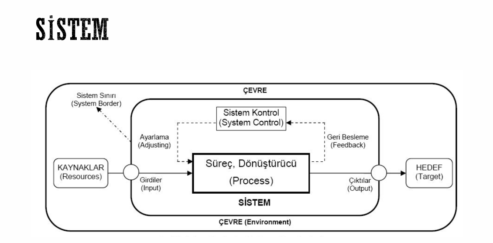
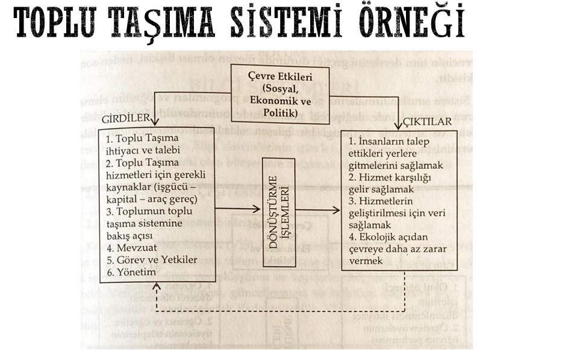

# Sistem Analizi

- [Sistem Nedir?](#sistem-nedir)
- [Sistem Modelleri](#sistem-modelleri)
- [Sistem Analiz Aşamaları](#sistem-analiz-aşamaları)
- [Yaşam Döngüsü ve Süreç Modeli](#yaşam-döngüsü-ve-süreç-modeli)
- [Fonksiyonel/Fonksiyonel Olmayan Gereksinimler ve Fizibilite Çalışmaları](#fonksiyonel/fonksiyonel-olmayan-gereksinimler-ve-fizibilite-çalışmaları)
- [UML](#uml)
- [WireFrame](#wireframe)
- [Persona Yazılım Süreci](#persona-yazılım-süreci)

## Sistem Nedir?

**Sistem:** Plana uygun şekilde bir amacı gerçekleştirmek için tasarlanmış, çeşitli bileşenlerin oluşturduğu bütün

<mark>Sistem bir bütündür, uyumsuz veya çalışmayan bir öğe bütünü etkiler.</mark>

Sistem düşüncesinin ortaya çıkmasındaki temel nedenler:
 1. Bilimin bir bütün oluşu
 2. Bilimde savurganlık,
 3. Bilimsel yöntemin yetersizliği
 4. Tükenmeyen sorunlar

Bu nedenlerle geliştirilen sistemin 3 ilkesi:
 1. Bütünsel yaklaşım
 2. Disiplinler arası yaklaşım
 3. Bilimsel yaklaşım

### Sistemin Temel Kavramları

**Bileşen:** Sistem elemanlarıdır. Bir bütünün parçalarından her birisine bileşen denir.

**İlişki:** Sistemin öğeleri arasındaki yönler ve her türdeki etkileşimi ifade eder.

Özelliklerine göre sınıflandırırsak:
- **Mekansal İlişki:** Fiziksel ögelerin belirli bir mekandaki kendi aralarında var olan ilişkisidir.
- **Örnek:** Bir üretim sistemindeki tezgahlar arasında olması gereken uzaklık (mesafe)

- **Zamansal İlişki:** Sistem içerisindeki olayların sırasını ayırt etmek için kullanılır.  
- **Örnek**: Bir üretim tesisinde bir mamulün izleyeceği işlem sıraları arasında yer alan zaman ilişkisi
- **Neden Sonuç İlişkisi:** Bir nedenin oluşması ile o nedene bağlı sonuçların oluşması
- **Örnek:** üretimde aksaklık nedeni ile üretim miktarının düşmesi

**Amaç:** Her sistemin yöneldiği bir ya da birden daha fazla amaç vardır

### Sistemlerin Sınıflandırılması

**Açık sistemler:** Çevresi ile etkileşim halinde olan sistemlerdir.  
**Kapalı sistemler:** Çevresiyle etkileşimi olmayan sistemlerdir.Bazı kimyasal reaksiyonlar örnek olarak verilebilir.  
**Canlı sistemler:** Biyolojik özelliklere sahip sistemlerdir.  
**Cansız sistemler:** Biyolojik özelliğe sahip olmayan sistemlerdir.  
**Doğal sistemler:** İnsan etkisi olmadan doğal yollarla oluşan sistemlerdir.  
**İnsan yapısı sistemler:** İnsanlar tarafından belirli amaçlarla oluşturulan sistemlerdir.  
**Statik sistemler:** Değişikliğe uğramadan devamlılığını sağlayan sistemlerdir. Örnek: Güneş sistemi  
**Dinamik sistemler:** Çevredeki değişikliklere göre zamanla değişime uğrayan sistemlerdir.  Geri besleme mekanizması sayesinde kendisini çevredeki değişken parametrelere uydurur.  
**Örnek:** Çevredeki arz ve talep değişkenine göre bir işletmenin durumunu ayarlamak 
zorunda kalması

