# Sistem Analizi

- [Sistem Nedir?](#sistem-nedir)
- [Sistem Modelleri](#sistem-modelleri)
- [Sistem Analiz Aşamaları](#sistem-analiz-aşamaları)
- [Yaşam Döngüsü ve Süreç Modeli](#yaşam-döngüsü-ve-süreç-modeli)
- [Fonksiyonel/Fonksiyonel Olmayan Gereksinimler ve Fizibilite Çalışmaları](#fonksiyonel/fonksiyonel-olmayan-gereksinimler-ve-fizibilite-çalışmaları)
- [UML](#uml)
- [WireFrame](#wireframe)
- [Persona Yazılım Süreci](#persona-yazılım-süreci)

## Sistem Nedir?

**Sistem:** Plana uygun şekilde bir amacı gerçekleştirmek için tasarlanmış, çeşitli bileşenlerin oluşturduğu bütün

<mark>Sistem bir bütündür, uyumsuz veya çalışmayan bir öğe bütünü etkiler.</mark>

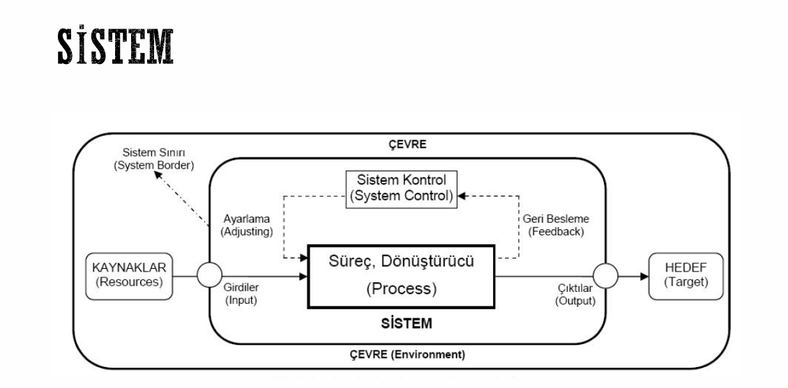

Sistem düşüncesinin ortaya çıkmasındaki temel nedenler:
 1. Bilimin bir bütün oluşu
 2. Bilimde savurganlık,
 3. Bilimsel yöntemin yetersizliği
 4. Tükenmeyen sorunlar

Bu nedenlerle geliştirilen sistemin 3 ilkesi:
 1. Bütünsel yaklaşım
 2. Disiplinler arası yaklaşım
 3. Bilimsel yaklaşım

### Sistemin Temel Kavramları

**Bileşen:** Sistem elemanlarıdır. Bir bütünün parçalarından her birisine bileşen denir.

**İlişki:** Sistemin öğeleri arasındaki yönler ve her türdeki etkileşimi ifade eder.

Özelliklerine göre sınıflandırırsak:
- **Mekansal İlişki:** Fiziksel ögelerin belirli bir mekandaki kendi aralarında var olan ilişkisidir.
- **Örnek:** Bir üretim sistemindeki tezgahlar arasında olması gereken uzaklık (mesafe)

- **Zamansal İlişki:** Sistem içerisindeki olayların sırasını ayırt etmek için kullanılır.  
- **Örnek**: Bir üretim tesisinde bir mamulün izleyeceği işlem sıraları arasında yer alan zaman ilişkisi
- **Neden Sonuç İlişkisi:** Bir nedenin oluşması ile o nedene bağlı sonuçların oluşması
- **Örnek:** üretimde aksaklık nedeni ile üretim miktarının düşmesi

**Amaç:** Her sistemin yöneldiği bir ya da birden daha fazla amaç vardır

### Sistemlerin Sınıflandırılması

**Açık sistemler:** Çevresi ile etkileşim halinde olan sistemlerdir.  
**Kapalı sistemler:** Çevresiyle etkileşimi olmayan sistemlerdir.Bazı kimyasal reaksiyonlar örnek olarak verilebilir.  
**Canlı sistemler:** Biyolojik özelliklere sahip sistemlerdir.  
**Cansız sistemler:** Biyolojik özelliğe sahip olmayan sistemlerdir.  
**Doğal sistemler:** İnsan etkisi olmadan doğal yollarla oluşan sistemlerdir.  
**İnsan yapısı sistemler:** İnsanlar tarafından belirli amaçlarla oluşturulan sistemlerdir.  
**Statik sistemler:** Değişikliğe uğramadan devamlılığını sağlayan sistemlerdir. Örnek: Güneş sistemi  
**Dinamik sistemler:** Çevredeki değişikliklere göre zamanla değişime uğrayan sistemlerdir.  Geri besleme mekanizması sayesinde kendisini çevredeki değişken parametrelere uydurur.  
**Örnek:** Çevredeki arz ve talep değişkenine göre bir işletmenin durumunu ayarlamak 
zorunda kalması

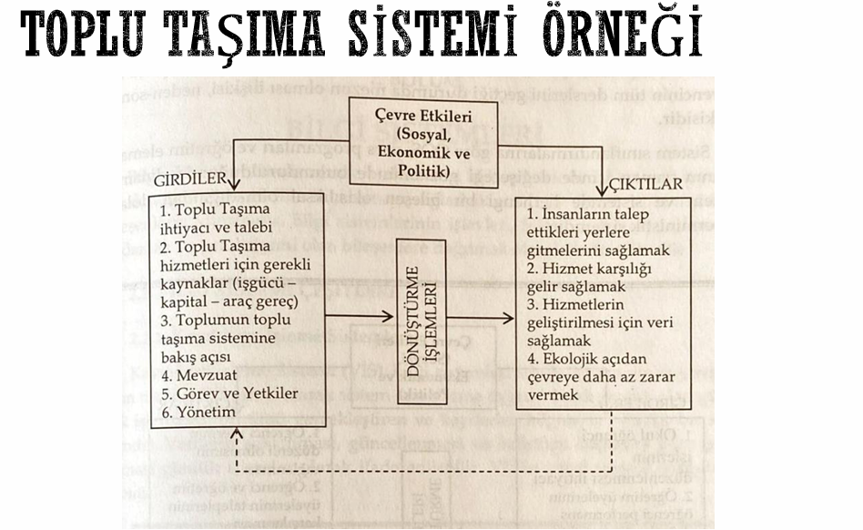

## Sistem Modelleri
**Model:** Var olan gerçek olayın soyut bir gösterimi veya temsili

### SÖZLÜ (KAVRAMSAL) MODELLER
Sözcüklerin kullanıldığı en eski ve en genel olanı  
Avantajları:
- Düşük maliyet
- Kolay kurulabilir
- Karmaşık olmayan sistemlerde kolay anlaşılabilir  

Dezavantajları:
- Sözcüklere farklı insanlar tarafından farklı anlamlar yüklenebileceğinden yanlış anlaşılmalara 
sebebiyet verebilir

### ŞEMATİK MODELLER
Sözlü modeldeki yanlış anlaşılmaların önüne geçer. Algılamadaki etkinliği arttırır.

Aşağıdaki başlıkların her biri şematik modeldir.  

**GRAFİKLER**

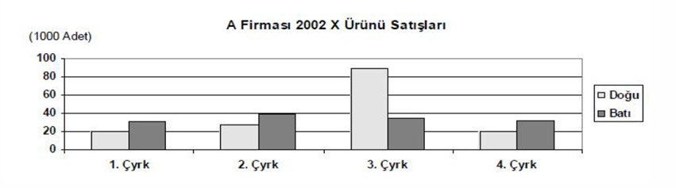

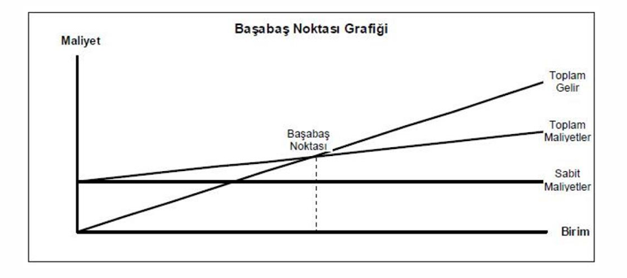

---
**GANT ŞEMASI**
Henry Gantt tarafından tasarlanan, proje yönetim tekniğinin önemli tekniklerinden birisidir.  
İş yönetiminde zaman planlamasını sağlar.  

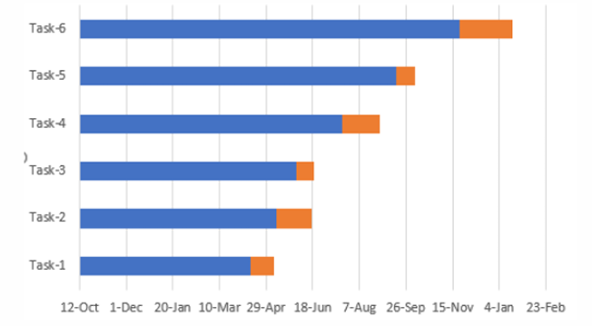
--

**AĞ DİYAGRAMLARI**  
Görevleri, bağımlılıkları görüntülemeye yarar.  
Sistemde bazı faaliyetlerin çözümlenmesi ve optimum sonuçlara ulaşabilmesi için kullanılır.  

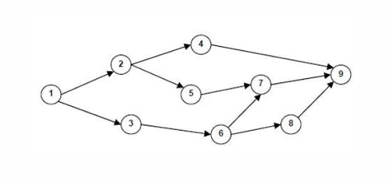
--

**KARAR AĞACI**  
Sistemde kararlar alınırken bu kararların sistemi nereye götüreceğinin görselleştirilmesi için kullanılır.  
Karar analizlerinde karmaşık sorunların araştırılmasında yaygın kullanılır.  

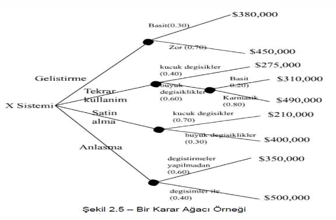
--

**ORGANİZASYON ŞEMASI**  
Sistemdeki hiyearşiyi göstermek için kullanılır.  

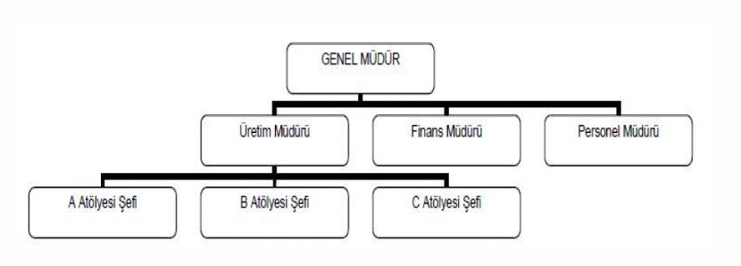
--

**SÜREÇ AKIŞ ŞEMASI**  
Sistemde bulunan genel işin veya alt işlerin nasıl işlediğini göstermeye yarayan şematik model.  
NPC(National Computing Centre) tarafından İngilterede geliştirilen simgelerle gösterim sağlanmakta.  

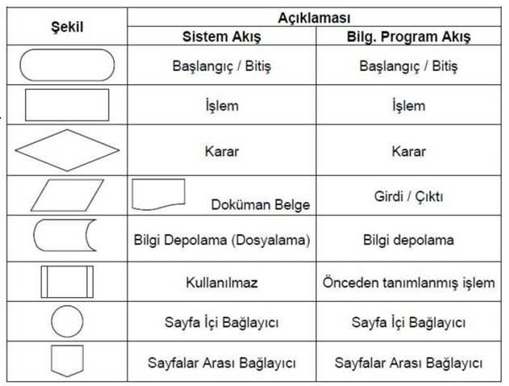

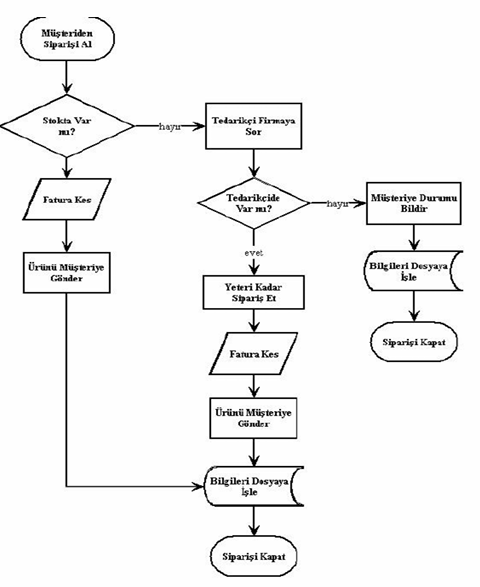

## Sistem Analiz Aşamaları

Bir araştırma ve problem çözme yaklaşımı (sistem analizi)
- Sistem analizi ile 
- sistemin çözümlenmesi, 
- sorunun belirlenmesi, 
- hedeflerin ortaya konması, 
- alternatiflerin belirlenmesi, araştırılması, değerlendirilmesi, seçilmesi
- Düzenleme, uygulama ve monitoring
- izlenecek yolun en uygun seçiminin yapılması sağlanır.
- Daha etkin bir biçimde işleyen süreçlerin oluşması sağlanır.

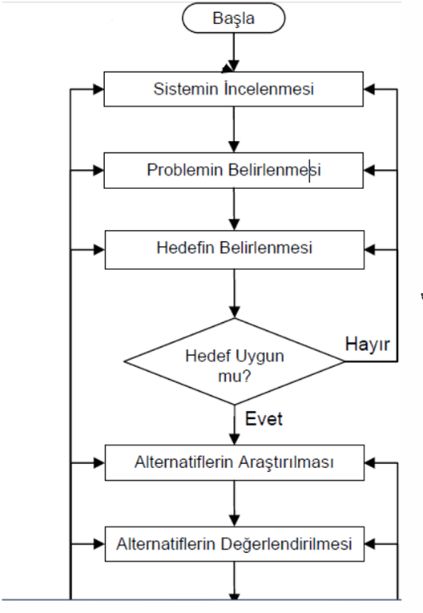
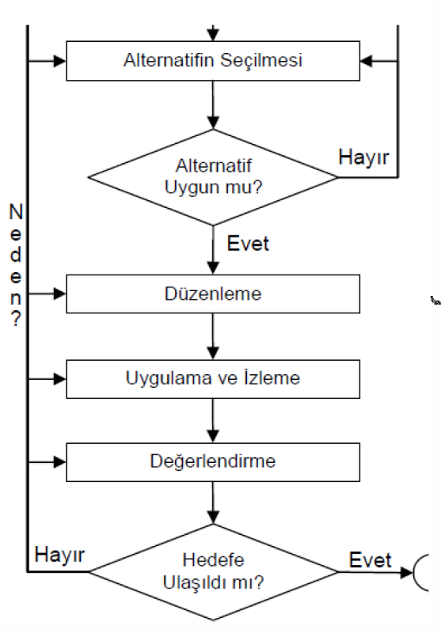

**1. Sistemin İncelenmesi**  
**a)** Sistem işleyişinin gözlenmesi  
**b)** Sistemin çevresinin belirlenmesi  
- Sistemi hangi sistemler çevreliyor? 
- Bu sistemlerle bağlantısı nedir?
- Çevreden hangi girdiler alınır?
- Nasıl işlenir?
- Hangi çıktılar verilir?
- Çevreden gelen kısıtlamalar var mıdır?

**c)** Sistemi oluşturan bileşenlerin (alt sistemler) belirlenmesi (Bileşenlerin sistem amaçlarına etkisi- katkısı)   
**d)** Bileşenler arasındaki ilişkinin belirlenmesi  
- Alt sistemler birbirleri ile nasıl bir alış-verişte bulunur?
- Ne için ve nasıl bir ilişki?
- Girdi – çıktı nedir?  
 
**e)** erilerin toplanması, işlenmesi, yorumlanması
- Sistemin iç işleyişi  ve çevresine olan etkisini görebilmek için ihtiyaç duyulan verilerin toplanması, işlenmesi ve yorumlanması  

**2. Problemin Belirlenmesi**  
- Sistemin işleyişi esnasında ortaya çıkabilecek sorunlar saptanabilmeli
- Genel ifade yerine anlaşılabilir problemler olarak belirlenmeli

**3. Hedeflerin Belirlenmesi**  
- Problemin belirlenmesi ile bu sorun veya sorunların giderilmesi için amaçlar ortaya çıkarılır
- Sistemin işleyişini beklenen duruma getirmek için amaçların belirlenmesi gerekir. Kuralları:
- Açık ve ölçülebilir olmalı
- Amaç açık bir biçimde ortaya konmalı
- Amaçlar ne oranda gerçekleşti? (karşılaştırma ölçütü)
- Ölçülebilir ölçütler olmalı
- Anlaşılabilir ve uyumlu olmalı
- Her yöneticinin anlayacağı şekilde olmalı
- Birbirleri ve sistem politikası ile uyumlu olmalı
- Gerçekçi ve ulaşılabilir olmalı:
- Kaynaklar ve olanaklara göre gerçekçi olmalı
- «Amaçlar sisteme yön gösterecek uygunluğa sahip mi?» sorusunun cevabı «Evet» olmalı  

**4. Alternatiflerin Araştırılması**  
- Sistemin belirlenen amaçları gerçekleştirebilmek için seçeneklerin belirlenmesi gerekmekte
- Analist, araştırmanın ne yürütülemeyecek kadar geniş ne de önemsenmeyecek şekilde küçük 
olmamasına dikkat etmeli.
- Araştırma konusu yapılan her alternatife ilişkin veri ve bilginin sağlanması gerekmektedir.

**5. Seçeneklerin (Alternatiflerin) Değerlendirilmesi**  
- Olası alternatiflerin değerlendirme ihtiyacı bulunmakta (Her seçeneğin ve sonucun)
- Alternatiflerin amacı gerçekleştirmesi tek başına yeterli değil !
- Aynı zamanda sistem işleyişini hangi yönde ve nasıl etkilediği önemlidir.
- Her alternatif için sistem analizinin yanı sıra modelini de kurmak gerekir.
- Böylelikle sistemi gerçek çalışma ortamına almadan önce değerlendirme imkanı sunar.

**6. Alternatifin Seçilmesi**  
- Alternatifler içinde en uygununun seçilmesi
- Alternatiflerin değerlendirilmesi aşamasında:
- Bir modele dayalı olarak elde edilen bilgilerle 
- Amaçlar ve kısıtlamalar göz önünde bulundurularak
- En uygun seçenek seçilir
- «Tüm sistem açısından seçilen seçenek en uygun mu?» sorusunun cevabı «Evet» olmalı

**7. Düzenleme – Dizayn**  
- Seçilen seçeneğin uygulamaya konulabilmesi için:
- gerekli faaliyetlerin belirlenmesi
- bu faaliyetlerin diğer faaliyetlerle ilişkilendirilmesi için gerekli düzenlemelerin planlanması 
yapılmalı

**PERT tekniği**
- PERT Tekniği (Program Evaluation and Review Technique)
- Program değerlendirme ve gözden geçirme tekniği
- Bir projedeki işler ve bu işlerin sürelerinin çıkarılması ile başlar.
- Projedeki işlerin hangi işlere bağlı olduğu bulunur.
- Sonrasında PERT diyagramı çizilir.
- Projeyi yönetmeyi kolaylaştırır.

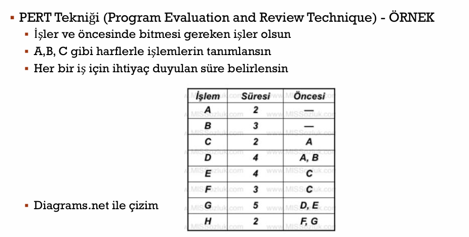

**8. Uygulama ve İzleme**  
- Dizayn aşamasında hazırlanan plana göre faaliyetler uygulamaya konulur.
- Uygulama esnasında sistem izlenmelidir.
- Sistem plana uygun işliyor mu?
- İzleme esnasında oluşacak aksaklıklar aniden giderilebilir. (Sistemin kendi kendini düzenlemesi)

**9. Değerlendirme**
- Sonuçların ve sistemin başarı durumu  değerlendirilir.
- Daha önce belirlenen  amaç ve ölçütlere göre hedefler ne oranda gerçekleşti?

