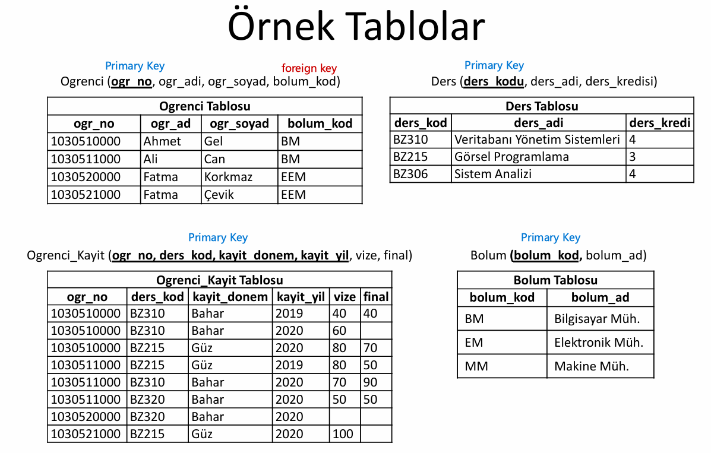
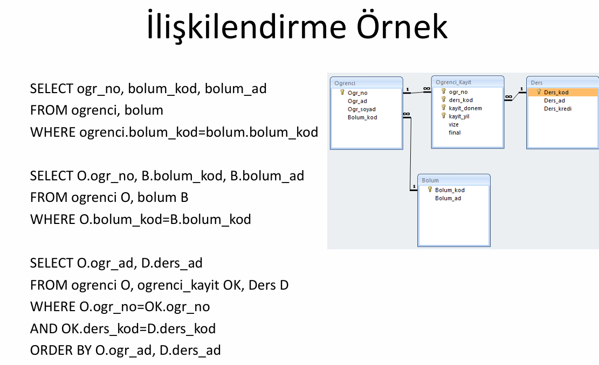

# Veritabanı Yönetim sistemleri

# İçerik
-[Temel Kavramlar](#temel-kavramlar)  
-[Veritabanı Tasarımı](#veritabanı-tasarımı)  
-[Er Diyagramı](#er-diyagrami)  
-[Veritabanı Normalizasyonu](#veritabanı-normalizasyonu)  
-[İlişkisel Cebir](#ilişkisel-cebir)  
-[SQL ve DDL ](#sql-ve-ddl)  
-[SQLde Aritmetik Operatorler ve Fonksiyonlar](#sqlde-aritmetik-operatorler-ve-fonksiyonlar)  
-[SQLde Alt Sorgular](#sqlde-alt-sorgular)
-[SQLde View](#sqlde-view)  
-[SQL Transaction Yönetimi](#sql-transaction-yönetimi)  
-[Btree](#btree)  
-[Sorgu Optimizasyonu](#sorgu-optimizasyonu)  

## Temel Kavramlar
Sıralı Erişimli Dosyalar = Static Array
Doğrudan Erilimli Dosyalar = Dynamic Array

### Veritabanı Nedir?
**Veri tabanı**, yapılandırılmış bir şekilde organize edilmiş ve depolanmış veri koleksiyonudur.  
**Tablo** Veritabanı içerisinde tutulacak verileri depolamak için kullanılır.  
**Satır**lar kayıtları (record) gösterir.  
**Sütun**lar veri türlerini gösterir  
**Anahtar** kayıtlar içerisinde benzersiz olan sütun veya sütun grubudur.  
**Birincil Anahtar ( Primary Key)** Benzersiz yani aynı değeri iki kez içermeyecek olan sütunlardir.  
– NULL(boş) veya birbirinin aynı olan değerleri içeremez.  
**İkincil Anahtar (Foreign Key)** İki tablo arasında bağlantı (ilişki) varsa bir tablodaki bir sütun diğer  
tablonunun birincil anahtarı ise bu sütuna ikincil anahtar denilir.  

**İlişkilendirme(join)** Tek sorgu ile birden fazla tablodan bilgi alama işlemine ilişkilendirme denilir.  

Farklı join türleri vardır:  
-Inner Join,  
-Left Outer Join,  
-Right Outer Join,  
-Full Outer Join

### Veritabanı Yönetim Sistemleri ###  

**Veritabanı yönetim sistemleri** (Database Management Systems) veri tutmak amacıyla yeni veritabanı oluşturmak, var olan veri tabanı üzerinde değişiklik yapmak, veritabanın bakımı ve yedeklenmesi, tablolar arasında ilişki kurmak, kullanıcı yetkilerini belirlemek amacıyla kullanılan yazılımlardır.  

**Veritabanı Yönetim Sistemleri Faydaları**  
-Veri tekrarı (Data Redundancy) engellenir.  
-Veri Tutarlılığı (Data Consistency)  
-Veri Paylaşımı (Data Concurrency)  
-Veri Bütünlüğü (Data Integrity)    
-Veri Güvenliği (Data Security)  
-Veri Bağımsızlığı (Data Independecy)  

**Veritabanı Kullanıcıları**  
-Veritabanı Yöneticisi (Database Administrator)  
-Uygulama Programcısı  
-Sorgu Dili KUllanıcıları  
-Son Kullanıcılar  

