# Veritabanı Yönetim sistemleri

# İçerik
- [Temel Kavramlar](#temel-kavramlar)  
- [Veritabanı Tasarımı](#veritabanı-tasarımı)  
- [ER Diyagramı](#er-diyagramı)  
- [Veritabanı Normalizasyonu](#veritabanı-normalizasyonu)  
- [İlişkisel Cebir](#i̇lişkisel-cebir)  
- [SQL ve DDL ](#sql-ve-ddl)  
- [SQLde Aritmetik Operatorler ve Fonksiyonlar](#sqlde-aritmetik-operatorler-ve-fonksiyonlar)  
- [SQLde Alt Sorgular](#sqlde-alt-sorgular)
- [SQLde View](#sqlde-view)  
- [SQL Transaction Yönetimi](#sql-transaction-yönetimi)  
- [Btree](#btree)  
- [Sorgu Optimizasyonu](#sorgu-optimizasyonu)  
- [Vize ve Final Çalışması](vize_ve_final.md) (Bu kısım dönem bitince eklenecek)
## Temel Kavramlar
Sıralı Erişimli Dosyalar = Static Array  
Doğrudan Erişimli Dosyalar = Dynamic Array  

### Veritabanı Nedir?  
**Veri tabanı**, yapılandırılmış bir şekilde organize edilmiş ve depolanmış veri koleksiyonudur.  

**Tablo** Veritabanı içerisinde tutulacak verileri depolamak için kullanılır.  
**Satır**lar kayıtları (record) gösterir.  
**Sütun**lar veri türlerini gösterir  
**Anahtar** kayıtlar içerisinde benzersiz olan sütun veya sütun grubudur.  

**Birincil Anahtar ( Primary Key)** Benzersiz yani aynı değeri iki kez içermeyecek olan sütunlardir. 
NULL(boş) veya birbirinin aynı olan değerleri içeremez.  

**İkincil Anahtar (Foreign Key)** İki tablo arasında bağlantı (ilişki) varsa bir tablodaki bir sütun diğer tablonunun birincil anahtarı ise bu sütuna ikincil anahtar denilir.  

---
<br>

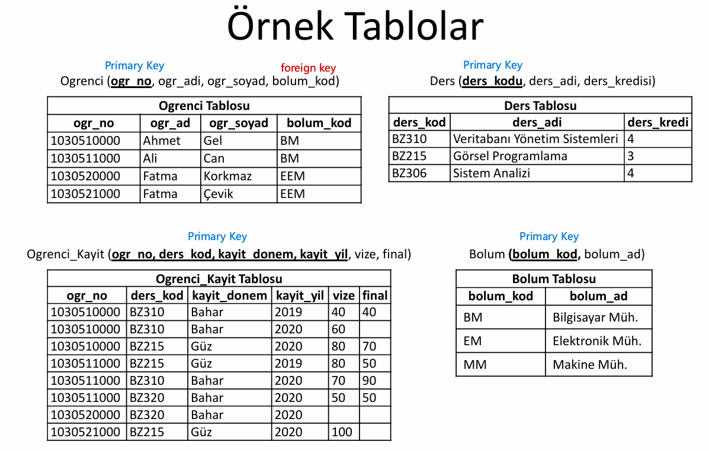

---
<br>

**İlişkilendirme(join)** Tek sorgu ile birden fazla tablodan bilgi alama işlemine ilişkilendirme denilir.  

Farklı join türleri vardır:  
- Inner Join  
- Left Outer Join  
- Right Outer Join  
- Full Outer Join

---
<br>

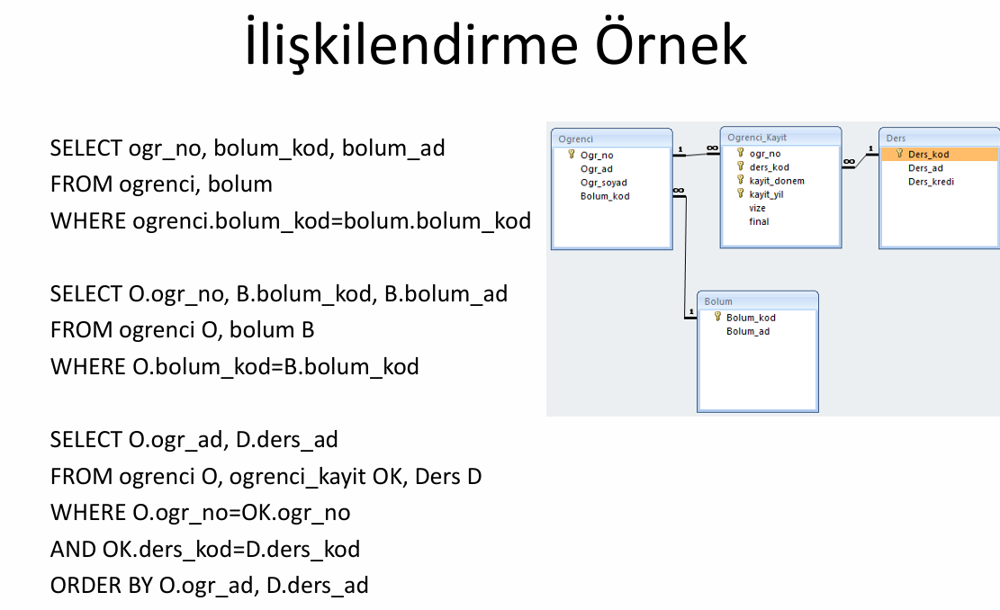

---
<br>

### Veritabanı Yönetim Sistemleri ###  

**Veritabanı yönetim sistemleri** (Database Management Systems) veri tutmak amacıyla yeni veritabanı oluşturmak, var olan veri tabanı üzerinde değişiklik yapmak, veritabanın bakımı ve yedeklenmesi, tablolar arasında ilişki kurmak, kullanıcı yetkilerini belirlemek amacıyla kullanılan yazılımlardır.  

**Veritabanı Yönetim Sistemleri Faydaları**  
- Veri tekrarı (Data Redundancy) engellenir.  
- Veri Tutarlılığı (Data Consistency)  
- Veri Paylaşımı (Data Concurrency)  
- Veri Bütünlüğü (Data Integrity)    
- Veri Güvenliği (Data Security)  
- Veri Bağımsızlığı (Data Independecy)  

**Veritabanı Kullanıcıları**  
- Veritabanı Yöneticisi (Database Administrator)  
- Uygulama Programcısı  
- Sorgu Dili KUllanıcıları  
- Son Kullanıcılar  

<br>

## **Veritabanı Tasarımı**

**Veritabanı tasarımında takip edilecek adımlar**  
- Depolanacak verilerin belirlenmesi  
- Tabloların oluşturulması  
- Anahtar sütunların belirlenmesi  
- Tabloların bölünmesi (gerekirse)   
- İlişkilerin kurulması  

**Kavramsal Tasarım**  
- En çok kullanılan model ER (Entity-Relationship,Varlık-İlişli) modelidir.  
- Veritabanının şematik olarak tasarımıdır.  

**Varlık Kavramı**  
- Modelin en temel öğesidir.  
- Var olan ve benzerlerinden ayrılan her şey varlıktır.  

**Nitelik Kavramı**
- Varlıkların her bir özelliği nitelektir.  
- *Anahtar Nitelik*: Değeri her varlık için farklı olan niteliktir. Şemada altı çizilerek gösterilir.  

**Domain(Etki Alanı)**  
- Niteliklerin alabileceği değer aralığıdır.  
- Er diyagramınad gösterilmez  

**İlişki**  
- Farklı varlıklar arasındaki ilişkileri ifade eder.  
- Model içerisinde baklava dilimi ile gösterilir.  
- İlişkiler 1-1,1-n,n-m olabilir.  

---
<br>

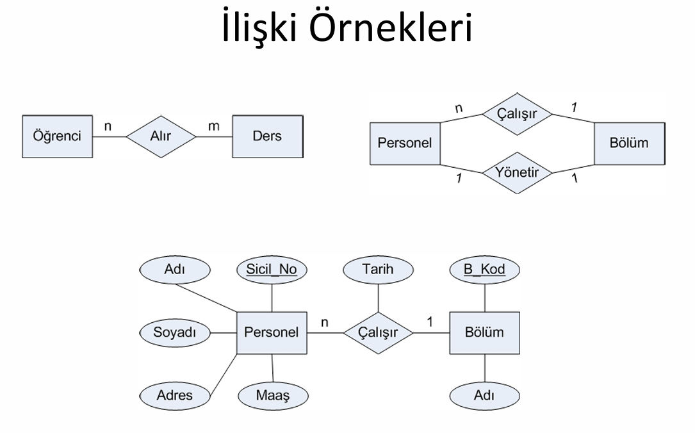

---
<br>

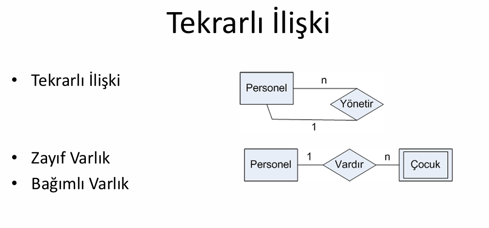

---
<br>

### Bire-bir (1-1) İlişkinin tabloya dönüştürülmesi
İlişkide bir varlık kümesinin birincil anahtarı diğer varlık kümesinin yabancı (ikincil) anahtarı olur. 

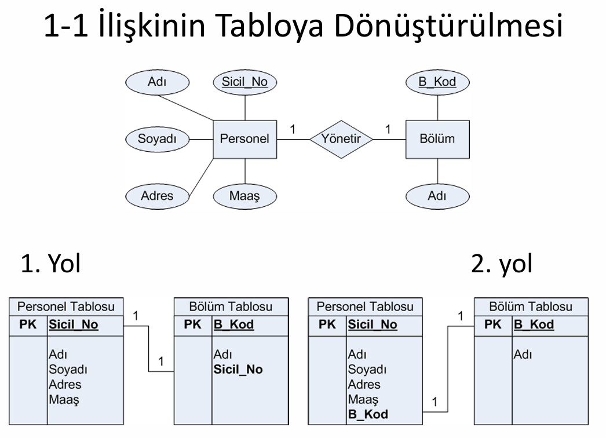

---
<br>

### Bire-Çok veya Çoğa-Bir (1-n, n-1) İlişkilerin Tabloya Dönüştürülmesi
İlişkinin n tarafındaki tabloya 1 tarafındaki tablonun birincil anahtarı yabancı anahtar olarak eklenir.

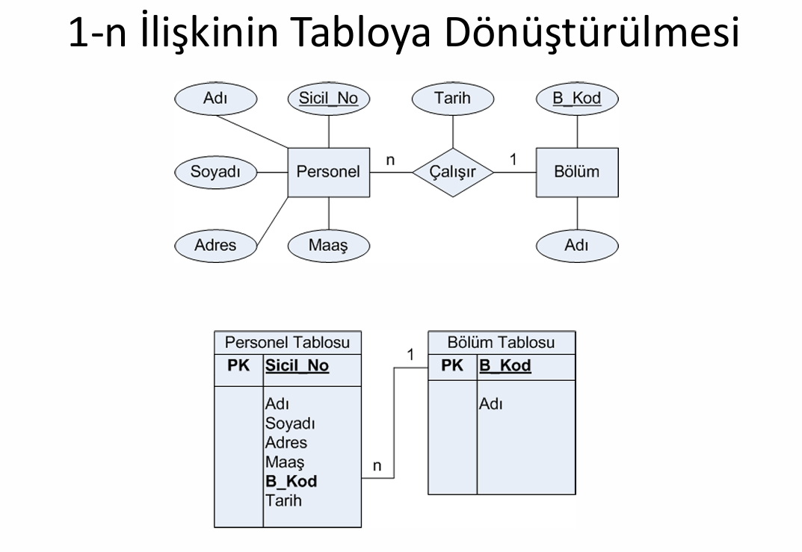

---
<br>

### Çoğa-Çok (n-m) İlişkilerin Tabloya Dönüştürülmesi  
İlişkiyi oluşturan tabloların birincil anahtarları ilişiki oluşturan tabloya yabancı anahtar olarak eklenir.  
İlişkiden oluşturulan tablonun birincil anahtarı oluşturulan yabancı anahtarların birleşiminden oluşur. Eğer bu ihtiyaca cevaba vermez ise yeni sütun eklenerek birincil anahtar yapılır. 

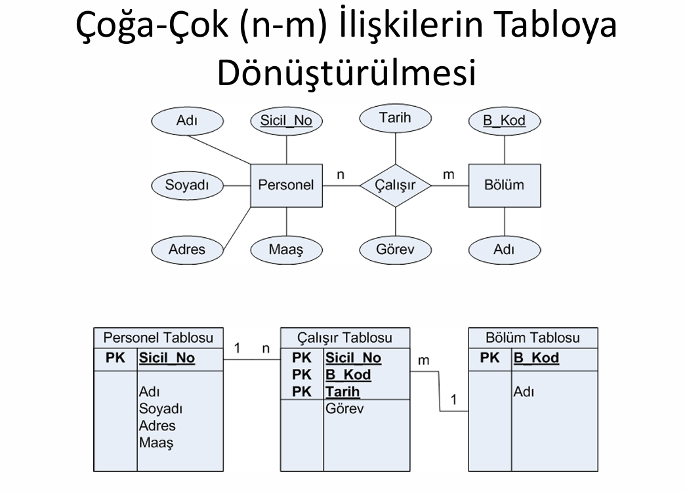

---
<br>

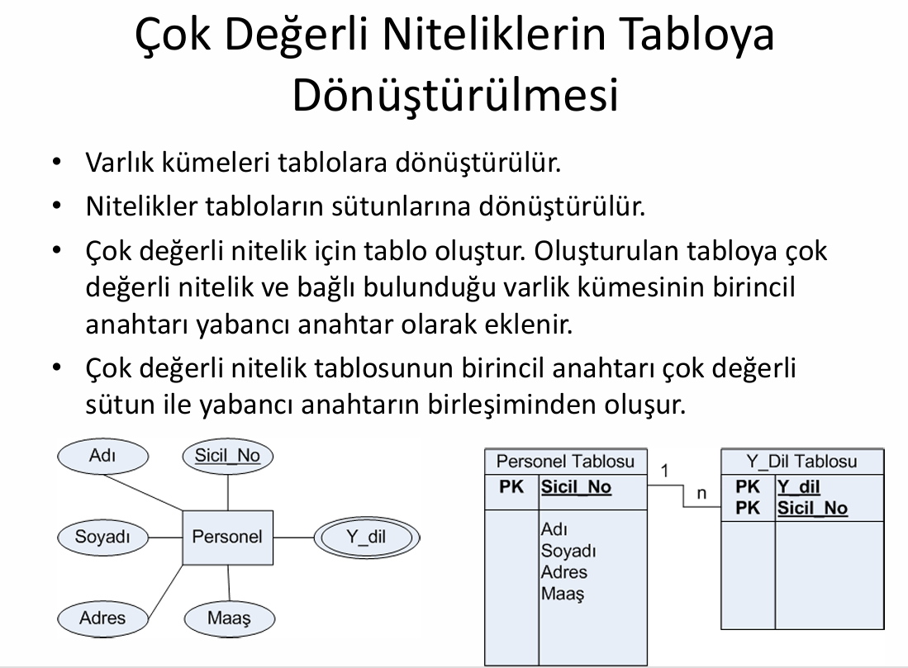

--- 
<br>

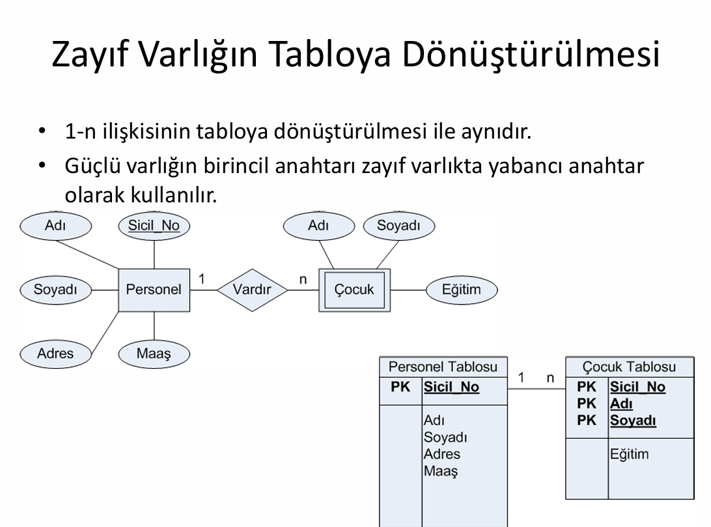

--- 
<br>

## ER-Diyagramı 

1. Her uçağın bir kayıt numarası vardır ve her bir uçak bir modele aittir. 
2. Havaalanında belirli sayıda uçak modelleri vardır ve herbir modelin bir kapasitesi, 
ağırlığı ve model numarası vardır. 
3. Havaalanında belirsi sayıda teknisyen çalışır. Herbir teknisyenın ismi, TC kimlik 
nosu, adresi, telefonu ve maaş bilgisi tutulur. 
4. Herbir teknisyen bir veya birden fazla uçak modelinde uzmandır ve tekniskenlerin 
uzmanlıkları diğer teknisyenlerinkiyle çakışabilir yani aynı olabilir. Bu bilgi de 
tutulmalıdır. 
5. Trafik kontrolörleri yıllık check-uptan geçirilmelidir. Herbir kontrolör için, en son 
yapılan check up un tarihi tutulur. 
6. Herbir havaalanı işçisi bir sendikaya üyedir (teknisyenler de dahil). Herbir işçinin 
sendika üyelik numarası, ve ayrıca TC kimlik numarası kaydedilmelidir. 
7. Havaalanı ve uçakların güvenliği için, havaalanı periyodik olarak belli sayıda teste 
tabi tutulur. Herbir testin Türk Hava Kurumu (THK) tarafından belirlenen bir test 
numarası, ismi, ve maksimum alınabilecek notu bulunur. 
8. THK, havaalanları tarafından test edilen uçakların bilgilerinin (yani ne zaman test 
edildi, hangi teknisyen tarafından ve hangi testler kullanılarak) tutulmasını şart 
koşar. Herbir test etme işlemi için, gerekli olan bilgiler, tarih, teknisyenın  test 
yaparken harcadığı saat, ve test sonucunda uçağın aldıgı not.

---

1. Verilen hikayeye göre ER diyagramını çiziniz? 
2. Gerekli olabilecek şartları (constraint) belirleyiniz? 
3. ER diyagramı tarafından gösterilemeyen şartlar 
constraint() var mıdır? Bunları belirtiniz. 
4. İlişki türlerini belirleyiniz? 
5. Tablo yapılarını oluşturunuz? 
6. ER diyagramını çizdiğiniz havaalanı veritabanını SQL cümleleri kullanarak oluşturunuz 

---
<br>

**Birinci sorunun cevabı:**  

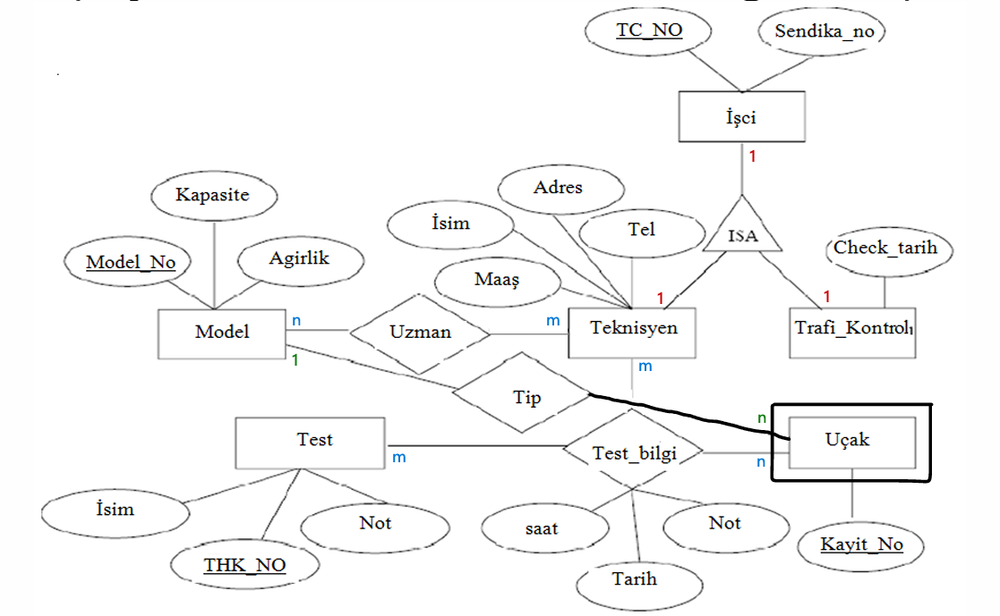

---
<br>

**İkinci sorunun cevabı:**  

1. Her uçağın bir modeli olmalıdır (Toplam katılım)
2. Her teknisyen en az bir modelde uzman olmalıdır
3. Her test etme işleminde bir teknisyen, bir uçak ve bir test bulunmalıdır
4. TC Kimlik no tüm işçiler için tekil olmalıdır
5. Sendika üyelik numarası tüm işçiler için tekil olmalıdır
6. Bir kişi hem teknisyen hem kontrolör olamaz (Ayrık inheritance)
7. Test notu maksimum notu geçemez
8. Her kontrolörün en az bir check-up tarihi olmalıdır

---
<br>

**Üçüncü sorunun cevabı:**  

1. Test sonucu (AlınanNot) <= Test.MaksNot
2. Teknisyen maaşı > 0
3. Tarih bilgisi geçmiş veya bugün olabilir, gelecek olamaz
4. Harcanan saat > 0
5. Telefon numarası format kontrolü
6. TC Kimlik no format kontrolü (11 haneli, vb.)
7. Uçak kapasitesi > 0
8. Uçak ağırlığı > 0

---
<br>

**Dördüncü sorunun cevabı:**  

1. Tip - UÇAK ile MODEL arasında - M:N (Uçak zayıf varlık ama M:N ilişkide zayıf varlık olamaz ki?)
2. Uzman - TEKNİSYEN ile MODEL arasında - M:N
3. Gerçekleştirir - TEKNİSYEN ile UÇAK arasında - M:N
4. Uygulanır - TEST ile UÇAK arasında - M:N
5. Kullanır - TEKNİSYEN ile TEST arasında - M:N
6. IS_A - İŞÇİ ile TEKNİSYEN/KONTROLÖR arasında - 1:1

---
<br>

**Beşinci sorunun cevabı:**  

- **MODELLER tablosu**  
MODEL(ModelNo, Kapasite, Ağırlık)  
PK: ModelNo  

- **UÇAK tablosu**  
UCAK(KayıtNo, ModelNo)  
PK: KayıtNo  
FK: ModelNo references MODEL(ModelNo)  

- **İŞÇİ tablosu**  
ISCI(TC_NO, Sendika_no)  
PK: TC_NO  
UK: Sendika_no (NOT NULL + UNIQUE)

- **TEKNİSYEN tablosu**  
TEKNISYEN(TC_NO, İsim, Adres, Tel, Maas)  
PK: TC_NO  
FK: TC_NO references ISCI(TC_NO)  

- **KONTROLÖR tablosu**  
KONTROLOR(TC_NO, Check_tarih)  
PK: TC_NO  
FK: TC_NO references ISCI(TC_NO)  

- **UZMAN tablosu**   
UZMAN(Model_no, TC_NO)  
PK: (Model_no, TC_NO)  
FK: TC_NO references TEKNISYEN(TC_NO)  
FK: Model_no references MODEL(Model_no)  

- **TEST tablosu**  
TEST(THK_No, Isim, Not)  
PK: THK_No  

- **TEST_bilgi tablosu**  
TEST_bilgi(THK_No, TC_NO, Kayit_no, saat, tarih, not)  
PK: (THK_No, TC_NO, Kayit_no, saat, tarih)  
FK: THK_No references TEST(THK_No)  
FK: Kayıt_no references UCAK(Kayıt_no)  
FK: TC_No references TEKNISYEN(TC_No)  

---
<br>

**Altıncı sorunun cevabı:** 

```sql
-- 1. MODELLER tablosu
CREATE TABLE MODEL (
    ModelNo INT PRIMARY KEY,
    Kapasite INT NOT NULL CHECK (Kapasite > 0),
    Agirlik DECIMAL(10,2) NOT NULL CHECK (Agirlik > 0)
);

-- 2. UÇAK tablosu
CREATE TABLE UCAK (
    KayitNo VARCHAR(20) PRIMARY KEY,
    ModelNo INT NOT NULL,
    FOREIGN KEY (ModelNo) REFERENCES MODEL(ModelNo)
);

-- 3. İŞÇİ tablosu
CREATE TABLE ISCI (
    TC_NO CHAR(11) PRIMARY KEY,
    Sendika_no INT NOT NULL UNIQUE
);

-- 4. TEKNİSYEN tablosu
CREATE TABLE TEKNISYEN (
    TC_NO CHAR(11) PRIMARY KEY,
    Isim VARCHAR(100) NOT NULL,
    Adres VARCHAR(200),
    Tel VARCHAR(15),
    Maas DECIMAL(10,2) NOT NULL CHECK (Maas > 0),
    FOREIGN KEY (TC_NO) REFERENCES ISCI(TC_NO)
);

-- 5. KONTROLÖR tablosu
CREATE TABLE KONTROLOR (
    TC_NO CHAR(11) PRIMARY KEY,
    Check_tarih DATE NOT NULL,
    FOREIGN KEY (TC_NO) REFERENCES ISCI(TC_NO),
    CHECK (Check_tarih <= CURRENT_DATE)
);

-- 6. UZMAN tablosu 
CREATE TABLE UZMAN (
    Model_no INT,
    TC_NO CHAR(11),
    PRIMARY KEY (Model_no, TC_NO),
    FOREIGN KEY (TC_NO) REFERENCES TEKNISYEN(TC_NO),
    FOREIGN KEY (Model_no) REFERENCES MODEL(ModelNo)
);

-- 7. TEST tablosu
CREATE TABLE TEST (
    THK_No INT PRIMARY KEY,
    Isim VARCHAR(100) NOT NULL,
    Not_ INT NOT NULL CHECK (Not_ > 0)
);

-- 8. TEST_bilgi tablosu
CREATE TABLE TEST_bilgi (
    THK_No INT,
    TC_NO CHAR(11),
    Kayit_no VARCHAR(20),
    saat DECIMAL(5,2) NOT NULL CHECK (saat > 0),
    tarih DATE NOT NULL,
    not_ INT NOT NULL,
    PRIMARY KEY (THK_No, TC_NO, Kayit_no, saat, tarih),
    FOREIGN KEY (THK_No) REFERENCES TEST(THK_No),
    FOREIGN KEY (Kayit_no) REFERENCES UCAK(KayitNo),
    FOREIGN KEY (TC_NO) REFERENCES TEKNISYEN(TC_NO),
    CHECK (not_ <= (SELECT Not_ FROM TEST WHERE TEST.THK_No = THK_No))
);
```
---
<br>

## Veritabanı Normalizasyonu  

**Normalizsyonun amacı:**   
- Veri bütünlüğünü sağlamak 
- Uygulamadan bağımsızlık 
- Performansı arttırmak 

---
<br>

**Normalizasyon Kuralları**  
- Normalizasyon “ normal form” ismi verilen kurallara göre yapılır.  
- Normalizyon kuralları çok fazla olabilmektedir. Ancak genellikle üçüncü normal formdan sonrası uygulanmaz.  
- Normal formlar sırası ile uygulanmalıdır.  

---
<br>

**Fonksiyonel Bağımlılık**  
- R ilişkisi X ve Y nitelik kümelerinden oluşmaktadır.  
- Eğer X nitelik kümesinin değerleri Y nitelik kümesinin değerlerini belirliyorsa, Y niteliği X niteliğine fonksiyonel bağımlıdır denilir.  
- X->Y  şeklinde gösterilir.  
- X’in herbir değeri Y’nin bir değerine karşılık geldiği durumlarda da fonksiyonel bağımlılık söz konusudur.  
- Eğer X nitelik kümesinden bir nitelik çıkarıldığı halde bağımlılık 
devam ediyorsa buna kısmi bağımlılık denilir.  
- Anahtar sütuna bağımlı olmayan bağımlılığa geçişli bağımlılık denilir.  

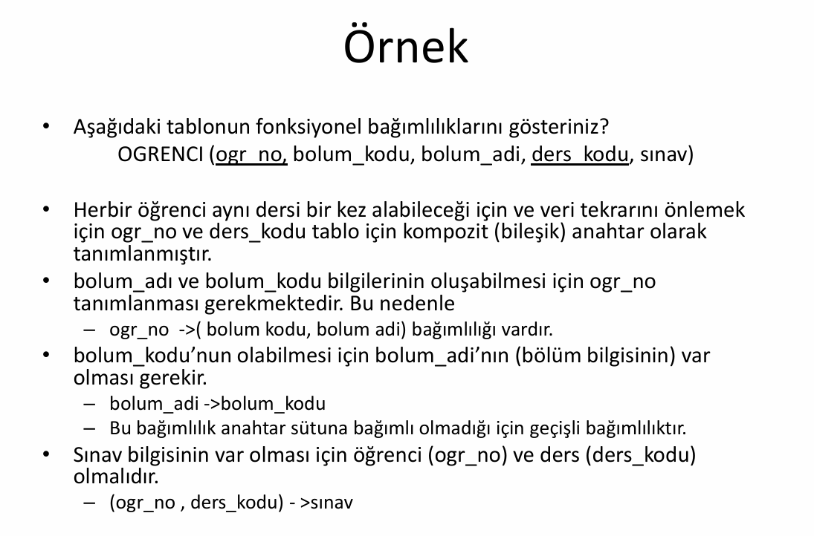

---
<br>

### 1. Normal Form - 1NF  

**1NF Kuralları** 
- Veriabanında bulunan tablolar ilişkilendirilebilir bir şekilde tasarlanmalıdır.
- Birden fazla türde bilgi tek bir sütunda olamaz. 
- Bir alan içerisindeki bilgi özel karakterlerle ayrılarak tutulmamalıdır. 

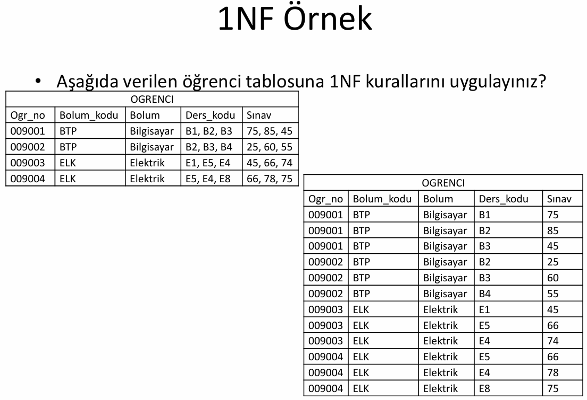

---
**1NF Sorunları**  
- 1NF sonucunda tablo, tekrarlı satırlara sahip olacağı için satır ekleme, silme ve güncelleme sorunları olabilmektedir. 
- **Satır ekleme sorunu**  
    - Öğrenci tablosuna yeni bir öğrenci veya bölüm tanımlanması yapılabilmesi için ders kodu ve sınav bilgilerinin girilmesi zorunludur.  
- **Satır silme sorunu** 
    - Öğrenci tablosunda bir bölüm için sadece bir öğrenci kayıtlı olursa öğrenci silindiğinde bölüm de silinecektir 
- **Satır güncelleme sorunu** 
    - Öğrenci tablosunda bir öğrencinin bölümü değiştiğinde birden fazla kaydın güncellenmesi gerekecektir.  
    - Bu durum çok fazla veri içeren veritabanları için performans sorunlarına neden olacaktır.

---
<br>

### 2. Normal Form - 2NF  

- 1NF’ de karşılaşılan problemleri çözmek için uygulanır.
- 2NF’de fonksiyonel bağımlılıklar belirlenerek tablolar oluşturulur.

**2NF Kuralları**
- Bir tablo içinde tanımlı ve anahtar olmayan her sütun birincil anahtar olarak tanımlı sütuna bağımlı olmalıdır. Anahtar sütunun ihtiyaç duyduğu bilgileri içermelidir. 
    - Öğrenci bilgilerinin olduğu tabloda not ve ders bilgisinin olması gereksizdir . 
    - Notlar ile ilgili asıl klavuz öğrenci numarasıdır bölüm veya  bölum kodu bilgilerinin ayrıntılı tutulmasına gerek yoktur.  
    - Bu durumda öğrenci bilgileri ve not bilgileri ayrı tablolarda tutulur
- Anahtar sütun birden fazla sütunun birleşiminden oluşuyorsa tabloda 
yer alacak veriler iki sütuna da bağımlı olmalıdır.  
    - Tek sütuna bağımlı ise ayrı bir tabloda tutulmalıdır.  
    - Veriabanında bulunan tablolar ilişkilendirilebilir bir şekilde tasarlanmalıdır. 

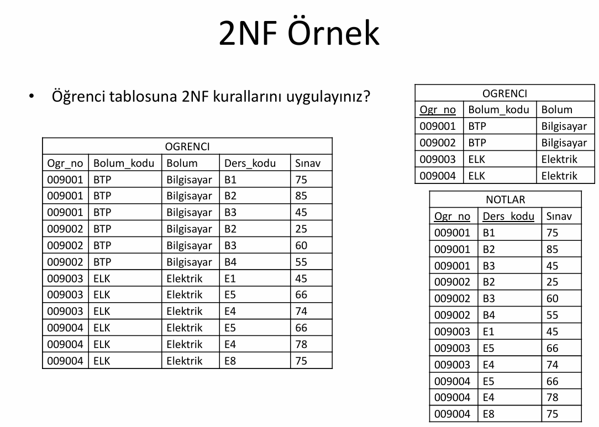

**2NF Sorunları**  

- **Satır ekleme sorunu**  
    - Öğrenci tablosuna yeni bir bölüm tanımlanması yapılabilmesi öğrenci 
tanımlanması zorunludur.  
- **Satır silme sorunu** 
    - Öğrenci tablosunda bir bölüm için sadece bir öğrenci kayıtlı olursa öğrenci silindiğinde bölüm de silinecektir 

---
<br>

### 3. Normal Form - 3NF  
-  3NF’de geçişli bağımlılıklar ortadan kaldırılır.
- 3NF’de  
    - anahtar olmayan bir sütun, başka bir tablonun anahtar sütunu veya bulunduğu tablonun sütunları ile ilgili olmalıdır veya  
    - bir tablo için anahtar olmayan bir sütun anahtar olmayan başka bir sütuna bağımlı olamaz. 

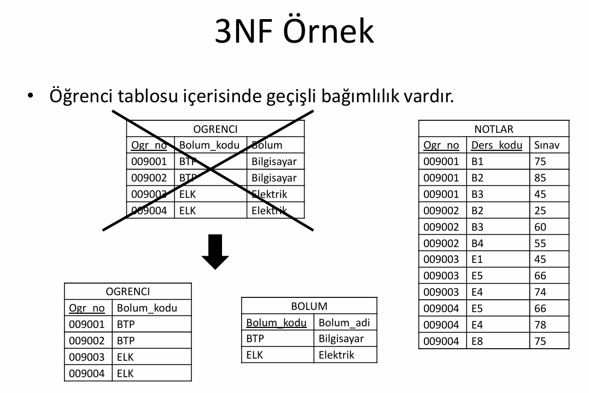

---
<br>

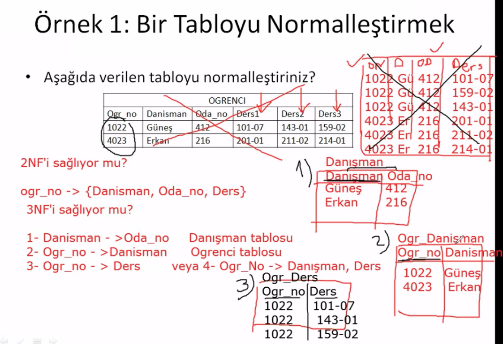

---
<br>

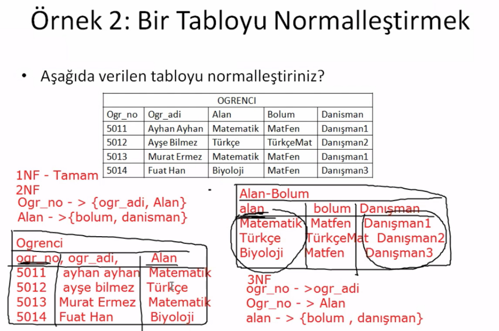

---
<br>

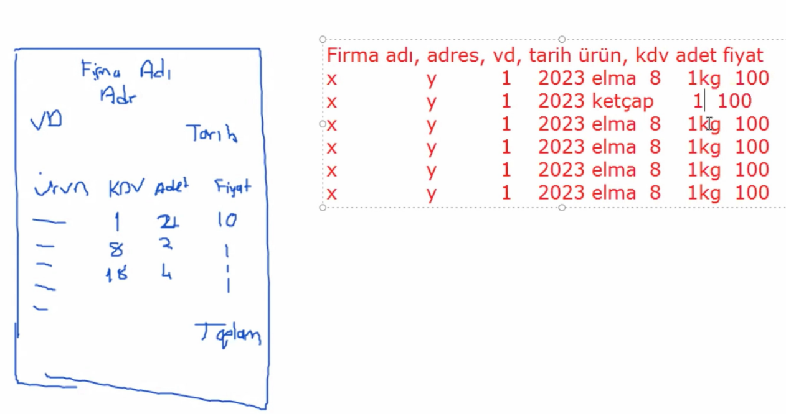

**Bu örneğinin normalizasyonu:**  

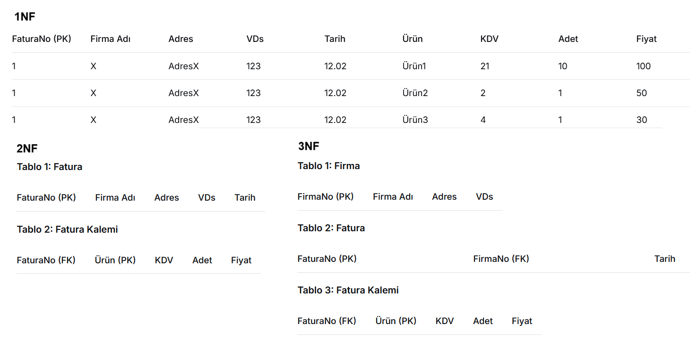

## İlişkisel Cebir

**Sorgu Çalışma Adımları**
- SQL İfadesi
- İlişkisel Cebir İfadesi
- Sorgu Çalıştırma Planı
- Çalıştırabilir Kod

**Sorgu Operatörleri** 

1. Seçim (Selection) 
2. Göster (Atma - Projection) 
3. Kartezyen Çarpımı (Cross-Product) 
4. Birleşim (Union)  
5. Küme Farkı (Set-difference)  
6. Kesişim (Intersection)  
7. Bölme (Division)  
8. Birleştirme (Join) 
9. Yeniden Adlandırma 
10. Özetleme ve Gruplama

**Birleştirme**
- Şartlı Birleştirme (Condition Join) 
- Eşit Birleştirme (Equijoin)  
- Doğal Birleştirme (Natural Join) 
- Dışsal Birleştirme (Outer Join) 
- Sol Birleştirme (Left Outer Join) 
- Sağ Birleştirme (Right Outer Join)  
- Tam Birleştirme (Full Outer Join) 
- Yarı Birleştirme (Semi-Join) 
- Anti-Join

### 1. Seçim (Selection) 
- Bir ilişkiden, verilen kriterleri sağlayan satırların seçilmesi 
işlemidir.  
- σ seçim kriteri (Tablo Adı)   şeklinde gösterilir. 
- Seçim kriterinde karşılaştırma operatörleri (=, >,<,≥, ≤, ≠) 
kullanılabilir. 
- Birden fazla seçim kriteri verilirken mantıksal ve (˄) veya mantıksal or (˅) kullanılabilir. 

<br>

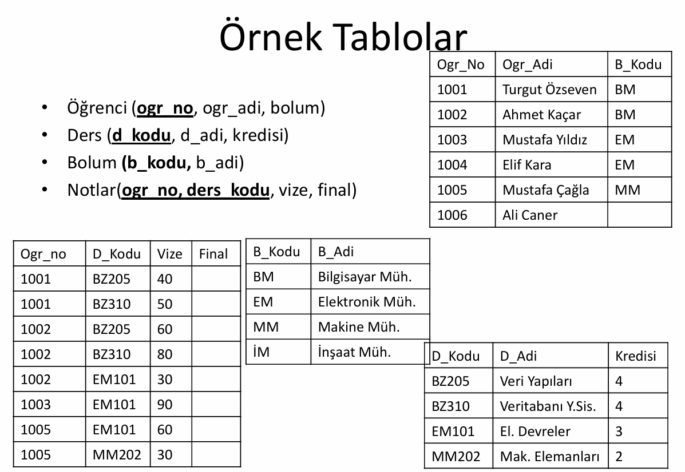

**Seçim (Selection) Örnek** 
- Bilgisayar bölümü öğrencilerini seçiniz? 
- Numarası 1003’ten büyük öğrencileri seçiniz? 
- Numarası 1003’ten büyük elektronik bölümü öğrencisini bulunuz? 

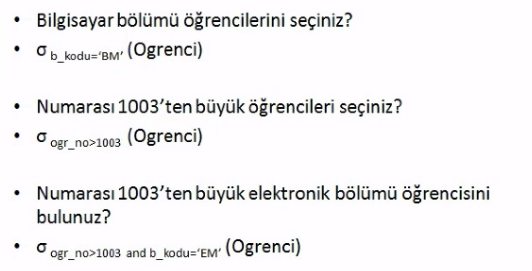

### 2. Göster (Atma - Projection) Π
- Bir ilişkiden; – verilen kriterleri sağlayan sütunları bulmak için – istenmeyen sütunları gizlemek için kullanılır.  
- Π sütun isimleri (Tablo Adı)   şeklinde gösterilir. 
- İki satır kaydı benzer ise nasıl çalışır. (!!!)  

**Göster (Atma - Projection) Örnek** 
- Öğrenci numaralarını ve bölümlerini göster. 
- Bilgisayar bölümü öğrencilerinin numara ve isimlerini 
listeleyiniz? 
- Numarası 1003’ten büyük öğrencilerin bölümlerini 
listeleyiniz? 
- Numarası 1003’ten büyük elektronik bölümü öğrencilerin 
isimleri nelerdir?

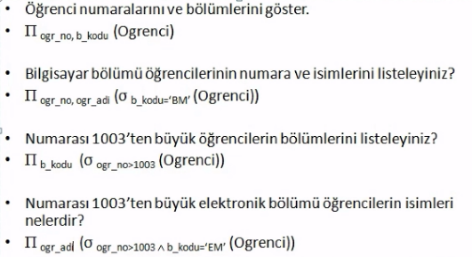

### 3. Kartezyen Çarpımı (Cross-Product) 
- Bir tablodaki bütün satırların (kayıtların) diğer tablodaki bütün 
satırlar (kayıtlar) ile eşleşmesidir.  
- Tablo 1 × Tablo 2

**Kartezyen Çarpımı Örnek**
Ogrenci × Ders sonucu ne olur?
- Öğrenci tablosundaki her bir öğrenci, ders tablosundaki her bir dersle eşleştirilir.

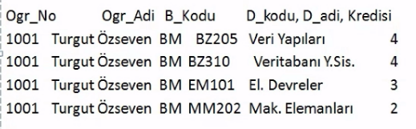

### 4. Birleşim (Union) U 
- İki ilişkideki bütün satırları almak için kullanılır.  
- İki ilişkinin de aynı sayıda sütunu olması gerekir. 
- İki ilişkinin karşılıklı sütunlarının aynı tipte olması gerekir.  
- İki ilişkide aynı satırlar varsa sadece bir tanesi alınır.  
- Tablo 1 U Tablo 2

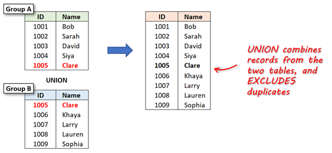

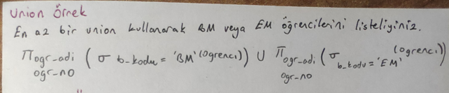

### 5. Küme Farkı (Set-difference) 
- İki ilişkiden birinde bulunup diğerinde bulunmayan kayıtları bulmak için kullanılır.  
- İki ilişkinin de aynı sayıda sütunu olması gerekir. 
- İki ilişkinin karşılıklı sütunlarının aynı tipte olması gerekir.  
- Tablo 1 – Tablo 2

### 6. Kesişim (Intersection) ∩ 
- İki ilişkideki aynı satırları almak için kullanılır.  
- İki ilişkinin de aynı sayıda sütunu olması gerekir. 
- İki ilişkinin karşılıklı sütunlarının aynı tipte olması gerekir.  
- Tablo 1 ∩ Tablo 2

### 7. Bölme (Division) : 
- İki ilişkiyi karşılaştırarak, birinci ilişkide ikinci ilişkinin bütün 
elemanlarını kapsayan satırları bulmak için kullanılır.  
- Tablo 1: Tablo 2 

- Bütün bilgisayar derslerini alan öğrencileri bulunuz?

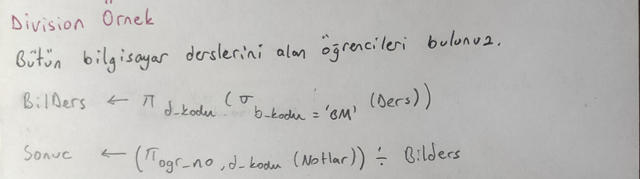

### 8. Birleştirme (Join)  
- Ortak sütunlara sahip ilişkilerin birleştirilerek tek bir ilişkiye 
dönüştürülmesi işlemidir.  

**Birleştirme Çeşitleri**   
- Şartlı Birleştirme  – Birleştirilecek ilişkilerde ortak sütunları için şart veya koşul belirtilir. – Tablo1 |X|c Tablo 2 
- Eşit Birleştirme  – Birleştirilecek ilişkilerde ortak sütunları için eşitlik ifadesi belirtilir. – Tablo1 |X|e Tablo 2 
- Doğal Birleştirme  – Birleştirilecek ilişkilerde herhangi bir şart yazılmaz ortak sütun sütun 
üzerinden birleştirilir. – Tablo1 |X| Tablo 2

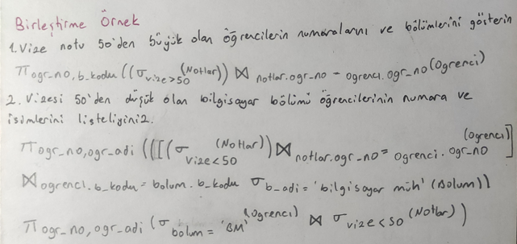

3. Numarası 1003’ten büyük öğrencilerin aldıkları dersleri 
listeleyiniz?

**π(d_kodu, d_adi, kredisi)((σ(ogr_no > 1003)(Öğrenci) ⋈ Notlar) ⋈ Ders)**

4. Numarası 1003’ten büyük elektronik bölümü öğrencilerin 
aldıkları dersler nelerdir?

**π(d_kodu, d_adi, kredisi)(((σ(ogr_no > 1003)(Öğrenci) ⋈ σ(b_adi='Elektronik')(Bolum)) ⋈ Notlar) ⋈ Ders)**

**Birleştirme Çeşitleri**  
- **Sol Birleştirme (Left Outer Join)** – Soldaki ilişki belirleyicidir ve soldaki ilişkinin bütün satırları birleşime 
girer. Bu durumda soldaki ilişki kayıtlarının sağlakilerle  ilişkisi olsun 
olmasın fark etmez.  
– Tablo1 ⟕ Tablo2 
- **Sağ Birleştirme (Right Outer Join)** – Sağdaki ilişki belirleyicidir ve sağdaki ilişkinin bütün satırları birleşime 
girer. Bu durumda sağdaki ilişki kayıtlarının soldakilerle ilişkisi olsun 
olmasın fark etmez.  
– Tablo1 ⟖ Tablo2 
- **Tam Birleştirme (Full Outer Join)** – Her iki ilişkiden bütün kayıtlar birleşme işlemine dahil olacak  
– Tablo1 ⟗ Tablo

**Birleştirme Örnekler**
1. Bütün öğrencilerin bölümlerini listeleyiniz?  
**π(ogr_no, ogr_adi, bolum, b_adi)(Öğrenci ⟕ Bolum)**

2. Bütün bölümlerin öğrencilerini listeleyiniz?  
**π(b.b_kodu, b.b_adi, o.ogr_no, o.ogr_adi)(Öğrenci ⟖ Bolum)**

3. Öğrenci ve bölüm üzerinde tam birleştirme uygulayınız?  
**π(ogr_no, ogr_adi, o.bolum, b.b_kodu, b.b_adi)(Öğrenci ⟗ Bolum)**

### 9. Yeniden Adlandırma (Renaming)  
- İlişkilere ve ilişkilerin içerdiği sütunları yeniden isimlendirme 
de kullanılır. 
- ρ ile gösterilir. 
- ρs (b1, b2, .., bn) (R)   R ilişkisi için s ismi verilir ve 
sutunlarınada b1, b2, .., bn isimleri verilir.  

### 10. Özetleme ve Gruplama 
- Özetleme ve gruplama operatörleri SUM, COUNT, AVERAGE, 
MAX ve MİN’dir.  
- [Gruplandırılacak sütun] ℊ [fonksiyon adı] [sütun adı] Tablo İsmi 

**Özetleme ve Gruplama Örnekler**
1. En vize notu olan öğrencinin bölümünü bulunuz?  
**π(ogr_adi, bolum, b_adi)((σ(vize = ℊ MAX(vize)(Notlar))(Notlar) ⋈ Öğrenci ⋈ Bolum)**

2. Derslerin ortalama vize ortalamalarını hesaplayınız?  
**ders_kodu ℊ AVG(vize) AS ortalama_vize (Notlar)**

3. Bölümü bilgisayar olan öğrencilerin en yüksek vizeli olanını bulunuz?  
**π(ogr_no, ogr_adi, vize)(σ(vize = ℊ MAX(vize)(BilgisayarNotlar))((σ(b_adi='Bilgisayar')(Bolum) ⋈ Öğrenci ⋈ Notlar)))**
