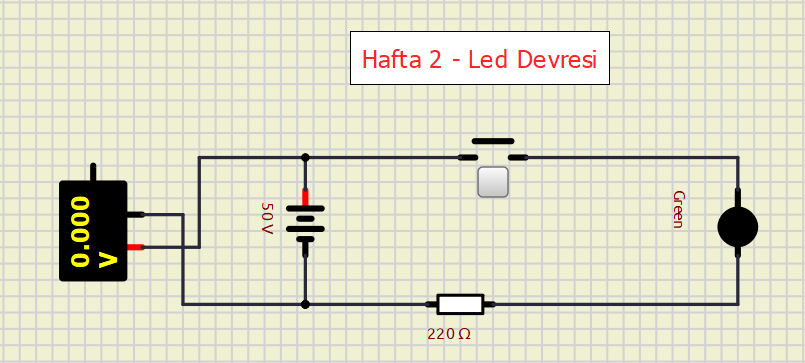
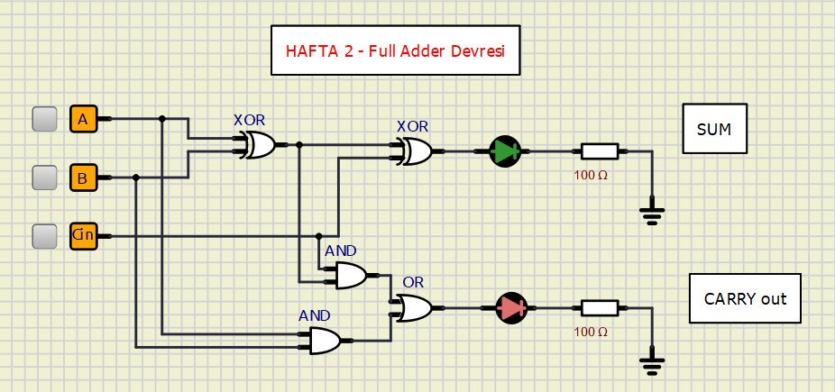

# Embedded Systems

## İçerik
- [SimulIDE Devreleri](./simulIDE/) (Klasöre gidip hafta hafta devreleri görebilirsiniz, w=week)
- [Pandemi Ders Notları](pandemi.md)

- [Hafta 1](#hafta-1)
- [Hafta 2](#hafta-2)

## Hafta 1

### 1. GÖMÜLÜ SİSTEM NEDİR?

| Tanım | Açıklama |
|-------|----------|
| **Genel Tanım** | Donanım, yazılım ve mekanik parçaların bir arada kullanıldığı, belirli bir amaç doğrultusunda çalıştırılan elektronik sistem |
| **İngilizce Tanım** | "A microprocessor based system that does not look like a computer" |
---

### 2. MİKRODENETLEYİCİ (MICROCONTROLLER)

Belirli bir görev icra etmek üzere özelleştirilmiş, aşağıdaki birimleri bir arada bulunduran elektronik sistem:

### Mikrodenetleyici Birimleri:
- Arithmetic and Logic Unit (ALU)
- Program belleği (Program Memory)
- EEPROM (kalıcı veri depolama)
- RAM (değişkenler ve özel fonksiyon registerları)
- Giriş/Çıkış portları (I/O ports)
- Zamanlayıcılar ve sayaçlar (Timers/Counters)
- Analog-Dijital çevirici (ADC)
- Reset, güç açma, seri programlama devreleri
- Instruction decoder ve kontrol birimi
- Seri haberleşme portu

---

### 3. MİMARI YAPILAR

| Mimari | Açıklama |
|--------|----------|
| **Harvard** | Program ve veri belleği ayrı |
| **Von Neumann** | Program ve veri belleği ortak |

---

### 4. KELİME BÜYÜKLÜĞÜ (WORD SIZE)

| Özellik | Açıklama |
|---------|----------|
| **Tanım** | İşlemcinin tek seferde işlediği veri büyüklüğü |
| **Önemi** | Registerlar genelde kelime boyutundadır, bellekten tek seferde taşınabilecek en büyük veri miktarıdır |
| **Gömülü Sistemlerde** | 8, 16, 24, 32, 64 bit |
| **Genel Amaçlı Bilgisayarlarda** | 32 veya 64 bit |
| **Tarihsel Boyutlar** | 9, 12, 18, 24, 26, 36, 39, 40, 48, 60 bit |

---

### 5. ÇALIŞMA TASARIM PROBLEMLERİ

- Mutex ve Barrier senkronizasyonu
- Deadlock (Kilitlenme)
- Deadlock için gerekli koşullar
- Deadlock önleme, kaçınma, tespit/kurtarma
- Banker algoritması
- Wait-for grafikleri

---

### 6. UYGULAMA ALANLARI

### Biyomedikal
- ECG kaydedici
- Kan hücresi sayıcı
- Hasta takip sistemi

### İletişim
- Cep telefonları
- Kablo TV terminalleri
- Faks ve transceiver'lar
- Video oyunları

### Çevresel Birimler
- Klavye denetleyici
- DRAM/DMA denetleyici
- Yazıcı denetleyici
- LAN denetleyici
- Disk sürücü denetleyici

### Enstrümantasyon
- Proses kontrol
- DC motor kontrol
- Robotik sistemler
- CNC makine kontrol
- Motor kontrol sistemleri

### Bilimsel
- Osiloskop
- Spektrum analizör

---

### 7. GÖMÜLÜ SİSTEMLERİN KISITLARI

| Kısıt | Açıklama |
|------|----------|
| **Özelleşmiş Görev** | Farklı işler için programlanamazlar, tek bir spesifik görev yaparlar |
| **Sınırlı Kaynaklar** | Özellikle bellek kısıtlıdır, CD/floppy gibi ikincil depolama genelde yoktur |
| **Zaman Kısıtı** | Belirli zaman diliminde iş tamamlanmalıdır (Real-time sistemler) |
| **Güç Tüketimi** | Pil ile çalıştıkları için düşük güç tüketimi şarttır |
| **Güvenilirlik** | Yüksek güvenilirlik gerekir, reset atmak çoğu zaman mümkün değildir |
| **Çevre Koşulları** | Yüksek sıcaklık, nem gibi zorlu koşullarda çalışabilmeli |
| **Maliyet** | Tüketici ürünlerinde maliyet çok önemlidir (Rs.10 fark bile milyonlarca üründe büyük tasarruf) |
| **Platform Çeşitliliği** | Intel-Microsoft hakimiyeti yoktur, çok çeşitli işlemci ve işletim sistemi vardır |

---

### 8. GÖMÜLÜ SİSTEM SINIFLANDIRMASI

1. **Stand-alone** (Bağımsız) Gömülü Sistemler
2. **Gerçek Zamanlı** (Real-time) Gömülü Sistemler
3. **Ağ Bağlantılı** (Networked) Bilgi Cihazları
4. **Mobil** Cihazlar

---

### 9. KAPSAM (Derste İşlenecek Konular)

- İletişim teknolojileri
- Gömülü sistem yazılımı geliştirme
- Programlama dilleri
- Watchdog timer
- Analog ve Dijital çevrim
- Kablosuz iletişim
- Arayüz ve görselleştirme
- Sayısal sensörler okuma
- Analog sensörler okuma

## Hafta 2

**1. Resistor:** Akımı sınırlar. Ohm (Ω) ile ölçülür.
Neden kullanırız?
- **Led Koruma:** Bir LED'i doğrudan pile bağlarsanız yanar. Ama önüne bir direnç koyarsanız, akımı sınırlar ve LED uzun süre yanar.
- **Gerilim Bölme:** Tek bir gerilimi (örneğin 5V'u) iki dirençle bölerek 3V ve 2V gibi farklı gerilimler elde edebiliriz.
- **Pull-up / Pull-down:** Buton gibi devrelerde, butona basılmadığında girişin "boşta" kalmasını (gürültü yapmasını) engellemek için kullanılır.

**2. Switch Button:** Mekanik bir anahtardır. Fiziksel olarak bastığınızda devreyi tamamlar veya keser. astığınızda, normalde açık olan kontak kapanır ve akım geçmeye başlar.  

**3. Valve:** Tıpkı bir transistör gibi sinyali yükseltebilir veya anahtarlama yapabilir.  

**4. Opamp:** Girişindeki iki gerilim arasındaki farkı alıp, onu çok yüksek bir kazançla (genelde 100.000 kat) çıktıya aktarır.  Etrafına dirençler ekleyerek kontrollü bir yükselteç veya mantık devresi haline getiririz.  

**Karşılaştırıcı (Comparator):** Bir sensörden gelen gerilim belli bir eşiği geçti mi? (Örn: Sıcaklık 50°C'yi geçti mi?)  
**Yükselteç:** Mikrofon gibi çok zayıf bir sinyali, duyulabilir seviyeye çıkarmak. 

---

**5. Full Adder:** Bilgisayarın temel işlemidir: İki sayıyı toplar. Ama sadece 1 bit'lik (0 veya 1) sayıları değil, aynı zamanda bir önceki basamaktan gelen eldeyi (carry) de toplar.  

